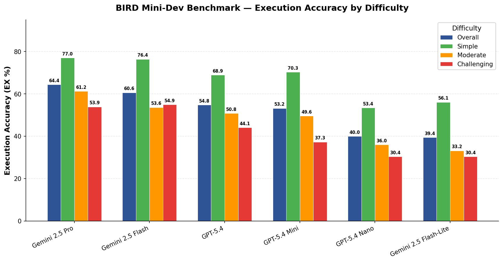

<!--
  © 2026 CVS Health and/or one of its affiliates. All rights reserved.

  Licensed under the Apache License, Version 2.0 (the "License");
  you may not use this file except in compliance with the License.
  You may obtain a copy of the License at

      http://www.apache.org/licenses/LICENSE-2.0

  Unless required by applicable law or agreed to in writing, software
  distributed under the License is distributed on an "AS IS" BASIS,
  WITHOUT WARRANTIES OR CONDITIONS OF ANY KIND, either express or implied.
  See the License for the specific language governing permissions and
  limitations under the License.
-->
# Ask RITA (Reasoning Interface for Text-to-Analytics)

> **Ask what. Get answers.** RITA turns a natural-language question into SQL, statistics, and insights — no code required.

Go beyond simple text-to-SQL. Ask RITA is an LLM-powered analytics framework that generates queries, runs scipy-backed statistical tests, conducts CRISP-DM research workflows, classifies data, and visualizes results — across SQL and NoSQL databases — from a single natural-language question.

[](https://www.python.org/downloads/)
[](https://pypi.org/project/askrita/)
[](https://pepy.tech/project/askrita)
[](https://www.apache.org/licenses/LICENSE-2.0)

> **🔒 IMPORTANT — Read-Only Database Access Required**
>
> AskRITA generates and executes SQL/NoSQL queries against your database. **LLM-generated queries are inherently unpredictable.** To prevent inadvertent writes, deletes, or schema changes:
>
> 1. **Always connect with a read-only database user.** Grant only `SELECT` (SQL) or `find`/`aggregate` (MongoDB) permissions. Never use credentials with `INSERT`, `UPDATE`, `DELETE`, `DROP`, or DDL privileges.
> 2. **Do not rely on application-level safeguards alone.** AskRITA includes prompt-injection detection and blocks known destructive patterns, but these are defence-in-depth measures — not substitutes for proper database permissions.
> 3. **Store credentials in environment variables** (`${DB_USER}`, `${DB_PASSWORD}`), never in config files. See [Configuration Guide](docs/configuration/overview.md).
>
> **The database user's granted permissions are the only reliable boundary between AskRITA and your data.**

## 🆕 **What's New in v0.13.0**

- 🧠 **Research Agent — Real Statistical Tests**: scipy-powered hypothesis testing replaces LLM-generated statistics
  - Auto-selects Pearson vs Spearman correlation based on Shapiro-Wilk normality test
  - Tukey HSD post-hoc pairwise comparisons after significant ANOVA
  - Bonferroni correction across multiple tests in a single research run
  - `analyze_hypothesis_data()` auto-routes to the correct test family based on column types
- ⚡ **Research Agent — Parallel Evidence Execution**: Evidence queries now execute concurrently via `ThreadPoolExecutor` — wall time ≈ max(query_times) instead of sum
- 🏗️ **Research Agent — Architecture Separation**: SQL Agent generates SQL only; Research Agent executes queries directly via `db_manager`
- 🐛 **Bug Fixes**: Thread-safety for parallel queries, aggregated data detection, Bonferroni-aware confidence scoring, schema decorator recursion storm fix

**Previous Release (v0.12.2):**

- 🛡️ **SQL Prompt Injection Prevention**: Defence-in-depth protection against malicious inputs
- 🔧 **SonarQube Fixes**: S2737, S3776, S1481, S1135, S1871

## 🚀 **Four Powerful Workflows**

### 📊 **SQLAgentWorkflow** - Natural Language to SQL
- 🗣️ **Natural Language to SQL** - Ask questions in plain English
- 💬 **Conversational Queries** - Follow-up questions with context awareness
- 🗄️ **Multi-Database Support** - PostgreSQL, MySQL, SQLite, SQL Server, BigQuery, Snowflake, IBM Db2
- 📊 **Smart Visualization** - Automatic chart recommendations
- 🔄 **Error Recovery** - Automatic SQL retry with error feedback

### 🍃 **NoSQLAgentWorkflow** - Natural Language to MongoDB
- 🗣️ **Natural Language to MongoDB** - Ask questions, get aggregation pipelines
- 🍃 **MongoDB Support** - `mongodb://` and `mongodb+srv://` (Atlas) connections
- 🛡️ **Safety Validation** - Blocks destructive operations, read-only analytics
- 🔄 **Full Feature Parity** - PII detection, visualization, follow-up questions, Chain-of-Thoughts

### 🔬 **ResearchAgent** - CRISP-DM Data Science Research
- 📋 **CRISP-DM Methodology** - Complete 6-phase data science workflow
- 🧪 **Hypothesis Testing** - Automated research question formulation and testing
- 📊 **Real Statistics** - scipy-powered t-tests, ANOVA, correlation, chi-square (not LLM-generated!)
- 📈 **Effect Sizes** - Cohen's d, η², Cramér's V with automatic interpretation
- 🎯 **Actionable Insights** - Data-driven recommendations with confidence levels

### 🏷️ **DataClassificationWorkflow** - LLM-Powered Data Processing
- 🖼️ **Image Classification** - AI extracts data directly from images (medical bills, invoices, documents)
- 📄 **Excel/CSV Processing** - Process large datasets with AI classification
- 🚀 **API-First Design** - Perfect for microservices with dynamic field definitions per request
- 🧠 **Multi-Tenant Support** - Different schemas per customer/organization without server restarts


## 📊 Model Performance Comparison (BIRD Benchmark)

BIRD Mini-Dev text-to-SQL execution accuracy (EX) across 500 questions, with oracle knowledge (evidence) enabled.



| Model | Overall | Simple (148) | Moderate (250) | Challenging (102) |
|:---|:---:|:---:|:---:|:---:|
| **Gemini 2.5 Pro** | **64.4%** | 77.0% | 61.2% | 53.9% |
| **Gemini 2.5 Flash** | **60.6%** | 76.3% | 53.6% | 54.9% |
| **GPT-5.4** | **54.8%** | 68.9% | 50.8% | 44.1% |
| **GPT-5.4 Mini** | **53.2%** | 70.3% | 49.6% | 37.2% |
| **GPT-5.4 Nano** | **40.0%** | 53.4% | 36.0% | 30.4% |
| **Gemini 2.5 Flash-Lite** | **39.4%** | 56.1% | 33.2% | 30.4% |

## Core Features

- 🤖 **Multi-Cloud LLM Integration** - OpenAI, Azure, Google Cloud Vertex AI, AWS Bedrock
- ⚙️ **Configurable Workflows** - Enable/disable steps, customize prompts, enhanced security options
- 🔒 **Enterprise Security** - Credential management, access controls, audit logging
- 🛡️ **PII/PHI Detection** - Automatic privacy protection with Microsoft Presidio analyzer
- 🏗️ **Production Ready** - Design pattern architecture, comprehensive logging, error handling, monitoring
- 🌐 **Advanced BigQuery** - Cross-project dataset access, 3-step validation, configurable access patterns
- 📊 **Token Management** - Built-in token utilities for cost optimization and LLM efficiency
- 🧪 **Extensive Testing** - Full test suite with quality assurance tools (550+ tests passing)
- 🔌 **Type-Safe Integration** - Exported Pydantic models for seamless downstream application integration

## Quick Start

### 1. Install
```bash
pip install askrita
```
> **📋 More options**: [Installation Guide](docs/installation.md) — pip, Poetry, from-source, development setup

### 2. Configure  
```bash
export OPENAI_API_KEY="your-api-key-here"
cp example-configs/query-openai.yaml my-config.yaml
```
> **⚙️ Full reference**: [Configuration Guide](docs/configuration/overview.md)

### 3. Use
```python
from askrita import SQLAgentWorkflow, ConfigManager

config = ConfigManager("my-config.yaml")
workflow = SQLAgentWorkflow(config)
result = workflow.query("What are the top 10 customers by revenue?")
print(result['answer'])
```

### NoSQL (MongoDB)
```python
from askrita import NoSQLAgentWorkflow, ConfigManager

config = ConfigManager("mongodb-config.yaml")
workflow = NoSQLAgentWorkflow(config)
result = workflow.query("How many orders were placed last month?")
print(result.answer)
```

### Research Agent - CRISP-DM Data Science
```python
from askrita import ConfigManager
from askrita.research import ResearchAgent

config = ConfigManager("my-config.yaml")
research = ResearchAgent(config)

result = research.test_hypothesis(
    research_question="How does customer satisfaction differ across business lines?",
    hypothesis="Medicare members have higher NPS scores than Commercial members"
)

print(f"Conclusion: {result['conclusion']}")  # SUPPORTED, REFUTED, or INCONCLUSIVE
print(f"P-value: {result['key_metrics'].get('p_value')}")  # Real scipy computation
```

> **📖 All examples**: [Usage Examples & API Reference](docs/usage-examples.md) — conversational queries, data classification, exports, CLI, result format

**⚠️ Important**: Configuration file with LLM provider settings and prompts is always required. API keys are read from environment variables.

### Type-Safe Integration
```python
from askrita import (
    SQLAgentWorkflow, ConfigManager,
    UniversalChartData, ChartDataset, DataPoint, WorkflowState
)

result: WorkflowState = workflow.query("Show me sales by region")
chart = UniversalChartData(**result['chart_data'])
```

## Supported Platforms

**Databases**: PostgreSQL, MySQL, SQLite, SQL Server, BigQuery, Snowflake, IBM DB2, MongoDB

**LLM Providers**: OpenAI, Azure OpenAI, Google Cloud Vertex AI, AWS Bedrock

> **📋 Connection strings, auth details, config templates**: [Supported Platforms](docs/supported-platforms.md)

## Configuration

### Required Components

| Component | Required | Description |
|-----------|----------|-------------|
| 🔑 **LLM** | ✅ **Yes** | Provider, model + env variables |
| 🗄️ **Database** | ✅ **Yes** | Connection string |  
| 📝 **Prompts** | ✅ **Yes** | All 5 workflow prompts |

### Quick Setup

```bash
export OPENAI_API_KEY="your-api-key-here"
cp example-configs/query-openai.yaml my-config.yaml
```

### Configuration Templates

```bash
example-configs/query-openai.yaml           # OpenAI + PostgreSQL
example-configs/query-azure-openai.yaml     # Azure OpenAI
example-configs/query-snowflake.yaml        # Snowflake database
example-configs/query-mongodb.yaml          # MongoDB (NoSQL)
example-configs/example-zscaler-config.yaml # Corporate proxy setup
example-configs/data-classification-*.yaml  # Data processing workflows
```

> **📚 Complete reference**: [Configuration Guide](docs/configuration/overview.md)

### Corporate Proxy & SSL

```yaml
llm:
  ca_bundle_path: "./credentials/zscaler-ca.pem"
```

> **📚 Full guide**: [CA Bundle Setup](docs/guides/ca-bundle-setup.md)

### MCP Server (for AI Assistants)

```json
{
  "mcpServers": {
    "askrita": {
      "command": "askrita",
      "args": ["mcp", "--config", "/path/to/your/config.yaml"]
    }
  }
}
```

> **📖 Setup guide**: [Claude Desktop Setup](docs/guides/claude-desktop-setup.md)

## Development

### Setup

```bash
git clone https://github.com/cvs-health/askRITA.git
cd askRITA
pip install poetry && poetry install
```

### Quality Checks

```bash
poetry run pytest                    # Tests
poetry run black askrita/         # Format  
poetry run flake8 askrita/        # Lint
poetry run mypy askrita/          # Type check
```

## 📚 Documentation

| Guide | Description |
|-------|-------------|
| [Installation](docs/installation.md) | pip, Poetry, from-source, development setup |
| [Configuration](docs/configuration/overview.md) | YAML configuration — database, LLM, prompts, PII, security |
| [Usage Examples & API](docs/usage-examples.md) | Code examples, CLI, API reference, result format |
| [Supported Platforms](docs/supported-platforms.md) | Databases, LLM providers, connection strings, auth |
| [SQL Workflow](docs/guides/sql-workflow.md) | Core text-to-SQL workflow — query, chat, export, schema |
| [Conversational SQL](docs/guides/conversational-sql.md) | Multi-turn chat mode, follow-up questions, clarification |
| [Research Workflow](docs/guides/research-workflow.md) | CRISP-DM hypothesis testing with scipy statistics |
| [Data Classification](docs/guides/data-classification.md) | LLM-powered classification of CSV/Excel with dynamic schemas |
| [NoSQL Workflow](docs/guides/nosql-workflow.md) | MongoDB workflow setup and usage |
| [Export (PPTX, PDF, Excel)](docs/guides/exports.md) | Export query results to branded reports and spreadsheets |
| [Security](docs/guides/security.md) | SQL safety, prompt injection detection, PII/PHI scanning |
| [Schema Enrichment](docs/guides/schema-enrichment.md) | Schema caching, descriptions, decorators, cross-project access |
| [Chain of Thoughts](docs/guides/chain-of-thoughts.md) | Step-by-step reasoning traces and progress callbacks |
| [CLI Reference](docs/guides/cli-reference.md) | `askrita` command — query, interactive, test, mcp |
| [MCP Server](docs/guides/mcp-server.md) | Model Context Protocol server setup |
| [Claude Desktop Setup](docs/guides/claude-desktop-setup.md) | MCP integration with Claude Desktop |
| [CA Bundle Setup](docs/guides/ca-bundle-setup.md) | Certificate authority configuration |
| [Benchmark Results](docs/benchmarks/results.md) | BIRD Mini-Dev model comparison and per-model analysis |
| [Chart Types](docs/charts/README.md) | Google Charts — 13 chart types, React & Angular guides |
| [Contributing](docs/developer/contributing.md) | Dev setup, branching, pull requests, code quality |
| [Versioning & Releases](docs/developer/versioning.md) | Semantic versioning, version bump scripts, release checklist |
| [Docker Testing](docs/developer/docker-testing.md) | Cross-version compatibility testing in isolated environments |
| [Changelog](CHANGELOG.md) | Version history and updates |

> **📖 Complete index**: [Documentation Site](docs/index.md)

## License

Apache License 2.0 - see [LICENSE](LICENSE) file for details.
