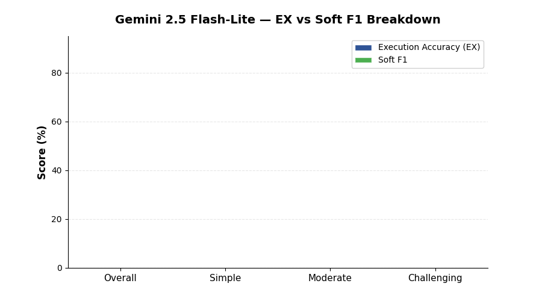

<!--
  © 2026 CVS Health and/or one of its affiliates. All rights reserved.

  Licensed under the Apache License, Version 2.0 (the "License");
  you may not use this file except in compliance with the License.
  You may obtain a copy of the License at

      http://www.apache.org/licenses/LICENSE-2.0

  Unless required by applicable law or agreed to in writing, software
  distributed under the License is distributed on an "AS IS" BASIS,
  WITHOUT WARRANTIES OR CONDITIONS OF ANY KIND, either express or implied.
  See the License for the specific language governing permissions and
  limitations under the License.
-->
# Gemini 2.5 Flash-Lite

BIRD Mini-Dev benchmark results for **Gemini 2.5 Flash-Lite** via Google Cloud Vertex AI.

[Back to Overall Results](results.md)

---

## Summary

| | |
|:---|:---|
| **Provider** | Google Cloud Vertex AI |
| **Model** | `gemini-2.5-flash-lite` |
| **Overall EX Accuracy** | **39.4%** |
| **Overall Soft F1** | **39.0%** |
| **Error Rate** | 41.8% (209 / 500) |
| **Avg Latency** | 7.2s per question |
| **Total Benchmark Time** | 60.4 minutes |
| **Rank** | #6 overall (last) |

## Detailed Scores

| Metric | Overall | Simple (148) | Moderate (250) | Challenging (102) |
|:---|:---:|:---:|:---:|:---:|
| Execution Accuracy (EX) | **39.4%** | 56.1% | 33.2% | 30.4% |
| Soft F1 | **39.0%** | 55.8% | 33.4% | 28.6% |

## Analysis

### Strengths

- **Reasonable on simple questions** at 56.1% EX — comparable to GPT-5.4 Nano (53.4%)
- **Lowest-cost Gemini model** for experimentation and prototyping

### Weaknesses

- **Extremely high error rate** at 41.8% — nearly half of all queries fail to produce valid SQL
- **Soft F1 is lower than EX** (-0.4 points) — unlike all other models, partial credit doesn't help because the model frequently generates completely wrong or broken SQL
- **Slowest budget model** at 7.2s — nearly 2x slower than GPT-5.4 Nano (4.1s) while scoring lower
- **No advantage over GPT-5.4 Nano** — similar accuracy but higher error rate, higher latency, and no cost benefit

### When to Use

Gemini 2.5 Flash-Lite is **not recommended for text-to-SQL workloads**. The 41.8% error rate makes it unreliable for any production or development scenario.

Potential use cases are limited to:

- Rough experimentation with Vertex AI pricing tiers
- Workloads where text-to-SQL is not the primary task

### Not Recommended For

- Any text-to-SQL application (production or development)
- Batch processing (high error rate wastes compute)
- Interactive applications (7.2s latency with no accuracy payoff)

### Comparison with Peers

| vs Model | EX Difference | Latency Ratio |
|:---|:---:|:---:|
| vs GPT-5.4 Nano | -0.6 points | 1.8x slower |
| vs GPT-5.4 Mini | -13.8 points | 2.0x slower |
| vs Gemini 2.5 Flash | -21.2 points | 1.1x slower |

---

[Back to Overall Results](results.md)
