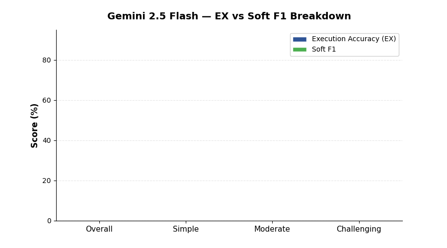

<!--
  © 2026 CVS Health and/or one of its affiliates. All rights reserved.

  Licensed under the Apache License, Version 2.0 (the "License");
  you may not use this file except in compliance with the License.
  You may obtain a copy of the License at

      http://www.apache.org/licenses/LICENSE-2.0

  Unless required by applicable law or agreed to in writing, software
  distributed under the License is distributed on an "AS IS" BASIS,
  WITHOUT WARRANTIES OR CONDITIONS OF ANY KIND, either express or implied.
  See the License for the specific language governing permissions and
  limitations under the License.
-->
# Gemini 2.5 Flash

BIRD Mini-Dev benchmark results for **Gemini 2.5 Flash** via Google Cloud Vertex AI.

[Back to Overall Results](results.md)

---

## Summary

| | |
|:---|:---|
| **Provider** | Google Cloud Vertex AI |
| **Model** | `gemini-2.5-flash` |
| **Overall EX Accuracy** | **60.6%** |
| **Overall Soft F1** | **62.1%** |
| **Error Rate** | 2.4% (12 / 500) |
| **Avg Latency** | 6.7s per question |
| **Total Benchmark Time** | 56.0 minutes |
| **Rank** | #2 overall |

## Detailed Scores

| Metric | Overall | Simple (148) | Moderate (250) | Challenging (102) |
|:---|:---:|:---:|:---:|:---:|
| Execution Accuracy (EX) | **60.6%** | 76.4% | 53.6% | 54.9% |
| Soft F1 | **62.1%** | 75.1% | 56.8% | 55.9% |

## Analysis

### Strengths

- **Best on challenging questions** at 54.9% EX — highest among all models, edging out even Gemini 2.5 Pro (53.9%)
- **Excellent reliability** with only 12 errors (2.4%), second-lowest error rate
- **Good balance of speed and accuracy** — 3x faster than Gemini 2.5 Pro while only 3.8 points behind
- **Soft F1 exceeds EX by 1.5 points**, showing it frequently produces partially-correct SQL on harder questions

### Weaknesses

- **Moderate question gap** — drops to 53.6% on moderate difficulty, 7.6 points behind Gemini 2.5 Pro
- **Not the fastest** — GPT-5.4 Mini runs at roughly half the latency (3.6s vs 6.7s)

### When to Use

Gemini 2.5 Flash offers the best accuracy-to-speed ratio among Google models. Ideal for:

- Production text-to-SQL where both speed and accuracy matter
- Complex analytical queries (best performance on challenging questions)
- Real-time applications where 20s+ latency from Pro is unacceptable

### Comparison with Peers

| vs Model | EX Difference | Latency Ratio |
|:---|:---:|:---:|
| vs Gemini 2.5 Pro | -3.8 points | 3.0x faster |
| vs GPT-5.4 | +5.8 points | 0.96x (similar) |
| vs GPT-5.4 Mini | +7.4 points | 1.9x slower |

---

[Back to Overall Results](results.md)
