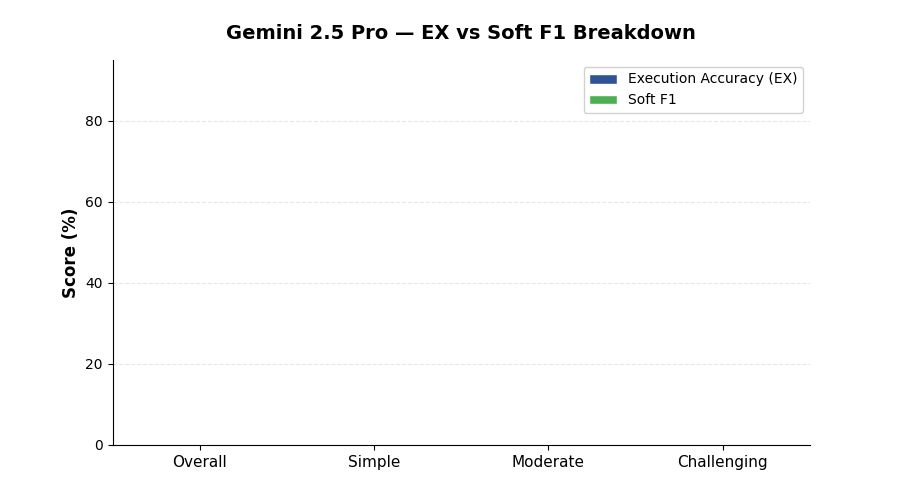

<!--
  © 2026 CVS Health and/or one of its affiliates. All rights reserved.

  Licensed under the Apache License, Version 2.0 (the "License");
  you may not use this file except in compliance with the License.
  You may obtain a copy of the License at

      http://www.apache.org/licenses/LICENSE-2.0

  Unless required by applicable law or agreed to in writing, software
  distributed under the License is distributed on an "AS IS" BASIS,
  WITHOUT WARRANTIES OR CONDITIONS OF ANY KIND, either express or implied.
  See the License for the specific language governing permissions and
  limitations under the License.
-->
# Gemini 2.5 Pro

BIRD Mini-Dev benchmark results for **Gemini 2.5 Pro** via Google Cloud Vertex AI.

[Back to Overall Results](results.md)

---

## Summary

| | |
|:---|:---|
| **Provider** | Google Cloud Vertex AI |
| **Model** | `gemini-2.5-pro` |
| **Overall EX Accuracy** | **64.4%** |
| **Overall Soft F1** | **64.0%** |
| **Error Rate** | 3.6% (18 / 500) |
| **Avg Latency** | 20.1s per question |
| **Total Benchmark Time** | 167.3 minutes |
| **Rank** | #1 overall |

## Detailed Scores

| Metric | Overall | Simple (148) | Moderate (250) | Challenging (102) |
|:---|:---:|:---:|:---:|:---:|
| Execution Accuracy (EX) | **64.4%** | 77.0% | 61.2% | 53.9% |
| Soft F1 | **64.0%** | 75.4% | 61.7% | 53.0% |

## Analysis

### Strengths

- **Highest overall accuracy** at 64.4% EX, the top-performing model across all difficulty levels
- **Best moderate-question performance** at 61.2% EX — a 7.6-point lead over the next model (Gemini 2.5 Flash at 53.6%)
- **Minimal EX-to-F1 gap** (0.4 points) — when this model gets close, it almost always gets it exactly right
- **Low error rate** at 3.6%, producing well-formed SQL the vast majority of the time

### Weaknesses

- **Significantly slower** at 20.1s average latency — roughly 3x slower than GPT-5.4 and Gemini 2.5 Flash
- **Total runtime** of 167.3 minutes (nearly 3 hours) makes it the most expensive to run
- **Not the best on challenging questions** — Gemini 2.5 Flash edges it out on the hardest queries (54.9% vs 53.9%)

### When to Use

Gemini 2.5 Pro is the right choice when accuracy is the primary concern and latency is acceptable. Ideal for:

- Offline or batch SQL generation pipelines
- High-stakes analytical queries where correctness matters most
- Scenarios where cost/time is secondary to precision

### Comparison with Peers

| vs Model | EX Difference | Latency Ratio |
|:---|:---:|:---:|
| vs Gemini 2.5 Flash | +3.8 points | 3.0x slower |
| vs GPT-5.4 | +9.6 points | 2.9x slower |
| vs GPT-5.4 Mini | +11.2 points | 5.6x slower |

---

[Back to Overall Results](results.md)
