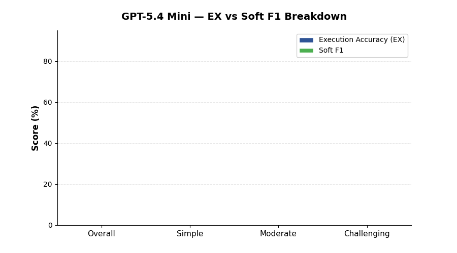

<!--
  © 2026 CVS Health and/or one of its affiliates. All rights reserved.

  Licensed under the Apache License, Version 2.0 (the "License");
  you may not use this file except in compliance with the License.
  You may obtain a copy of the License at

      http://www.apache.org/licenses/LICENSE-2.0

  Unless required by applicable law or agreed to in writing, software
  distributed under the License is distributed on an "AS IS" BASIS,
  WITHOUT WARRANTIES OR CONDITIONS OF ANY KIND, either express or implied.
  See the License for the specific language governing permissions and
  limitations under the License.
-->
# GPT-5.4 Mini

BIRD Mini-Dev benchmark results for **GPT-5.4 Mini** via OpenAI.

[Back to Overall Results](results.md)

---

## Summary

| | |
|:---|:---|
| **Provider** | OpenAI |
| **Model** | `gpt-5.4-mini` |
| **Overall EX Accuracy** | **53.2%** |
| **Overall Soft F1** | **57.2%** |
| **Error Rate** | 2.2% (11 / 500) |
| **Avg Latency** | 3.6s per question |
| **Total Benchmark Time** | 29.8 minutes |
| **Rank** | #4 overall |

## Detailed Scores

| Metric | Overall | Simple (148) | Moderate (250) | Challenging (102) |
|:---|:---:|:---:|:---:|:---:|
| Execution Accuracy (EX) | **53.2%** | 70.3% | 49.6% | 37.3% |
| Soft F1 | **57.2%** | 72.0% | 55.0% | 41.4% |

## Analysis

### Strengths

- **Fastest model tested** at 3.6s average latency — nearly 2x faster than GPT-5.4 and 5.6x faster than Gemini 2.5 Pro
- **Shortest total runtime** at 29.8 minutes for all 500 questions
- **Strong on simple questions** at 70.3% EX, competitive with much larger models
- **Low error rate** at 2.2%, similar reliability to Gemini 2.5 Flash

### Weaknesses

- **Sharp drop on challenging questions** — 37.3% EX on challenging is a 33-point drop from simple, the largest gap among top-4 models
- **Moderate accuracy gap** compared to Gemini models — 11.2 points behind Pro, 7.4 behind Flash

### When to Use

GPT-5.4 Mini is the best choice when speed matters most. Ideal for:

- Real-time interactive applications where sub-5s latency is required
- High-volume batch processing where cost-per-query matters
- Simple-to-moderate query workloads where 70%+ accuracy on simple questions is sufficient
- Prototyping and development where fast iteration beats peak accuracy

### Comparison with Peers

| vs Model | EX Difference | Latency Ratio |
|:---|:---:|:---:|
| vs GPT-5.4 | -1.6 points | 1.9x faster |
| vs Gemini 2.5 Flash | -7.4 points | 1.9x faster |
| vs GPT-5.4 Nano | +13.2 points | 0.89x (similar) |

---

[Back to Overall Results](results.md)
