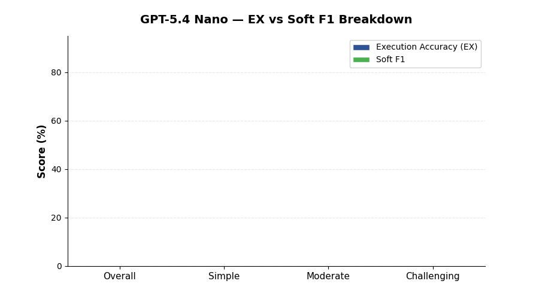

<!--
  © 2026 CVS Health and/or one of its affiliates. All rights reserved.

  Licensed under the Apache License, Version 2.0 (the "License");
  you may not use this file except in compliance with the License.
  You may obtain a copy of the License at

      http://www.apache.org/licenses/LICENSE-2.0

  Unless required by applicable law or agreed to in writing, software
  distributed under the License is distributed on an "AS IS" BASIS,
  WITHOUT WARRANTIES OR CONDITIONS OF ANY KIND, either express or implied.
  See the License for the specific language governing permissions and
  limitations under the License.
-->
# GPT-5.4 Nano

BIRD Mini-Dev benchmark results for **GPT-5.4 Nano** via OpenAI.

[Back to Overall Results](results.md)

---

## Summary

| | |
|:---|:---|
| **Provider** | OpenAI |
| **Model** | `gpt-5.4-nano` |
| **Overall EX Accuracy** | **40.0%** |
| **Overall Soft F1** | **43.2%** |
| **Error Rate** | 6.8% (34 / 500) |
| **Avg Latency** | 4.1s per question |
| **Total Benchmark Time** | 33.9 minutes |
| **Rank** | #5 overall |

## Detailed Scores

| Metric | Overall | Simple (148) | Moderate (250) | Challenging (102) |
|:---|:---:|:---:|:---:|:---:|
| Execution Accuracy (EX) | **40.0%** | 53.4% | 36.0% | 30.4% |
| Soft F1 | **43.2%** | 56.3% | 40.0% | 31.9% |

## Analysis

### Strengths

- **Fast** at 4.1s average latency, second only to GPT-5.4 Mini
- **Reasonable on simple questions** at 53.4% EX — more than half of straightforward queries produce correct results
- **Lower error rate than Flash-Lite** at 6.8% compared to 41.8%, showing better SQL generation reliability

### Weaknesses

- **Below 40% on moderate and challenging** — 36.0% and 30.4% respectively, making it unsuitable for complex SQL
- **Higher error rate** than the full GPT-5.4 family (6.8% vs 0.6-2.2%)
- **No significant speed advantage** over GPT-5.4 Mini — only 0.5s faster at 4.1s vs 3.6s, while scoring 13.2 points lower

### When to Use

GPT-5.4 Nano is a budget-tier model best suited for limited scenarios:

- Simple lookup queries against well-structured databases
- Cost-constrained environments where OpenAI token pricing matters
- Non-critical internal tools where approximate answers are acceptable

### Not Recommended For

- Production text-to-SQL applications
- Complex multi-table joins or subqueries
- Any scenario where GPT-5.4 Mini is available (better in every metric except marginal cost)

### Comparison with Peers

| vs Model | EX Difference | Latency Ratio |
|:---|:---:|:---:|
| vs GPT-5.4 Mini | -13.2 points | 1.1x slower |
| vs GPT-5.4 | -14.8 points | 0.59x faster |
| vs Gemini 2.5 Flash-Lite | +0.6 points | 0.57x faster |

---

[Back to Overall Results](results.md)
