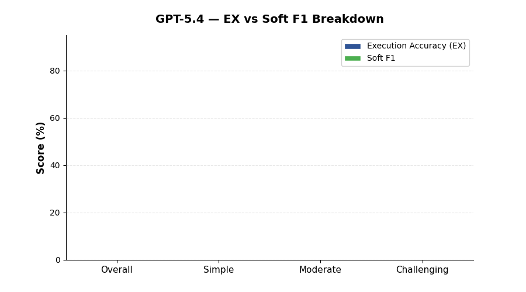

<!--
  © 2026 CVS Health and/or one of its affiliates. All rights reserved.

  Licensed under the Apache License, Version 2.0 (the "License");
  you may not use this file except in compliance with the License.
  You may obtain a copy of the License at

      http://www.apache.org/licenses/LICENSE-2.0

  Unless required by applicable law or agreed to in writing, software
  distributed under the License is distributed on an "AS IS" BASIS,
  WITHOUT WARRANTIES OR CONDITIONS OF ANY KIND, either express or implied.
  See the License for the specific language governing permissions and
  limitations under the License.
-->
# GPT-5.4

BIRD Mini-Dev benchmark results for **GPT-5.4** via OpenAI.

[Back to Overall Results](results.md)

---

## Summary

| | |
|:---|:---|
| **Provider** | OpenAI |
| **Model** | `gpt-5.4` |
| **Overall EX Accuracy** | **54.8%** |
| **Overall Soft F1** | **60.6%** |
| **Error Rate** | 0.6% (3 / 500) |
| **Avg Latency** | 7.0s per question |
| **Total Benchmark Time** | 58.2 minutes |
| **Rank** | #3 overall |

## Detailed Scores

| Metric | Overall | Simple (148) | Moderate (250) | Challenging (102) |
|:---|:---:|:---:|:---:|:---:|
| Execution Accuracy (EX) | **54.8%** | 68.9% | 50.8% | 44.1% |
| Soft F1 | **60.6%** | 71.5% | 58.7% | 49.4% |

## Analysis

### Strengths

- **Most reliable model** — only 3 errors across 500 questions (0.6% error rate), the lowest of any model tested
- **Largest Soft F1 advantage** — F1 exceeds EX by 5.8 points overall, indicating GPT-5.4 frequently generates SQL that is semantically close even when not an exact match
- **Consistent across difficulty** — gradual degradation from 68.9% (simple) to 44.1% (challenging) without sudden drops

### Weaknesses

- **Lower EX than Gemini models** — 9.6 points behind Gemini 2.5 Pro and 5.8 points behind Flash on exact match
- **Moderate latency** at 7.0s, similar to Gemini 2.5 Flash but roughly 2x slower than GPT-5.4 Mini

### When to Use

GPT-5.4 is the best choice when reliability and low error rates are critical. Ideal for:

- Production pipelines where SQL generation failures are costly
- Applications that benefit from partial-credit accuracy (Soft F1 of 60.6%)
- Teams already on OpenAI infrastructure who want maximum capability

### Comparison with Peers

| vs Model | EX Difference | Latency Ratio |
|:---|:---:|:---:|
| vs Gemini 2.5 Pro | -9.6 points | 2.9x faster |
| vs Gemini 2.5 Flash | -5.8 points | 1.04x (similar) |
| vs GPT-5.4 Mini | +1.6 points | 1.9x slower |

---

[Back to Overall Results](results.md)
