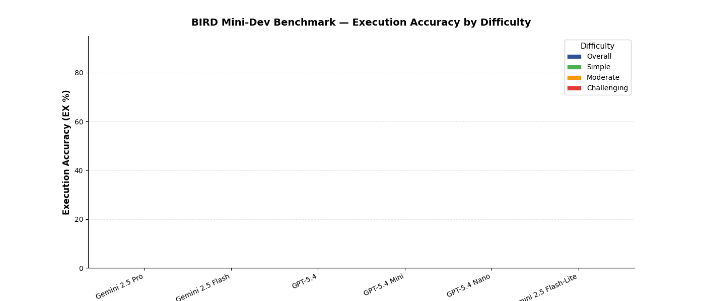
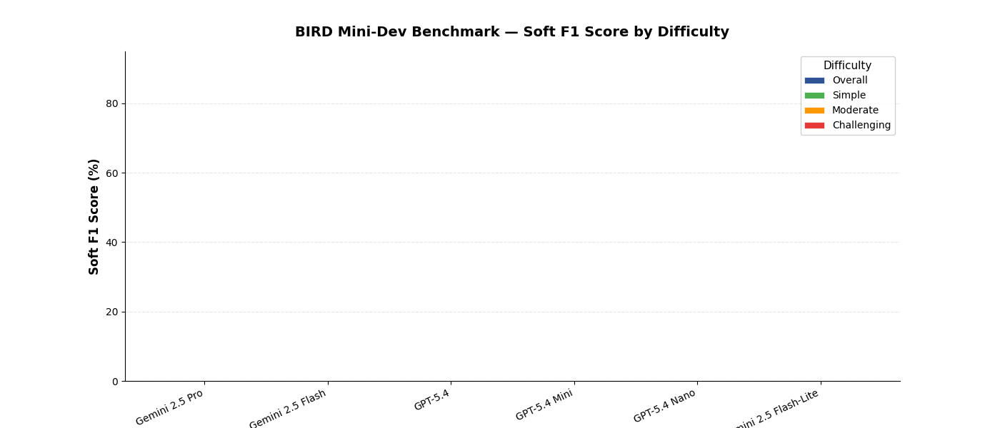
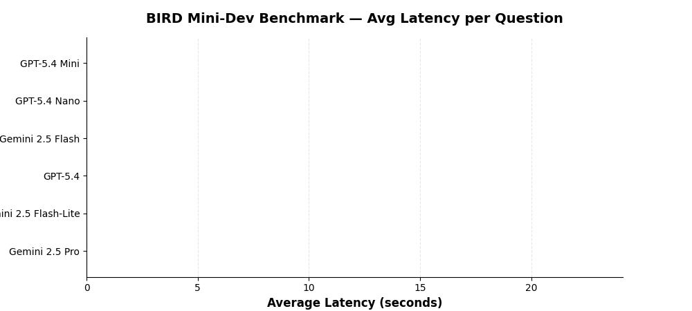
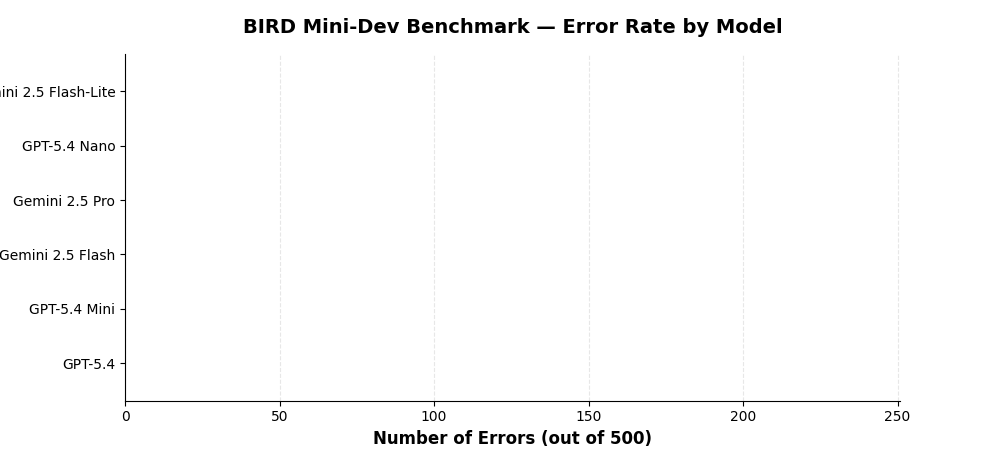

<!--
  © 2026 CVS Health and/or one of its affiliates. All rights reserved.

  Licensed under the Apache License, Version 2.0 (the "License");
  you may not use this file except in compliance with the License.
  You may obtain a copy of the License at

      http://www.apache.org/licenses/LICENSE-2.0

  Unless required by applicable law or agreed to in writing, software
  distributed under the License is distributed on an "AS IS" BASIS,
  WITHOUT WARRANTIES OR CONDITIONS OF ANY KIND, either express or implied.
  See the License for the specific language governing permissions and
  limitations under the License.
-->
# Benchmark Results

BIRD Mini-Dev text-to-SQL benchmark results for Ask RITA across 6 LLM models from OpenAI and Google.

All evaluations use the full 500-question BIRD Mini-Dev dataset with oracle knowledge (evidence) enabled.

## Overall Comparison

### Execution Accuracy (EX)

Execution Accuracy measures whether the predicted SQL produces the same result set as the gold SQL when executed against the database.

| Model | Provider | Overall | Simple (148) | Moderate (250) | Challenging (102) | Errors |
|:---|:---|:---:|:---:|:---:|:---:|:---:|
| [**Gemini 2.5 Pro**](gemini-25-pro.md) | Vertex AI | **64.4%** | 77.0% | 61.2% | 53.9% | 18 |
| [**Gemini 2.5 Flash**](gemini-25-flash.md) | Vertex AI | **60.6%** | 76.4% | 53.6% | 54.9% | 12 |
| [**GPT-5.4**](gpt-54.md) | OpenAI | **54.8%** | 68.9% | 50.8% | 44.1% | 3 |
| [**GPT-5.4 Mini**](gpt-54-mini.md) | OpenAI | **53.2%** | 70.3% | 49.6% | 37.3% | 11 |
| [**GPT-5.4 Nano**](gpt-54-nano.md) | OpenAI | **40.0%** | 53.4% | 36.0% | 30.4% | 34 |
| [**Gemini 2.5 Flash-Lite**](gemini-25-flash-lite.md) | Vertex AI | **39.4%** | 56.1% | 33.2% | 30.4% | 209 |

### Soft F1 Score

Soft F1 measures partial credit — how much overlap exists between predicted and gold result sets, even when they don't match exactly.

| Model | Overall | Simple | Moderate | Challenging |
|:---|:---:|:---:|:---:|:---:|
| [**Gemini 2.5 Pro**](gemini-25-pro.md) | **64.0%** | 75.4% | 61.7% | 53.0% |
| [**Gemini 2.5 Flash**](gemini-25-flash.md) | **62.1%** | 75.1% | 56.8% | 55.9% |
| [**GPT-5.4**](gpt-54.md) | **60.6%** | 71.5% | 58.7% | 49.4% |
| [**GPT-5.4 Mini**](gpt-54-mini.md) | **57.2%** | 72.0% | 55.0% | 41.4% |
| [**GPT-5.4 Nano**](gpt-54-nano.md) | **43.2%** | 56.3% | 40.0% | 31.9% |
| [**Gemini 2.5 Flash-Lite**](gemini-25-flash-lite.md) | **39.0%** | 55.8% | 33.4% | 28.6% |

### Latency

Average time per question including schema retrieval, SQL generation, validation, and execution.

| Model | Provider | Avg Latency | Total Time (500 Qs) |
|:---|:---|:---:|:---:|
| [**GPT-5.4 Mini**](gpt-54-mini.md) | OpenAI | **3.6s** | 29.8 min |
| [**GPT-5.4 Nano**](gpt-54-nano.md) | OpenAI | **4.1s** | 33.9 min |
| [**Gemini 2.5 Flash**](gemini-25-flash.md) | Vertex AI | **6.7s** | 56.0 min |
| [**GPT-5.4**](gpt-54.md) | OpenAI | **7.0s** | 58.2 min |
| [**Gemini 2.5 Flash-Lite**](gemini-25-flash-lite.md) | Vertex AI | **7.2s** | 60.4 min |
| [**Gemini 2.5 Pro**](gemini-25-pro.md) | Vertex AI | **20.1s** | 167.3 min |

### Error Rates

Errors include malformed SQL, timeouts, and queries that fail to execute.

GPT-5.4 has the lowest error rate (3 errors, 0.6%) while Gemini 2.5 Flash-Lite has the highest (209 errors, 41.8%), indicating significant reliability differences between models.

---

## Key Takeaways

1. **Gemini 2.5 Pro leads on accuracy** (64.4% EX) but is 3x slower than most alternatives
2. **GPT-5.4 is the most reliable** with only 3 errors across 500 questions (0.6% error rate)
3. **GPT-5.4 Mini offers the best speed/accuracy tradeoff** — fastest model (3.6s) with competitive accuracy (53.2%)
4. **Challenging questions remain hard for all models** — best score is 54.9% (Gemini 2.5 Flash)
5. **Soft F1 consistently exceeds EX** for OpenAI models, suggesting they generate partially-correct SQL more often than exact matches
6. **Budget models (Nano, Flash-Lite) are not suitable** for production text-to-SQL — both below 40% with high error rates

## Methodology

- **Dataset**: [BIRD Mini-Dev](https://bird-bench.github.io/) — 500 text-to-SQL questions across 11 SQLite databases
- **Difficulty levels**: Simple (148), Moderate (250), Challenging (102)
- **Evidence**: Oracle knowledge (ground-truth evidence) provided for all questions
- **Workflow**: Full Ask RITA `SQLAgentWorkflow` pipeline — schema retrieval, SQL generation, validation, execution
- **Evaluation**: Execution accuracy (result set match) and Soft F1 (partial credit)
- **Date**: March 27, 2026

> For details on running benchmarks yourself, see the [How to Run](guide.md) guide.
