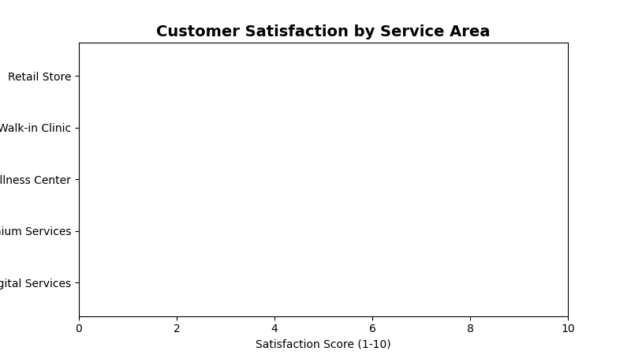

<!--
  © 2026 CVS Health and/or one of its affiliates. All rights reserved.

  Licensed under the Apache License, Version 2.0 (the "License");
  you may not use this file except in compliance with the License.
  You may obtain a copy of the License at

      http://www.apache.org/licenses/LICENSE-2.0

  Unless required by applicable law or agreed to in writing, software
  distributed under the License is distributed on an "AS IS" BASIS,
  WITHOUT WARRANTIES OR CONDITIONS OF ANY KIND, either express or implied.
  See the License for the specific language governing permissions and
  limitations under the License.
-->
# Bar Chart (Horizontal)

## Overview
Displays data as horizontal bars, perfect for comparing categories with long names or when you have limited vertical space. Ideal for ranking data and comparing 2-3 categories with large disparities.

## Sample Preview



## Best Use Cases
- **Service Area Rankings** - Compare satisfaction scores across different service areas
- **Top Performing Stores** - Show best/worst performing locations
- **Survey Response Categories** - Display response volumes by category

## Sample Data Structure

### AskRITA UniversalChartData
```python
from askrita.sqlagent.formatters.DataFormatter import UniversalChartData, ChartDataset, DataPoint

bar_data = UniversalChartData(
    type="horizontal_bar",
    title="Customer Satisfaction by Service Area",
    labels=["Retail Store", "Walk-in Clinic", "Wellness Center", "Premium Services", "Digital Services"],
    datasets=[
        ChartDataset(
            label="Satisfaction Score",
            data=[
                DataPoint(y=8.4, category="Retail Store"),
                DataPoint(y=8.7, category="Walk-in Clinic"),
                DataPoint(y=8.2, category="Wellness Center"),
                DataPoint(y=7.9, category="Premium Services"),
                DataPoint(y=7.1, category="Digital Services")
            ]
        )
    ],
    xAxisLabel="Satisfaction Score (1-10)",
    yAxisLabel="Service Areas"
)
```

## Google Charts Implementation

### HTML Structure
```html
<!DOCTYPE html>
<html>
<head>
    <script type="text/javascript" src="https://www.gstatic.com/charts/loader.js"></script>
</head>
<body>
    <div id="bar_chart" style="width: 900px; height: 500px;"></div>
</body>
</html>
```

### JavaScript Code
```javascript
google.charts.load('current', {'packages':['corechart']});
google.charts.setOnLoadCallback(drawBarChart);

function drawBarChart() {
    var data = google.visualization.arrayToDataTable([
        ['Service Area', 'Satisfaction Score'],
        ['Retail Store', 8.4],
        ['Walk-in Clinic', 8.7],
        ['Wellness Center', 8.2],
        ['Premium Services', 7.9],
        ['Digital Services', 7.1]
    ]);

    var options = {
        title: 'Customer Satisfaction by Service Area',
        titleTextStyle: {
            fontSize: 18,
            bold: true
        },
        width: 900,
        height: 500,
        hAxis: {
            title: 'Satisfaction Score (1-10)',
            minValue: 0,
            maxValue: 10,
            format: '#.#'
        },
        vAxis: {
            title: 'Service Areas'
        },
        colors: ['#4285f4'],
        backgroundColor: 'white',
        chartArea: {
            left: 150,
            top: 80,
            width: '70%',
            height: '75%'
        },
        bar: {
            groupWidth: '75%'
        }
    };

    var chart = new google.visualization.BarChart(document.getElementById('bar_chart'));
    chart.draw(data, options);
}
```

## React Implementation
```tsx
import React, { useEffect, useRef } from 'react';

interface BarChartProps {
    data: Array<{
        category: string;
        value: number;
    }>;
    title?: string;
    width?: number;
    height?: number;
    xAxisLabel?: string;
    yAxisLabel?: string;
}

const HorizontalBarChart: React.FC<BarChartProps> = ({
    data,
    title = "Horizontal Bar Chart",
    width = 900,
    height = 500,
    xAxisLabel = "Value",
    yAxisLabel = "Category"
}) => {
    const chartRef = useRef<HTMLDivElement>(null);

    useEffect(() => {
        if (!window.google || !chartRef.current) return;

        const chartData = new google.visualization.DataTable();
        chartData.addColumn('string', 'Category');
        chartData.addColumn('number', 'Value');

        const rows = data.map(item => [item.category, item.value]);
        chartData.addRows(rows);

        const options = {
            title: title,
            width: width,
            height: height,
            hAxis: {
                title: xAxisLabel,
                minValue: 0
            },
            vAxis: {
                title: yAxisLabel
            },
            colors: ['#4285f4'],
            chartArea: {
                left: 150,
                top: 80,
                width: '70%',
                height: '75%'
            }
        };

        const chart = new google.visualization.BarChart(chartRef.current);
        chart.draw(chartData, options);
    }, [data, title, width, height, xAxisLabel, yAxisLabel]);

    return <div ref={chartRef} style={{ width: `${width}px`, height: `${height}px` }} />;
};

export default HorizontalBarChart;
```

## Survey Data Examples

### Top Performing Locations
```javascript
// Best performing store locations
var data = google.visualization.arrayToDataTable([
    ['Store Location', 'NPS Score'],
    ['Store #1234 - Boston, MA', 85],
    ['Store #5678 - Austin, TX', 82],
    ['Store #9012 - Seattle, WA', 80],
    ['Store #3456 - Denver, CO', 78],
    ['Store #7890 - Phoenix, AZ', 76]
]);

var options = {
    title: 'Top 5 Performing Store Locations (NPS Score)',
    hAxis: {
        title: 'Net Promoter Score',
        minValue: 0,
        maxValue: 100
    },
    colors: ['#28a745']
};
```

### Service Category Comparison
```javascript
// Satisfaction across different service categories
var data = google.visualization.arrayToDataTable([
    ['Service Category', 'Average Rating'],
    ['Prescription Services', 8.7],
    ['Health Consultations', 8.4],
    ['Immunizations', 8.2],
    ['Health Screenings', 7.9],
    ['Digital App Experience', 7.1]
]);

var options = {
    title: 'Customer Satisfaction by Service Category',
    hAxis: {
        title: 'Average Rating (1-10 scale)',
        minValue: 0,
        maxValue: 10
    },
    colors: ['#ff7f0e'],
    bar: { groupWidth: '80%' }
};
```

### Response Volume by Demographics
```javascript
// Survey response volume by age group
var data = google.visualization.arrayToDataTable([
    ['Age Group', 'Response Count'],
    ['65+ Years', 12450],
    ['55-64 Years', 8920],
    ['45-54 Years', 6780],
    ['35-44 Years', 4560],
    ['25-34 Years', 3210],
    ['18-24 Years', 1890]
]);

var options = {
    title: 'Survey Response Volume by Age Group',
    hAxis: {
        title: 'Number of Responses',
        format: '#,###'
    },
    colors: ['#9467bd']
};
```

## Advanced Features

### Color Coding by Performance
```javascript
function getColorForValue(value, threshold) {
    if (value >= threshold.high) return '#28a745'; // Green
    if (value >= threshold.medium) return '#ffc107'; // Yellow
    return '#dc3545'; // Red
}

// Apply conditional coloring
var data = google.visualization.arrayToDataTable([
    ['Service Area', 'Score', { role: 'style' }],
    ['Walk-in Clinic', 8.7, getColorForValue(8.7, {high: 8.0, medium: 7.0})],
    ['Retail Store', 8.4, getColorForValue(8.4, {high: 8.0, medium: 7.0})],
    ['Wellness Center', 8.2, getColorForValue(8.2, {high: 8.0, medium: 7.0})],
    ['Premium Services', 7.9, getColorForValue(7.9, {high: 8.0, medium: 7.0})],
    ['Digital Services', 7.1, getColorForValue(7.1, {high: 8.0, medium: 7.0})]
]);
```

### Interactive Selection
```javascript
function drawInteractiveBarChart() {
    var data = google.visualization.arrayToDataTable([
        ['Service Area', 'Score'],
        ['Walk-in Clinic', 8.7],
        ['Retail Store', 8.4],
        ['Wellness Center', 8.2],
        ['Premium Services', 7.9],
        ['Digital Services', 7.1]
    ]);

    var options = { title: 'Customer Satisfaction by Service Area' };
    var chart = new google.visualization.BarChart(document.getElementById('bar_chart'));
    
    google.visualization.events.addListener(chart, 'select', function() {
        var selection = chart.getSelection();
        if (selection.length > 0) {
            var row = selection[0].row;
            var category = data.getValue(row, 0);
            var value = data.getValue(row, 1);
            showDetailedAnalysis(category, value);
        }
    });
    
    chart.draw(data, options);
}

function showDetailedAnalysis(category, value) {
    // Load detailed data for selected category
    console.log(`Selected: ${category} with value ${value}`);
    // Could trigger a modal, navigate to detail page, etc.
}
```

### Animated Updates
```javascript
function animateBarChart() {
    var currentData = initialData;
    
    function updateChart() {
        // Simulate data updates
        for (let i = 1; i < currentData.getNumberOfRows(); i++) {
            const currentValue = currentData.getValue(i, 1);
            const newValue = currentValue + (Math.random() - 0.5) * 0.5;
            currentData.setValue(i, 1, Math.max(0, Math.min(10, newValue)));
        }
        
        chart.draw(currentData, options);
    }
    
    // Update every 3 seconds
    setInterval(updateChart, 3000);
}
```

## Key Features
- **Long Category Names** - Horizontal layout accommodates lengthy labels
- **Easy Comparison** - Natural left-to-right reading pattern
- **Space Efficient** - Works well in narrow containers
- **Color Coding** - Visual performance indicators
- **Interactive Selection** - Click handling for drill-down

## When to Use
✅ **Perfect for:**
- Ranking/leaderboard displays
- Long category names
- Limited vertical space
- 2-8 categories comparison
- Performance scorecards

❌ **Avoid when:**
- Many categories (>10)
- Time series data
- Part-to-whole relationships
- Multiple data series needed

## Responsive Design
```javascript
function createResponsiveBarChart() {
    function drawChart() {
        const container = document.getElementById('bar_chart');
        const width = container.offsetWidth;
        const height = Math.max(300, data.getNumberOfRows() * 60 + 100);
        
        const options = {
            ...baseOptions,
            width: width,
            height: height,
            chartArea: {
                left: Math.max(100, width * 0.2),
                top: 60,
                width: width * 0.7,
                height: height - 120
            }
        };
        
        chart.draw(data, options);
    }
    
    drawChart();
    window.addEventListener('resize', debounce(drawChart, 250));
}
```

## Documentation
- [Google Charts BarChart Documentation](https://developers.google.com/chart/interactive/docs/gallery/barchart)
