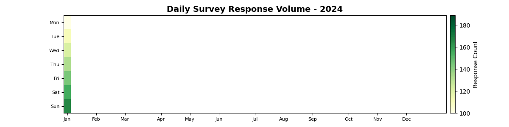

<!--
  © 2026 CVS Health and/or one of its affiliates. All rights reserved.

  Licensed under the Apache License, Version 2.0 (the "License");
  you may not use this file except in compliance with the License.
  You may obtain a copy of the License at

      http://www.apache.org/licenses/LICENSE-2.0

  Unless required by applicable law or agreed to in writing, software
  distributed under the License is distributed on an "AS IS" BASIS,
  WITHOUT WARRANTIES OR CONDITIONS OF ANY KIND, either express or implied.
  See the License for the specific language governing permissions and
  limitations under the License.
-->
# Calendar Heatmap Chart

## Overview
Displays data as a calendar with color-coded cells representing values for each day. Perfect for showing patterns over time, seasonal trends, or daily activity levels.

## Sample Preview



## Best Use Cases
- **Daily Survey Response Volume** - Show response patterns throughout the year
- **Satisfaction Score Trends** - Track daily satisfaction levels with color intensity
- **Campaign Activity Calendar** - Visualize when surveys were active

## Sample Data Structure

### AskRITA UniversalChartData
```python
from askrita.sqlagent.formatters.DataFormatter import UniversalChartData
from datetime import datetime, timedelta

# Generate sample calendar data
start_date = datetime(2024, 1, 1)
calendar_data_list = []

for i in range(365):
    current_date = start_date + timedelta(days=i)
    # Simulate response volume with some seasonality
    base_volume = 100
    seasonal_factor = 1 + 0.3 * (i % 30) / 30  # Monthly variation
    daily_volume = int(base_volume * seasonal_factor + (i % 7) * 10)  # Weekly pattern
    
    calendar_data_list.append({
        "date": current_date.strftime("%Y-%m-%d"),
        "value": daily_volume
    })

calendar_data = UniversalChartData(
    type="calendar",
    title="Daily Survey Response Volume - 2024",
    datasets=[],  # Empty for calendar charts
    calendar_data=calendar_data_list
)
```

## Google Charts Implementation

### HTML Structure
```html
<!DOCTYPE html>
<html>
<head>
    <script type="text/javascript" src="https://www.gstatic.com/charts/loader.js"></script>
</head>
<body>
    <div id="calendar_chart" style="width: 1000px; height: 350px;"></div>
</body>
</html>
```

### JavaScript Code
```javascript
google.charts.load('current', {'packages':['calendar']});
google.charts.setOnLoadCallback(drawCalendarChart);

function drawCalendarChart() {
    var dataTable = new google.visualization.DataTable();
    dataTable.addColumn({ type: 'date', id: 'Date' });
    dataTable.addColumn({ type: 'number', id: 'Response Count' });

    // Sample data for 2024
    var data = [];
    var startDate = new Date(2024, 0, 1); // January 1, 2024
    
    for (var i = 0; i < 365; i++) {
        var currentDate = new Date(startDate);
        currentDate.setDate(startDate.getDate() + i);
        
        // Simulate response volume with patterns
        var baseVolume = 100;
        var dayOfWeek = currentDate.getDay();
        var weekdayMultiplier = dayOfWeek === 0 || dayOfWeek === 6 ? 0.7 : 1.0; // Lower on weekends
        var monthlyVariation = 1 + 0.3 * Math.sin((i / 30) * Math.PI); // Seasonal pattern
        var randomVariation = 0.8 + Math.random() * 0.4; // Random daily variation
        
        var responseCount = Math.round(baseVolume * weekdayMultiplier * monthlyVariation * randomVariation);
        
        data.push([currentDate, responseCount]);
    }
    
    dataTable.addRows(data);

    var options = {
        title: 'Daily Survey Response Volume - 2024',
        titleTextStyle: {
            fontSize: 18,
            bold: true
        },
        width: 1000,
        height: 350,
        calendar: {
            cellSize: 15,
            cellColor: {
                stroke: '#76a7fa',
                strokeOpacity: 0.2,
                strokeWidth: 1
            },
            focusedCellColor: {
                stroke: '#d3362d',
                strokeOpacity: 1,
                strokeWidth: 2
            },
            dayOfWeekLabel: {
                fontName: 'Arial',
                fontSize: 12,
                color: '#1f1f1f',
                bold: false,
                italic: false
            },
            dayOfWeekRightSpace: 10,
            daysOfWeek: 'SMTWTFS'
        },
        colorAxis: {
            minValue: 50,
            maxValue: 200,
            colors: ['#e8f4fd', '#4285f4', '#1a73e8', '#0d47a1']
        },
        tooltip: {
            textStyle: {
                fontSize: 12
            }
        }
    };

    var chart = new google.visualization.Calendar(document.getElementById('calendar_chart'));
    chart.draw(dataTable, options);
}
```

## React Implementation
```tsx
import React, { useEffect, useRef } from 'react';

interface CalendarData {
    date: Date;
    value: number;
}

interface CalendarChartProps {
    data: CalendarData[];
    title?: string;
    width?: number;
    height?: number;
    colorRange?: {
        minValue: number;
        maxValue: number;
        colors: string[];
    };
}

const CalendarChart: React.FC<CalendarChartProps> = ({
    data,
    title = "Calendar Heatmap",
    width = 1000,
    height = 350,
    colorRange = {
        minValue: 0,
        maxValue: 100,
        colors: ['#e8f4fd', '#4285f4', '#1a73e8', '#0d47a1']
    }
}) => {
    const chartRef = useRef<HTMLDivElement>(null);

    useEffect(() => {
        if (!window.google || !chartRef.current) return;

        const dataTable = new google.visualization.DataTable();
        dataTable.addColumn({ type: 'date', id: 'Date' });
        dataTable.addColumn({ type: 'number', id: 'Value' });

        const rows = data.map(item => [item.date, item.value]);
        dataTable.addRows(rows);

        const options = {
            title: title,
            width: width,
            height: height,
            calendar: {
                cellSize: 15,
                cellColor: {
                    stroke: '#76a7fa',
                    strokeOpacity: 0.2,
                    strokeWidth: 1
                },
                focusedCellColor: {
                    stroke: '#d3362d',
                    strokeOpacity: 1,
                    strokeWidth: 2
                }
            },
            colorAxis: colorRange
        };

        const chart = new google.visualization.Calendar(chartRef.current);
        chart.draw(dataTable, options);
    }, [data, title, width, height, colorRange]);

    return <div ref={chartRef} style={{ width: `${width}px`, height: `${height}px` }} />;
};

export default CalendarChart;
```

## Survey Data Examples

### Daily Response Volume Calendar
```javascript
// Survey response volume throughout the year
function drawResponseVolumeCalendar() {
    var dataTable = new google.visualization.DataTable();
    dataTable.addColumn({ type: 'date', id: 'Date' });
    dataTable.addColumn({ type: 'number', id: 'Responses' });

    // Generate realistic survey response data
    var data = [];
    var startDate = new Date(2024, 0, 1);
    
    for (var i = 0; i < 365; i++) {
        var currentDate = new Date(startDate);
        currentDate.setDate(startDate.getDate() + i);
        
        var dayOfWeek = currentDate.getDay();
        var month = currentDate.getMonth();
        
        // Business patterns
        var weekdayFactor = (dayOfWeek >= 1 && dayOfWeek <= 5) ? 1.0 : 0.3; // Lower on weekends
        var holidayFactor = isHoliday(currentDate) ? 0.1 : 1.0; // Much lower on holidays
        var seasonalFactor = getSeasonalFactor(month); // Seasonal business patterns
        
        var baseResponses = 150;
        var responses = Math.round(baseResponses * weekdayFactor * holidayFactor * seasonalFactor * (0.8 + Math.random() * 0.4));
        
        data.push([currentDate, responses]);
    }
    
    dataTable.addRows(data);

    var options = {
        title: 'Daily Survey Response Volume - 2024',
        width: 1000,
        height: 350,
        colorAxis: {
            minValue: 0,
            maxValue: 250,
            colors: ['#f8f9fa', '#e3f2fd', '#4285f4', '#1565c0', '#0d47a1']
        },
        calendar: {
            cellSize: 16,
            monthLabel: {
                fontName: 'Arial',
                fontSize: 14,
                color: '#333',
                bold: true
            }
        }
    };

    var chart = new google.visualization.Calendar(document.getElementById('calendar_chart'));
    chart.draw(dataTable, options);
}

function isHoliday(date) {
    // Define major holidays that affect business
    var holidays = [
        '2024-01-01', // New Year's Day
        '2024-07-04', // Independence Day
        '2024-11-28', // Thanksgiving
        '2024-12-25'  // Christmas
    ];
    
    var dateString = date.toISOString().split('T')[0];
    return holidays.includes(dateString);
}

function getSeasonalFactor(month) {
    // Seasonal business patterns
    var factors = [0.8, 0.9, 1.0, 1.1, 1.2, 1.1, 0.9, 0.8, 1.0, 1.1, 1.0, 0.7];
    return factors[month];
}
```

### Customer Satisfaction Heat Calendar
```javascript
// Daily average satisfaction scores
function drawSatisfactionCalendar() {
    var dataTable = new google.visualization.DataTable();
    dataTable.addColumn({ type: 'date', id: 'Date' });
    dataTable.addColumn({ type: 'number', id: 'Avg Satisfaction' });

    var data = [];
    var startDate = new Date(2024, 0, 1);
    
    for (var i = 0; i < 365; i++) {
        var currentDate = new Date(startDate);
        currentDate.setDate(startDate.getDate() + i);
        
        // Simulate satisfaction scores with realistic patterns
        var baseSatisfaction = 8.0;
        var dayOfWeek = currentDate.getDay();
        var weekdayEffect = (dayOfWeek === 1) ? -0.3 : 0; // Monday blues
        var fridayEffect = (dayOfWeek === 5) ? 0.2 : 0; // Friday happiness
        var monthlyTrend = 0.1 * Math.sin((i / 365) * 2 * Math.PI); // Annual trend
        var randomVariation = (Math.random() - 0.5) * 0.8;
        
        var satisfaction = baseSatisfaction + weekdayEffect + fridayEffect + monthlyTrend + randomVariation;
        satisfaction = Math.max(6.0, Math.min(10.0, satisfaction)); // Clamp between 6-10
        
        data.push([currentDate, Math.round(satisfaction * 10) / 10]); // Round to 1 decimal
    }
    
    dataTable.addRows(data);

    var options = {
        title: 'Daily Average Customer Satisfaction Score - 2024',
        width: 1000,
        height: 350,
        colorAxis: {
            minValue: 6.0,
            maxValue: 9.5,
            colors: ['#ff5252', '#ff9800', '#ffc107', '#8bc34a', '#4caf50']
        },
        calendar: {
            cellSize: 16
        },
        tooltip: {
            textStyle: { fontSize: 12 },
            showColorCode: true
        }
    };

    var chart = new google.visualization.Calendar(document.getElementById('calendar_chart'));
    chart.draw(dataTable, options);
}
```

### Campaign Activity Calendar
```javascript
// Show when different survey campaigns were active
function drawCampaignActivityCalendar() {
    var dataTable = new google.visualization.DataTable();
    dataTable.addColumn({ type: 'date', id: 'Date' });
    dataTable.addColumn({ type: 'number', id: 'Campaign Activity' });

    var data = [];
    var startDate = new Date(2024, 0, 1);
    
    // Define campaign periods
    var campaigns = [
        { start: new Date(2024, 0, 15), end: new Date(2024, 1, 15), intensity: 3 }, // Q1 Email Campaign
        { start: new Date(2024, 2, 1), end: new Date(2024, 2, 31), intensity: 2 },  // March SMS Campaign
        { start: new Date(2024, 4, 10), end: new Date(2024, 5, 10), intensity: 4 }, // Major NPS Study
        { start: new Date(2024, 6, 1), end: new Date(2024, 6, 30), intensity: 1 },  // Summer Pulse
        { start: new Date(2024, 8, 15), end: new Date(2024, 9, 15), intensity: 3 }, // Fall Campaign
        { start: new Date(2024, 10, 1), end: new Date(2024, 10, 30), intensity: 2 } // Year-end Survey
    ];
    
    for (var i = 0; i < 365; i++) {
        var currentDate = new Date(startDate);
        currentDate.setDate(startDate.getDate() + i);
        
        var activity = 0;
        campaigns.forEach(function(campaign) {
            if (currentDate >= campaign.start && currentDate <= campaign.end) {
                activity = Math.max(activity, campaign.intensity);
            }
        });
        
        data.push([currentDate, activity]);
    }
    
    dataTable.addRows(data);

    var options = {
        title: 'Survey Campaign Activity Calendar - 2024',
        width: 1000,
        height: 350,
        colorAxis: {
            minValue: 0,
            maxValue: 4,
            colors: ['#f5f5f5', '#bbdefb', '#4285f4', '#1976d2', '#0d47a1']
        },
        calendar: {
            cellSize: 16
        }
    };

    var chart = new google.visualization.Calendar(document.getElementById('calendar_chart'));
    chart.draw(dataTable, options);
}
```

## Advanced Features

### Interactive Calendar with Drill-Down
```javascript
function drawInteractiveCalendar() {
    var chart = new google.visualization.Calendar(document.getElementById('calendar_chart'));
    
    google.visualization.events.addListener(chart, 'select', function() {
        var selection = chart.getSelection();
        if (selection.length > 0) {
            var row = selection[0].row;
            var date = dataTable.getValue(row, 0);
            var value = dataTable.getValue(row, 1);
            
            showDayDetails(date, value);
        }
    });
    
    chart.draw(dataTable, options);
}

function showDayDetails(date, value) {
    const detailPanel = document.getElementById('day-details');
    const dateString = date.toLocaleDateString();
    
    detailPanel.innerHTML = `
        <div class="day-detail">
            <h4>${dateString}</h4>
            <p><strong>Response Count:</strong> ${value}</p>
            <p><strong>Day of Week:</strong> ${date.toLocaleDateString('en-US', { weekday: 'long' })}</p>
            <button onclick="loadDayBreakdown('${date.toISOString().split('T')[0]}')">
                View Detailed Breakdown
            </button>
        </div>
    `;
    detailPanel.style.display = 'block';
}
```

### Multi-Year Calendar Comparison
```javascript
function drawMultiYearCalendar() {
    // Create separate calendars for each year
    var years = [2023, 2024];
    
    years.forEach(function(year, index) {
        var containerId = 'calendar_chart_' + year;
        var dataTable = generateYearData(year);
        
        var options = {
            title: `Survey Response Volume - ${year}`,
            width: 1000,
            height: 350,
            colorAxis: {
                minValue: 0,
                maxValue: 250,
                colors: ['#f8f9fa', '#4285f4', '#0d47a1']
            }
        };
        
        var chart = new google.visualization.Calendar(document.getElementById(containerId));
        chart.draw(dataTable, options);
    });
}

function generateYearData(year) {
    var dataTable = new google.visualization.DataTable();
    dataTable.addColumn({ type: 'date', id: 'Date' });
    dataTable.addColumn({ type: 'number', id: 'Responses' });
    
    var data = [];
    var startDate = new Date(year, 0, 1);
    var daysInYear = isLeapYear(year) ? 366 : 365;
    
    for (var i = 0; i < daysInYear; i++) {
        var currentDate = new Date(startDate);
        currentDate.setDate(startDate.getDate() + i);
        
        // Generate data with year-specific trends
        var baseValue = 100 + (year - 2023) * 20; // Growth over years
        var seasonalPattern = 50 * Math.sin((i / daysInYear) * 2 * Math.PI);
        var randomVariation = (Math.random() - 0.5) * 40;
        
        var value = Math.max(0, Math.round(baseValue + seasonalPattern + randomVariation));
        data.push([currentDate, value]);
    }
    
    dataTable.addRows(data);
    return dataTable;
}
```

### Custom Color Schemes
```javascript
// Different color schemes for different metrics
var colorSchemes = {
    volume: {
        colors: ['#f8f9fa', '#e3f2fd', '#4285f4', '#1565c0', '#0d47a1'],
        minValue: 0,
        maxValue: 300
    },
    satisfaction: {
        colors: ['#ffebee', '#ffcdd2', '#ffc107', '#8bc34a', '#4caf50'],
        minValue: 6.0,
        maxValue: 9.5
    },
    nps: {
        colors: ['#ffcdd2', '#ffeb3b', '#8bc34a', '#4caf50', '#2e7d32'],
        minValue: -100,
        maxValue: 100
    }
};

function applyColorScheme(scheme) {
    options.colorAxis = colorSchemes[scheme];
    chart.draw(dataTable, options);
}
```

## Key Features
- **Temporal Patterns** - Shows daily patterns over extended periods
- **Color Intensity** - Visual representation of value magnitude
- **Seasonal Trends** - Easy identification of seasonal patterns
- **Interactive Selection** - Click handling for daily details
- **Compact Display** - Year-at-a-glance visualization

## When to Use
✅ **Perfect for:**
- Daily activity patterns
- Seasonal trend analysis
- Long-term pattern identification
- Activity intensity visualization
- Comparative year-over-year analysis

❌ **Avoid when:**
- Hourly or minute-level data
- Non-temporal data
- Precise value comparison needed
- Small datasets (<30 days)

## Performance Considerations
```javascript
// For large datasets, consider data aggregation
function aggregateWeeklyData(dailyData) {
    const weeklyData = [];
    
    for (let i = 0; i < dailyData.length; i += 7) {
        const weekData = dailyData.slice(i, i + 7);
        const weekStart = weekData[0].date;
        const weekAverage = weekData.reduce((sum, day) => sum + day.value, 0) / weekData.length;
        
        // Create 7 entries for the week with the same average value
        weekData.forEach((day, index) => {
            weeklyData.push([new Date(weekStart.getTime() + index * 24 * 60 * 60 * 1000), weekAverage]);
        });
    }
    
    return weeklyData;
}
```

## Documentation
- [Google Charts Calendar Documentation](https://developers.google.com/chart/interactive/docs/gallery/calendar)
