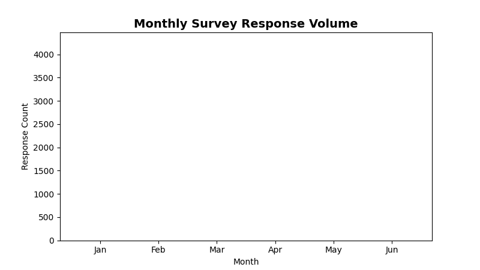

<!--
  © 2026 CVS Health and/or one of its affiliates. All rights reserved.

  Licensed under the Apache License, Version 2.0 (the "License");
  you may not use this file except in compliance with the License.
  You may obtain a copy of the License at

      http://www.apache.org/licenses/LICENSE-2.0

  Unless required by applicable law or agreed to in writing, software
  distributed under the License is distributed on an "AS IS" BASIS,
  WITHOUT WARRANTIES OR CONDITIONS OF ANY KIND, either express or implied.
  See the License for the specific language governing permissions and
  limitations under the License.
-->
# Column Chart (Vertical Bar)

## Overview
Displays data as vertical columns, perfect for comparing categorical data over time or across different categories. The standard choice for most comparison visualizations.

## Sample Preview



## Best Use Cases
- **Monthly Survey Responses** - Track response volumes over time
- **Satisfaction by Business Unit** - Compare scores across departments
- **Performance Metrics** - Show KPI values across categories

## Sample Data Structure

### AskRITA UniversalChartData
```python
from askrita.sqlagent.formatters.DataFormatter import UniversalChartData, ChartDataset, DataPoint

column_data = UniversalChartData(
    type="bar",  # Note: "bar" type creates vertical columns in AskRITA
    title="Monthly Survey Response Volume",
    labels=["Jan", "Feb", "Mar", "Apr", "May", "Jun"],
    datasets=[
        ChartDataset(
            label="Response Count",
            data=[
                DataPoint(y=2450, category="Jan"),
                DataPoint(y=2890, category="Feb"),
                DataPoint(y=3120, category="Mar"),
                DataPoint(y=2780, category="Apr"),
                DataPoint(y=3450, category="May"),
                DataPoint(y=3890, category="Jun")
            ]
        )
    ],
    xAxisLabel="Month",
    yAxisLabel="Response Count"
)
```

## Google Charts Implementation

### HTML Structure
```html
<!DOCTYPE html>
<html>
<head>
    <script type="text/javascript" src="https://www.gstatic.com/charts/loader.js"></script>
</head>
<body>
    <div id="column_chart" style="width: 900px; height: 500px;"></div>
</body>
</html>
```

### JavaScript Code
```javascript
google.charts.load('current', {'packages':['corechart']});
google.charts.setOnLoadCallback(drawColumnChart);

function drawColumnChart() {
    var data = google.visualization.arrayToDataTable([
        ['Month', 'Response Count'],
        ['Jan', 2450],
        ['Feb', 2890],
        ['Mar', 3120],
        ['Apr', 2780],
        ['May', 3450],
        ['Jun', 3890]
    ]);

    var options = {
        title: 'Monthly Survey Response Volume',
        titleTextStyle: {
            fontSize: 18,
            bold: true
        },
        width: 900,
        height: 500,
        hAxis: {
            title: 'Month'
        },
        vAxis: {
            title: 'Response Count',
            format: '#,###',
            minValue: 0
        },
        colors: ['#4285f4'],
        backgroundColor: 'white',
        chartArea: {
            left: 80,
            top: 80,
            width: '80%',
            height: '70%'
        },
        bar: {
            groupWidth: '75%'
        }
    };

    var chart = new google.visualization.ColumnChart(document.getElementById('column_chart'));
    chart.draw(data, options);
}
```

### Multi-Series Column Chart
```javascript
function drawMultiSeriesColumnChart() {
    var data = google.visualization.arrayToDataTable([
        ['Business Unit', 'Q1 Satisfaction', 'Q2 Satisfaction', 'Q3 Satisfaction'],
        ['Retail Store', 8.2, 8.4, 8.6],
        ['Walk-in Clinic', 8.5, 8.7, 8.8],
        ['Wellness Center', 7.9, 8.1, 8.3],
        ['Digital Services', 6.8, 7.2, 7.5]
    ]);

    var options = {
        title: 'Quarterly Satisfaction Scores by Business Unit',
        width: 900,
        height: 500,
        hAxis: {
            title: 'Business Unit'
        },
        vAxis: {
            title: 'Satisfaction Score (1-10)',
            minValue: 0,
            maxValue: 10
        },
        colors: ['#4285f4', '#34a853', '#fbbc04'],
        legend: {
            position: 'top',
            alignment: 'center'
        }
    };

    var chart = new google.visualization.ColumnChart(document.getElementById('column_chart'));
    chart.draw(data, options);
}
```

## React Implementation
```tsx
import React, { useEffect, useRef } from 'react';

interface ColumnChartProps {
    data: Array<{
        category: string;
        value: number;
        series?: string;
    }>;
    title?: string;
    width?: number;
    height?: number;
    xAxisLabel?: string;
    yAxisLabel?: string;
    multiSeries?: boolean;
}

const ColumnChart: React.FC<ColumnChartProps> = ({
    data,
    title = "Column Chart",
    width = 900,
    height = 500,
    xAxisLabel = "Category",
    yAxisLabel = "Value",
    multiSeries = false
}) => {
    const chartRef = useRef<HTMLDivElement>(null);

    useEffect(() => {
        if (!window.google || !chartRef.current) return;

        let chartData;
        
        if (multiSeries) {
            // Group data by category and series
            const grouped = data.reduce((acc, item) => {
                if (!acc[item.category]) acc[item.category] = {};
                acc[item.category][item.series || 'Value'] = item.value;
                return acc;
            }, {} as Record<string, Record<string, number>>);

            const categories = Object.keys(grouped);
            const series = [...new Set(data.map(item => item.series || 'Value'))];
            
            chartData = new google.visualization.DataTable();
            chartData.addColumn('string', 'Category');
            series.forEach(s => chartData.addColumn('number', s));

            const rows = categories.map(cat => [
                cat,
                ...series.map(s => grouped[cat][s] || 0)
            ]);
            chartData.addRows(rows);
        } else {
            chartData = new google.visualization.DataTable();
            chartData.addColumn('string', 'Category');
            chartData.addColumn('number', 'Value');

            const rows = data.map(item => [item.category, item.value]);
            chartData.addRows(rows);
        }

        const options = {
            title: title,
            width: width,
            height: height,
            hAxis: {
                title: xAxisLabel
            },
            vAxis: {
                title: yAxisLabel,
                minValue: 0
            },
            colors: ['#4285f4', '#34a853', '#fbbc04', '#ea4335'],
            chartArea: {
                left: 80,
                top: 80,
                width: '80%',
                height: '70%'
            }
        };

        const chart = new google.visualization.ColumnChart(chartRef.current);
        chart.draw(chartData, options);
    }, [data, title, width, height, xAxisLabel, yAxisLabel, multiSeries]);

    return <div ref={chartRef} style={{ width: `${width}px`, height: `${height}px` }} />;
};

export default ColumnChart;
```

## Survey Data Examples

### Satisfaction Trends Over Time
```javascript
// Monthly satisfaction scores
var data = google.visualization.arrayToDataTable([
    ['Month', 'NPS Score', 'CSAT Score'],
    ['Jan 2024', 68, 8.2],
    ['Feb 2024', 71, 8.4],
    ['Mar 2024', 74, 8.6],
    ['Apr 2024', 72, 8.3],
    ['May 2024', 76, 8.7],
    ['Jun 2024', 78, 8.9]
]);

var options = {
    title: 'Customer Satisfaction Trends',
    hAxis: { title: 'Month' },
    vAxes: {
        0: { title: 'NPS Score', minValue: 0, maxValue: 100 },
        1: { title: 'CSAT Score', minValue: 0, maxValue: 10 }
    },
    series: {
        0: { targetAxisIndex: 0, color: '#4285f4' },
        1: { targetAxisIndex: 1, color: '#34a853' }
    }
};
```

### Response Volume by Channel
```javascript
// Survey responses by different channels
var data = google.visualization.arrayToDataTable([
    ['Channel', 'Responses'],
    ['Email Survey', 15420],
    ['SMS Survey', 8932],
    ['Phone Survey', 5621],
    ['In-Store Kiosk', 3210],
    ['Mobile App', 2890],
    ['Website Pop-up', 1456]
]);

var options = {
    title: 'Survey Response Volume by Channel',
    hAxis: { title: 'Survey Channel' },
    vAxis: { 
        title: 'Number of Responses',
        format: '#,###'
    },
    colors: ['#ff7f0e'],
    bar: { groupWidth: '70%' }
};
```

### Departmental Performance Comparison
```javascript
// Satisfaction scores across departments
var data = google.visualization.arrayToDataTable([
    ['Department', 'Current Quarter', 'Previous Quarter', 'Target'],
    ['Pharmacy', 8.4, 8.2, 8.5],
    ['Walk-in Clinic', 8.7, 8.5, 8.5],
    ['Wellness Center', 8.1, 7.9, 8.5],
    ['Customer Service', 7.8, 7.6, 8.5],
    ['Digital Experience', 7.2, 6.9, 8.5]
]);

var options = {
    title: 'Department Satisfaction Scores vs Target',
    hAxis: { title: 'Department' },
    vAxis: { 
        title: 'Satisfaction Score (1-10)',
        minValue: 6,
        maxValue: 9
    },
    colors: ['#4285f4', '#9aa0a6', '#ea4335'],
    legend: { position: 'top' }
};
```

## Advanced Features

### Stacked Column Chart
```javascript
function drawStackedColumnChart() {
    var data = google.visualization.arrayToDataTable([
        ['Service Area', 'Promoters', 'Passives', 'Detractors'],
        ['Retail Store', 65, 25, 10],
        ['Walk-in Clinic', 70, 22, 8],
        ['Wellness Center', 58, 30, 12],
        ['Digital Services', 45, 35, 20]
    ]);

    var options = {
        title: 'NPS Distribution by Service Area',
        isStacked: true,
        hAxis: { title: 'Service Area' },
        vAxis: { title: 'Percentage of Customers' },
        colors: ['#28a745', '#ffc107', '#dc3545']
    };

    var chart = new google.visualization.ColumnChart(document.getElementById('column_chart'));
    chart.draw(data, options);
}
```

### 100% Stacked Column Chart
```javascript
function draw100PercentStackedChart() {
    var data = google.visualization.arrayToDataTable([
        ['Service Area', 'Promoters', 'Passives', 'Detractors'],
        ['Retail Store', 65, 25, 10],
        ['Walk-in Clinic', 70, 22, 8],
        ['Wellness Center', 58, 30, 12],
        ['Digital Services', 45, 35, 20]
    ]);

    var options = {
        title: 'NPS Distribution by Service Area (Percentage)',
        isStacked: 'percent',
        hAxis: { title: 'Service Area' },
        vAxis: { 
            title: 'Percentage',
            format: '#\'%\''
        },
        colors: ['#28a745', '#ffc107', '#dc3545']
    };

    var chart = new google.visualization.ColumnChart(document.getElementById('column_chart'));
    chart.draw(data, options);
}
```

### Interactive Column Chart with Drill-Down
```javascript
function drawInteractiveColumnChart() {
    var chart = new google.visualization.ColumnChart(document.getElementById('column_chart'));
    
    google.visualization.events.addListener(chart, 'select', function() {
        var selection = chart.getSelection();
        if (selection.length > 0) {
            var row = selection[0].row;
            var col = selection[0].column;
            
            if (col > 0) { // Not the category column
                var category = data.getValue(row, 0);
                var series = data.getColumnLabel(col);
                var value = data.getValue(row, col);
                
                showDrillDownData(category, series, value);
            }
        }
    });
    
    chart.draw(data, options);
}

function showDrillDownData(category, series, value) {
    // Load detailed breakdown for selected category/series
    const detailModal = document.getElementById('detail-modal');
    detailModal.innerHTML = `
        <h3>${category} - ${series}</h3>
        <p>Value: ${value}</p>
        <div id="detail-chart"></div>
    `;
    detailModal.style.display = 'block';
    
    // Load and display detailed data
    loadDetailedData(category, series);
}
```

## Key Features
- **Clear Comparison** - Easy to compare values across categories
- **Multiple Series** - Support for grouped and stacked columns
- **Time Series** - Perfect for showing trends over time
- **Interactive** - Selection and drill-down capabilities
- **Flexible Styling** - Colors, spacing, and formatting options

## When to Use
✅ **Perfect for:**
- Categorical data comparison
- Time series with discrete periods
- Multiple data series comparison
- Part-to-whole analysis (stacked)
- Performance dashboards

❌ **Avoid when:**
- Continuous time series (use line chart)
- Too many categories (>12)
- Precise value reading needed
- Proportional relationships (use pie chart)

## Performance Tips
```javascript
// For large datasets, consider data aggregation
function aggregateData(data, maxCategories = 10) {
    if (data.length <= maxCategories) return data;
    
    const sorted = data.sort((a, b) => b.value - a.value);
    const top = sorted.slice(0, maxCategories - 1);
    const others = sorted.slice(maxCategories - 1);
    
    const othersSum = others.reduce((sum, item) => sum + item.value, 0);
    
    return [...top, { category: 'Others', value: othersSum }];
}
```

## Documentation
- [Google Charts ColumnChart Documentation](https://developers.google.com/chart/interactive/docs/gallery/columnchart)
