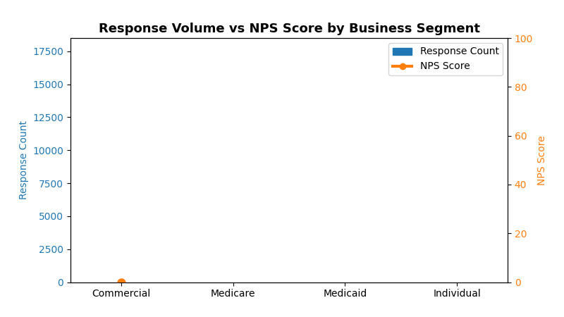

<!--
  © 2026 CVS Health and/or one of its affiliates. All rights reserved.

  Licensed under the Apache License, Version 2.0 (the "License");
  you may not use this file except in compliance with the License.
  You may obtain a copy of the License at

      http://www.apache.org/licenses/LICENSE-2.0

  Unless required by applicable law or agreed to in writing, software
  distributed under the License is distributed on an "AS IS" BASIS,
  WITHOUT WARRANTIES OR CONDITIONS OF ANY KIND, either express or implied.
  See the License for the specific language governing permissions and
  limitations under the License.
-->
# Bar-and-Line Chart (ComboChart)

## Overview
Combines bar charts and line charts in a single visualization with dual Y-axes. Perfect for showing volume metrics (bars) alongside performance metrics (lines) like response counts with NPS scores.

## Sample Preview



## Best Use Cases
- **Response Volume + NPS Scores** - Show survey response counts with satisfaction scores
- **Customer Count + Satisfaction** - Display customer base size with happiness metrics
- **Campaign Reach + Engagement** - Combine volume metrics with quality indicators

## Sample Data Structure

### AskRITA UniversalChartData
```python
from askrita.sqlagent.formatters.DataFormatter import UniversalChartData, ChartDataset, DataPoint, AxisConfig

combo_data = UniversalChartData(
    type="combo",
    title="Response Volume vs NPS Score by Business Segment",
    labels=["Commercial", "Medicare", "Medicaid", "Individual"],
    datasets=[
        ChartDataset(
            label="Response Count",
            data=[
                DataPoint(y=15420, category="Commercial"),
                DataPoint(y=8932, category="Medicare"),
                DataPoint(y=5621, category="Medicaid"),
                DataPoint(y=2103, category="Individual")
            ],
            yAxisId="left-axis"
        ),
        ChartDataset(
            label="NPS Score",
            data=[
                DataPoint(y=72, category="Commercial"),
                DataPoint(y=68, category="Medicare"),
                DataPoint(y=45, category="Medicaid"),
                DataPoint(y=38, category="Individual")
            ],
            yAxisId="right-axis"
        )
    ],
    yAxes=[
        AxisConfig(axisId="left-axis", position="left", label="Response Count"),
        AxisConfig(axisId="right-axis", position="right", label="NPS Score")
    ]
)
```

## Google Charts Implementation

### HTML Structure
```html
<!DOCTYPE html>
<html>
<head>
    <script type="text/javascript" src="https://www.gstatic.com/charts/loader.js"></script>
</head>
<body>
    <div id="combo_chart" style="width: 900px; height: 500px;"></div>
</body>
</html>
```

### JavaScript Code
```javascript
google.charts.load('current', {'packages':['corechart']});
google.charts.setOnLoadCallback(drawComboChart);

function drawComboChart() {
    var data = google.visualization.arrayToDataTable([
        ['Business Segment', 'Response Count', 'NPS Score'],
        ['Commercial',       15420,           72],
        ['Medicare',         8932,            68],
        ['Medicaid',         5621,            45],
        ['Individual',       2103,            38]
    ]);

    var options = {
        title: 'Response Volume vs NPS Score by Business Segment',
        titleTextStyle: {
            fontSize: 18,
            bold: true
        },
        width: 900,
        height: 500,
        vAxes: {
            0: {
                title: 'Response Count',
                textStyle: {color: '#1f77b4'},
                titleTextStyle: {color: '#1f77b4'},
                format: '#,###'
            },
            1: {
                title: 'NPS Score',
                textStyle: {color: '#ff7f0e'},
                titleTextStyle: {color: '#ff7f0e'},
                minValue: 0,
                maxValue: 100
            }
        },
        hAxis: {
            title: 'Business Segment',
            titleTextStyle: {fontSize: 14}
        },
        series: {
            0: {
                type: 'columns',
                targetAxisIndex: 0,
                color: '#1f77b4'
            },
            1: {
                type: 'line',
                targetAxisIndex: 1,
                color: '#ff7f0e',
                lineWidth: 3,
                pointSize: 8
            }
        },
        legend: {
            position: 'top',
            alignment: 'center'
        },
        backgroundColor: 'white',
        chartArea: {
            left: 80,
            top: 80,
            width: '75%',
            height: '70%'
        }
    };

    var chart = new google.visualization.ComboChart(document.getElementById('combo_chart'));
    chart.draw(data, options);
}
```

## React Implementation
```tsx
import React, { useEffect, useRef } from 'react';

interface ComboChartProps {
    data: Array<{
        segment: string;
        responseCount: number;
        npsScore: number;
    }>;
}

const ComboChart: React.FC<ComboChartProps> = ({ data }) => {
    const chartRef = useRef<HTMLDivElement>(null);

    useEffect(() => {
        if (!window.google || !chartRef.current) return;

        const chartData = new google.visualization.DataTable();
        chartData.addColumn('string', 'Business Segment');
        chartData.addColumn('number', 'Response Count');
        chartData.addColumn('number', 'NPS Score');

        const rows = data.map(item => [
            item.segment,
            item.responseCount,
            item.npsScore
        ]);
        chartData.addRows(rows);

        const options = {
            title: 'Response Volume vs NPS Score by Business Segment',
            width: 900,
            height: 500,
            vAxes: {
                0: {
                    title: 'Response Count',
                    textStyle: {color: '#1f77b4'},
                    titleTextStyle: {color: '#1f77b4'}
                },
                1: {
                    title: 'NPS Score',
                    textStyle: {color: '#ff7f0e'},
                    titleTextStyle: {color: '#ff7f0e'},
                    minValue: 0,
                    maxValue: 100
                }
            },
            series: {
                0: {type: 'columns', targetAxisIndex: 0, color: '#1f77b4'},
                1: {type: 'line', targetAxisIndex: 1, color: '#ff7f0e'}
            }
        };

        const chart = new google.visualization.ComboChart(chartRef.current);
        chart.draw(chartData, options);
    }, [data]);

    return <div ref={chartRef} style={{ width: '900px', height: '500px' }} />;
};

export default ComboChart;
```

## Survey Data Examples

### Customer Satisfaction by Channel
```javascript
// Response volume + CSAT scores by support channel
var data = google.visualization.arrayToDataTable([
    ['Channel', 'Response Count', 'CSAT Score'],
    ['Email',    2450,           8.2],
    ['Phone',    1890,           7.8],
    ['Chat',     1205,           8.5],
    ['Web',      820,            7.1]
]);
```

### Regional Performance Analysis
```javascript
// Survey responses + NPS by region
var data = google.visualization.arrayToDataTable([
    ['Region', 'Survey Count', 'NPS Score'],
    ['Northeast', 5420,         74],
    ['Southeast', 4932,         68],
    ['Midwest',   3621,         71],
    ['West',      6103,         76]
]);
```

## Key Features
- **Dual Y-Axes** - Different scales for volume vs scores
- **Color Coordination** - Matching colors for axes and series
- **Interactive Tooltips** - Hover for detailed information
- **Responsive Design** - Adapts to container size
- **Export Options** - Built-in PNG/PDF export

## When to Use
✅ **Perfect for:**
- Volume + Quality metrics
- Count + Score combinations
- Trend + Performance data
- Any metrics with 10x+ scale differences

❌ **Avoid when:**
- Both metrics have similar scales
- More than 2 metrics needed
- Data is time-series focused (use line chart instead)

## Documentation
- [Google Charts ComboChart Documentation](https://developers.google.com/chart/interactive/docs/gallery/combochart)
- [Dual Y-Axis Examples](https://developers.google.com/chart/interactive/docs/gallery/combochart#dual-y-charts)
