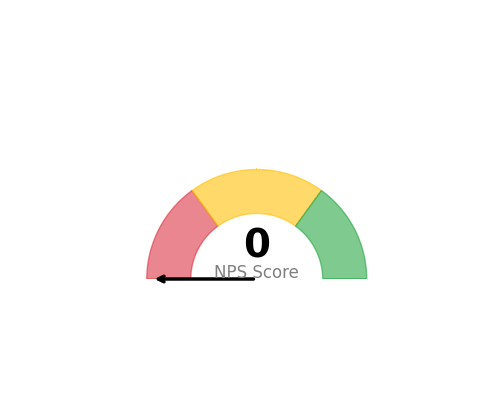

<!--
  © 2026 CVS Health and/or one of its affiliates. All rights reserved.

  Licensed under the Apache License, Version 2.0 (the "License");
  you may not use this file except in compliance with the License.
  You may obtain a copy of the License at

      http://www.apache.org/licenses/LICENSE-2.0

  Unless required by applicable law or agreed to in writing, software
  distributed under the License is distributed on an "AS IS" BASIS,
  WITHOUT WARRANTIES OR CONDITIONS OF ANY KIND, either express or implied.
  See the License for the specific language governing permissions and
  limitations under the License.
-->
# Gauge Chart

## Overview
Displays a single KPI value as a speedometer-style gauge with configurable min/max ranges and color zones. Perfect for showing current performance against targets.

## Sample Preview



## Best Use Cases
- **Current NPS Score** - Show current satisfaction level with target zones
- **Response Rate** - Display completion percentage with threshold indicators
- **Performance KPIs** - Single metric dashboards with target ranges

## Sample Data Structure

### AskRITA UniversalChartData
```python
from askrita.sqlagent.formatters.DataFormatter import UniversalChartData

gauge_data = UniversalChartData(
    type="gauge",
    title="Current NPS Score",
    datasets=[],  # Empty for gauge charts
    gauge_value=72,
    gauge_min=0,
    gauge_max=100
)
```

## Google Charts Implementation

### HTML Structure
```html
<!DOCTYPE html>
<html>
<head>
    <script type="text/javascript" src="https://www.gstatic.com/charts/loader.js"></script>
</head>
<body>
    <div id="gauge_chart" style="width: 400px; height: 300px;"></div>
</body>
</html>
```

### JavaScript Code
```javascript
google.charts.load('current', {'packages':['gauge']});
google.charts.setOnLoadCallback(drawGaugeChart);

function drawGaugeChart() {
    var data = google.visualization.arrayToDataTable([
        ['Label', 'Value'],
        ['NPS Score', 72]
    ]);

    var options = {
        title: 'Current NPS Score',
        titleTextStyle: {
            fontSize: 16,
            bold: true
        },
        width: 400,
        height: 300,
        redFrom: 0,
        redTo: 30,
        yellowFrom: 30,
        yellowTo: 70,
        greenFrom: 70,
        greenTo: 100,
        minorTicks: 5,
        majorTicks: ['0', '20', '40', '60', '80', '100'],
        min: 0,
        max: 100
    };

    var chart = new google.visualization.Gauge(document.getElementById('gauge_chart'));
    chart.draw(data, options);
}
```

### Multiple Gauges
```javascript
function drawMultipleGauges() {
    var data = google.visualization.arrayToDataTable([
        ['Label', 'Value'],
        ['NPS', 72],
        ['CSAT', 8.2],
        ['Response Rate', 85]
    ]);

    var options = {
        title: 'Key Performance Indicators',
        width: 600,
        height: 300,
        redFrom: 0,
        redTo: 25,
        yellowFrom: 25,
        yellowTo: 75,
        greenFrom: 75,
        greenTo: 100,
        minorTicks: 5
    };

    var chart = new google.visualization.Gauge(document.getElementById('gauges_chart'));
    chart.draw(data, options);
}
```

## React Implementation
```tsx
import React, { useEffect, useRef } from 'react';

interface GaugeChartProps {
    value: number;
    label: string;
    min?: number;
    max?: number;
    redZone?: [number, number];
    yellowZone?: [number, number];
    greenZone?: [number, number];
}

const GaugeChart: React.FC<GaugeChartProps> = ({
    value,
    label,
    min = 0,
    max = 100,
    redZone = [0, 30],
    yellowZone = [30, 70],
    greenZone = [70, 100]
}) => {
    const chartRef = useRef<HTMLDivElement>(null);

    useEffect(() => {
        if (!window.google || !chartRef.current) return;

        const data = new google.visualization.DataTable();
        data.addColumn('string', 'Label');
        data.addColumn('number', 'Value');
        data.addRow([label, value]);

        const options = {
            title: `Current ${label}`,
            width: 400,
            height: 300,
            redFrom: redZone[0],
            redTo: redZone[1],
            yellowFrom: yellowZone[0],
            yellowTo: yellowZone[1],
            greenFrom: greenZone[0],
            greenTo: greenZone[1],
            minorTicks: 5,
            min: min,
            max: max
        };

        const chart = new google.visualization.Gauge(chartRef.current);
        chart.draw(data, options);
    }, [value, label, min, max, redZone, yellowZone, greenZone]);

    return <div ref={chartRef} style={{ width: '400px', height: '300px' }} />;
};

export default GaugeChart;
```

## Survey Data Examples

### NPS Score Gauge
```javascript
// Current NPS with industry benchmarks
var data = google.visualization.arrayToDataTable([
    ['Metric', 'Score'],
    ['NPS', 72]
]);

var options = {
    title: 'Net Promoter Score',
    redFrom: 0, redTo: 30,      // Detractors zone
    yellowFrom: 30, yellowTo: 70, // Passives zone  
    greenFrom: 70, greenTo: 100,  // Promoters zone
    majorTicks: ['0', '25', '50', '75', '100']
};
```

### CSAT Score (0-10 Scale)
```javascript
// Customer Satisfaction on 10-point scale
var data = google.visualization.arrayToDataTable([
    ['Metric', 'Score'],
    ['CSAT', 8.2]
]);

var options = {
    title: 'Customer Satisfaction Score',
    min: 0,
    max: 10,
    redFrom: 0, redTo: 5,
    yellowFrom: 5, yellowTo: 7,
    greenFrom: 7, greenTo: 10,
    majorTicks: ['0', '2', '4', '6', '8', '10']
};
```

### Response Rate Percentage
```javascript
// Survey response completion rate
var data = google.visualization.arrayToDataTable([
    ['Metric', 'Rate'],
    ['Response Rate', 85]
]);

var options = {
    title: 'Survey Response Rate (%)',
    redFrom: 0, redTo: 40,
    yellowFrom: 40, yellowTo: 70,
    greenFrom: 70, greenTo: 100,
    majorTicks: ['0%', '25%', '50%', '75%', '100%']
};
```

## Advanced Features

### Animated Updates
```javascript
function updateGauge(newValue) {
    data.setValue(0, 1, newValue);
    chart.draw(data, options);
}

// Update every 5 seconds
setInterval(() => {
    const newNPS = Math.floor(Math.random() * 100);
    updateGauge(newNPS);
}, 5000);
```

### Custom Color Zones
```javascript
var options = {
    title: 'Customer Effort Score',
    min: 1,
    max: 7,
    redFrom: 5, redTo: 7,      // High effort (bad)
    yellowFrom: 3, yellowTo: 5, // Medium effort
    greenFrom: 1, greenTo: 3,   // Low effort (good)
    majorTicks: ['1', '2', '3', '4', '5', '6', '7']
};
```

## Dashboard Integration
```javascript
// Multiple KPI gauges in dashboard
function createKPIDashboard() {
    const metrics = [
        {id: 'nps_gauge', label: 'NPS', value: 72, container: 'nps_div'},
        {id: 'csat_gauge', label: 'CSAT', value: 8.2, container: 'csat_div'},
        {id: 'ces_gauge', label: 'CES', value: 2.1, container: 'ces_div'}
    ];

    metrics.forEach(metric => {
        const data = google.visualization.arrayToDataTable([
            ['Label', 'Value'],
            [metric.label, metric.value]
        ]);

        const chart = new google.visualization.Gauge(
            document.getElementById(metric.container)
        );
        chart.draw(data, getOptionsForMetric(metric.label));
    });
}
```

## Key Features
- **Color Zones** - Visual indicators for performance ranges
- **Customizable Scales** - Flexible min/max values
- **Real-time Updates** - Dynamic value changes
- **Multiple Gauges** - Side-by-side KPI displays
- **Responsive Design** - Adapts to container size

## When to Use
✅ **Perfect for:**
- Single KPI displays
- Executive dashboards
- Real-time monitoring
- Performance against targets
- Status indicators

❌ **Avoid when:**
- Multiple related metrics
- Trend analysis needed
- Comparative analysis required
- Historical data important

## Documentation
- [Google Charts Gauge Documentation](https://developers.google.com/chart/interactive/docs/gallery/gauge)
