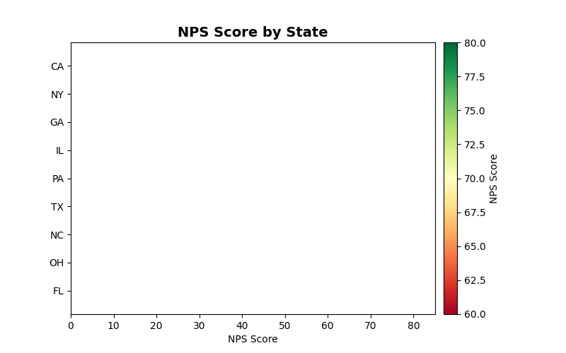

<!--
  © 2026 CVS Health and/or one of its affiliates. All rights reserved.

  Licensed under the Apache License, Version 2.0 (the "License");
  you may not use this file except in compliance with the License.
  You may obtain a copy of the License at

      http://www.apache.org/licenses/LICENSE-2.0

  Unless required by applicable law or agreed to in writing, software
  distributed under the License is distributed on an "AS IS" BASIS,
  WITHOUT WARRANTIES OR CONDITIONS OF ANY KIND, either express or implied.
  See the License for the specific language governing permissions and
  limitations under the License.
-->
# Geographic Map (GeoChart)

## Overview
Visualizes data on geographic maps with color-coded regions or markers. Perfect for showing satisfaction scores, response volumes, or performance metrics across different locations.

## Sample Preview



## Best Use Cases
- **Regional Satisfaction** - NPS/CSAT scores by state, country, or region
- **Response Distribution** - Survey volume by geographic location
- **Market Performance** - Business metrics across territories

## Sample Data Structure

### AskRITA UniversalChartData
```python
from askrita.sqlagent.formatters.DataFormatter import UniversalChartData

geo_data = UniversalChartData(
    type="geo",
    title="NPS Score by State",
    datasets=[],  # Empty for geo charts
    geographic_data=[
        {"location": "US-CA", "value": 75},
        {"location": "US-TX", "value": 68},
        {"location": "US-NY", "value": 72},
        {"location": "US-FL", "value": 65},
        {"location": "US-IL", "value": 70},
        {"location": "US-PA", "value": 69}
    ]
)
```

## Google Charts Implementation

### HTML Structure
```html
<!DOCTYPE html>
<html>
<head>
    <script type="text/javascript" src="https://www.gstatic.com/charts/loader.js"></script>
</head>
<body>
    <div id="geo_chart" style="width: 900px; height: 500px;"></div>
</body>
</html>
```

### JavaScript Code - US States
```javascript
google.charts.load('current', {
    'packages':['geochart'],
    'mapsApiKey': 'YOUR_API_KEY' // Optional for basic maps
});
google.charts.setOnLoadCallback(drawGeoChart);

function drawGeoChart() {
    var data = google.visualization.arrayToDataTable([
        ['State', 'NPS Score'],
        ['US-CA', 75],
        ['US-TX', 68],
        ['US-NY', 72],
        ['US-FL', 65],
        ['US-IL', 70],
        ['US-PA', 69],
        ['US-OH', 66],
        ['US-GA', 71],
        ['US-NC', 67],
        ['US-MI', 64]
    ]);

    var options = {
        title: 'NPS Score by State',
        titleTextStyle: {
            fontSize: 18,
            bold: true
        },
        region: 'US',
        displayMode: 'regions',
        resolution: 'provinces',
        width: 900,
        height: 500,
        colorAxis: {
            minValue: 0,
            maxValue: 100,
            colors: ['#FF6B6B', '#FFE66D', '#4ECDC4', '#45B7D1']
        },
        backgroundColor: '#f5f5f5',
        datalessRegionColor: '#E8E8E8',
        defaultColor: '#E8E8E8',
        tooltip: {
            textStyle: {
                fontSize: 12
            }
        }
    };

    var chart = new google.visualization.GeoChart(document.getElementById('geo_chart'));
    chart.draw(data, options);
}
```

### JavaScript Code - World Countries
```javascript
function drawWorldGeoChart() {
    var data = google.visualization.arrayToDataTable([
        ['Country', 'Customer Satisfaction'],
        ['United States', 72],
        ['Canada', 78],
        ['United Kingdom', 69],
        ['Germany', 74],
        ['France', 71],
        ['Australia', 76],
        ['Japan', 68],
        ['Brazil', 65],
        ['India', 63],
        ['Mexico', 67]
    ]);

    var options = {
        title: 'Global Customer Satisfaction Scores',
        width: 900,
        height: 500,
        colorAxis: {
            minValue: 50,
            maxValue: 80,
            colors: ['#e74c3c', '#f39c12', '#f1c40f', '#2ecc71']
        }
    };

    var chart = new google.visualization.GeoChart(document.getElementById('world_geo_chart'));
    chart.draw(data, options);
}
```

## React Implementation
```tsx
import React, { useEffect, useRef } from 'react';

interface GeoChartProps {
    data: Array<{
        location: string;
        value: number;
    }>;
    title?: string;
    region?: string;
    colorRange?: {
        min: number;
        max: number;
        colors: string[];
    };
}

const GeoChart: React.FC<GeoChartProps> = ({
    data,
    title = "Geographic Data",
    region = "US",
    colorRange = {
        min: 0,
        max: 100,
        colors: ['#FF6B6B', '#FFE66D', '#4ECDC4', '#45B7D1']
    }
}) => {
    const chartRef = useRef<HTMLDivElement>(null);

    useEffect(() => {
        if (!window.google || !chartRef.current) return;

        const chartData = new google.visualization.DataTable();
        chartData.addColumn('string', 'Location');
        chartData.addColumn('number', 'Value');

        const rows = data.map(item => [item.location, item.value]);
        chartData.addRows(rows);

        const options = {
            title: title,
            region: region,
            displayMode: 'regions',
            resolution: region === 'US' ? 'provinces' : 'countries',
            width: 900,
            height: 500,
            colorAxis: {
                minValue: colorRange.min,
                maxValue: colorRange.max,
                colors: colorRange.colors
            },
            backgroundColor: '#f5f5f5',
            datalessRegionColor: '#E8E8E8'
        };

        const chart = new google.visualization.GeoChart(chartRef.current);
        chart.draw(chartData, options);
    }, [data, title, region, colorRange]);

    return <div ref={chartRef} style={{ width: '900px', height: '500px' }} />;
};

export default GeoChart;
```

## Survey Data Examples

### Regional NPS Analysis
```javascript
// NPS scores by US regions
var data = google.visualization.arrayToDataTable([
    ['State', 'NPS Score', 'Response Count'],
    ['US-CA', 75, 2450],
    ['US-TX', 68, 1890],
    ['US-NY', 72, 2100],
    ['US-FL', 65, 1650],
    ['US-IL', 70, 1200],
    ['US-PA', 69, 980],
    ['US-OH', 66, 850],
    ['US-GA', 71, 920],
    ['US-NC', 67, 780],
    ['US-MI', 64, 690]
]);
```

### Store Location Performance
```javascript
// Individual store locations with markers
var data = google.visualization.arrayToDataTable([
    ['City', 'CSAT Score'],
    ['New York, NY', 8.2],
    ['Los Angeles, CA', 7.8],
    ['Chicago, IL', 8.0],
    ['Houston, TX', 7.5],
    ['Phoenix, AZ', 7.9],
    ['Philadelphia, PA', 8.1],
    ['San Antonio, TX', 7.6],
    ['San Diego, CA', 8.3],
    ['Dallas, TX', 7.7],
    ['San Jose, CA', 8.4]
]);

var options = {
    title: 'Store Performance by City',
    displayMode: 'markers',
    colorAxis: {
        minValue: 7.0,
        maxValue: 8.5,
        colors: ['#FF6B6B', '#FFE66D', '#4ECDC4']
    }
};
```

### International Markets
```javascript
// Global customer satisfaction
var data = google.visualization.arrayToDataTable([
    ['Country', 'Satisfaction Score'],
    ['United States', 72],
    ['Canada', 78],
    ['United Kingdom', 69],
    ['Germany', 74],
    ['France', 71],
    ['Australia', 76],
    ['Japan', 68],
    ['South Korea', 70],
    ['Singapore', 77],
    ['Netherlands', 75]
]);
```

## Advanced Features

### Custom Tooltips
```javascript
var options = {
    title: 'Regional Performance',
    tooltip: {
        textStyle: {
            color: '#333',
            fontSize: 14
        },
        showColorCode: true,
        trigger: 'focus'
    }
};
```

### Interactive Selection
```javascript
function drawInteractiveGeoChart() {
    var chart = new google.visualization.GeoChart(document.getElementById('geo_chart'));
    
    // Add selection listener
    google.visualization.events.addListener(chart, 'select', function() {
        var selection = chart.getSelection();
        if (selection.length > 0) {
            var row = selection[0].row;
            var state = data.getValue(row, 0);
            var score = data.getValue(row, 1);
            alert(`Selected: ${state} - Score: ${score}`);
        }
    });
    
    chart.draw(data, options);
}
```

### Drill-Down Functionality
```javascript
function createDrillDownGeo() {
    // Start with country view
    let currentLevel = 'country';
    let currentData = countryData;
    
    google.visualization.events.addListener(chart, 'select', function() {
        const selection = chart.getSelection();
        if (selection.length > 0) {
            const selectedCountry = currentData.getValue(selection[0].row, 0);
            
            if (currentLevel === 'country' && selectedCountry === 'United States') {
                // Drill down to states
                currentLevel = 'state';
                currentData = stateData;
                drawChart(currentData, {region: 'US', resolution: 'provinces'});
            }
        }
    });
}
```

## Color Schemes for Different Metrics

### NPS Color Scale
```javascript
colorAxis: {
    minValue: -100,
    maxValue: 100,
    colors: ['#d32f2f', '#ff9800', '#ffc107', '#8bc34a', '#4caf50']
}
```

### CSAT Color Scale (1-10)
```javascript
colorAxis: {
    minValue: 1,
    maxValue: 10,
    colors: ['#ff5252', '#ff9800', '#ffeb3b', '#8bc34a', '#4caf50']
}
```

### Response Volume Scale
```javascript
colorAxis: {
    minValue: 0,
    maxValue: 5000,
    colors: ['#e3f2fd', '#90caf9', '#42a5f5', '#1976d2', '#0d47a1']
}
```

## Key Features
- **Regional Coloring** - Color-coded geographic regions
- **Multiple Display Modes** - Regions, markers, or text
- **Custom Color Scales** - Flexible value-to-color mapping
- **Interactive Selection** - Click handling for drill-down
- **Responsive Design** - Adapts to container size
- **Tooltip Customization** - Rich hover information

## When to Use
✅ **Perfect for:**
- Regional performance analysis
- Geographic distribution of metrics
- Store/location comparisons
- Market penetration analysis
- Territory-based reporting

❌ **Avoid when:**
- Data not location-based
- Too many small regions (cluttered)
- Precise location accuracy needed
- Time-series analysis required

## Documentation
- [Google Charts GeoChart Documentation](https://developers.google.com/chart/interactive/docs/gallery/geochart)
