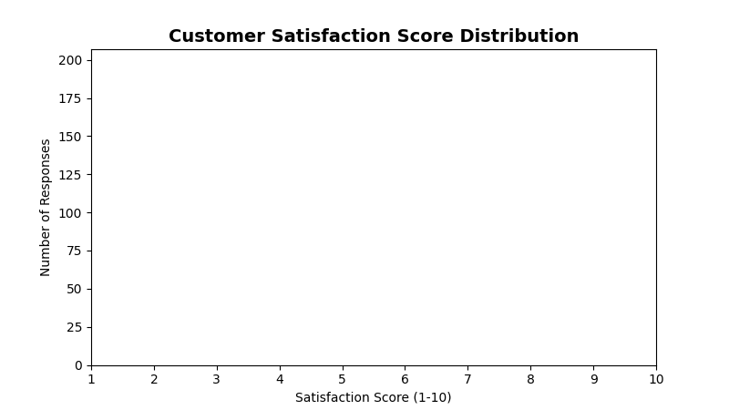

<!--
  © 2026 CVS Health and/or one of its affiliates. All rights reserved.

  Licensed under the Apache License, Version 2.0 (the "License");
  you may not use this file except in compliance with the License.
  You may obtain a copy of the License at

      http://www.apache.org/licenses/LICENSE-2.0

  Unless required by applicable law or agreed to in writing, software
  distributed under the License is distributed on an "AS IS" BASIS,
  WITHOUT WARRANTIES OR CONDITIONS OF ANY KIND, either express or implied.
  See the License for the specific language governing permissions and
  limitations under the License.
-->
# Histogram Chart

## Overview
Displays the distribution of numerical data by grouping values into bins and showing the frequency of each bin. Perfect for understanding data distribution patterns and identifying outliers.

## Sample Preview



## Best Use Cases
- **Response Score Distribution** - Show how satisfaction scores are distributed
- **Response Time Analysis** - Analyze distribution of survey completion times
- **Age Demographics** - Display customer age distribution patterns

## Sample Data Structure

### AskRITA UniversalChartData
```python
from askrita.sqlagent.formatters.DataFormatter import UniversalChartData
import random

# Generate sample raw values for histogram
satisfaction_scores = []
for _ in range(1000):
    # Simulate satisfaction scores with normal distribution around 8.0
    score = random.gauss(8.0, 1.2)
    score = max(1, min(10, score))  # Clamp between 1-10
    satisfaction_scores.append(score)

histogram_data = UniversalChartData(
    type="histogram",
    title="Customer Satisfaction Score Distribution",
    datasets=[],  # Empty for histogram charts
    raw_values=satisfaction_scores
)
```

## Google Charts Implementation

### HTML Structure
```html
<!DOCTYPE html>
<html>
<head>
    <script type="text/javascript" src="https://www.gstatic.com/charts/loader.js"></script>
</head>
<body>
    <div id="histogram_chart" style="width: 900px; height: 500px;"></div>
</body>
</html>
```

### JavaScript Code
```javascript
google.charts.load('current', {'packages':['corechart']});
google.charts.setOnLoadCallback(drawHistogram);

function drawHistogram() {
    // Generate sample satisfaction scores
    var rawData = [];
    for (var i = 0; i < 1000; i++) {
        // Simulate normal distribution around 8.0
        var score = gaussianRandom(8.0, 1.2);
        score = Math.max(1, Math.min(10, score)); // Clamp between 1-10
        rawData.push(['Score', score]);
    }

    var data = google.visualization.arrayToDataTable([
        ['Score', 'Frequency'],
        ...rawData
    ]);

    var options = {
        title: 'Customer Satisfaction Score Distribution',
        titleTextStyle: {
            fontSize: 18,
            bold: true
        },
        width: 900,
        height: 500,
        hAxis: {
            title: 'Satisfaction Score (1-10)',
            minValue: 1,
            maxValue: 10
        },
        vAxis: {
            title: 'Number of Responses',
            format: '#,###'
        },
        colors: ['#4285f4'],
        backgroundColor: 'white',
        chartArea: {
            left: 80,
            top: 80,
            width: '80%',
            height: '70%'
        },
        histogram: {
            bucketSize: 0.5, // Bin size
            hideBucketItems: true
        }
    };

    var chart = new google.visualization.Histogram(document.getElementById('histogram_chart'));
    chart.draw(data, options);
}

// Helper function to generate normal distribution
function gaussianRandom(mean, stdev) {
    var u = 0, v = 0;
    while(u === 0) u = Math.random(); // Converting [0,1) to (0,1)
    while(v === 0) v = Math.random();
    var z = Math.sqrt(-2.0 * Math.log(u)) * Math.cos(2.0 * Math.PI * v);
    return z * stdev + mean;
}
```

## React Implementation
```tsx
import React, { useEffect, useRef } from 'react';

interface HistogramChartProps {
    data: number[];
    title?: string;
    width?: number;
    height?: number;
    xAxisLabel?: string;
    yAxisLabel?: string;
    bucketSize?: number;
    color?: string;
}

const HistogramChart: React.FC<HistogramChartProps> = ({
    data,
    title = "Histogram",
    width = 900,
    height = 500,
    xAxisLabel = "Value",
    yAxisLabel = "Frequency",
    bucketSize = 1,
    color = '#4285f4'
}) => {
    const chartRef = useRef<HTMLDivElement>(null);

    useEffect(() => {
        if (!window.google || !chartRef.current) return;

        const chartData = new google.visualization.DataTable();
        chartData.addColumn('string', 'Label');
        chartData.addColumn('number', 'Value');

        const rows = data.map(value => ['Value', value]);
        chartData.addRows(rows);

        const options = {
            title: title,
            width: width,
            height: height,
            hAxis: {
                title: xAxisLabel
            },
            vAxis: {
                title: yAxisLabel
            },
            colors: [color],
            histogram: {
                bucketSize: bucketSize,
                hideBucketItems: true
            },
            chartArea: {
                left: 80,
                top: 80,
                width: '80%',
                height: '70%'
            }
        };

        const chart = new google.visualization.Histogram(chartRef.current);
        chart.draw(chartData, options);
    }, [data, title, width, height, xAxisLabel, yAxisLabel, bucketSize, color]);

    return <div ref={chartRef} style={{ width: `${width}px`, height: `${height}px` }} />;
};

export default HistogramChart;
```

## Survey Data Examples

### NPS Score Distribution
```javascript
// Distribution of Net Promoter Scores
function drawNPSHistogram() {
    var rawData = [];
    
    // Simulate NPS responses (0-10 scale)
    var npsScores = [
        // Detractors (0-6) - 20%
        ...Array(50).fill().map(() => Math.floor(Math.random() * 7)),
        // Passives (7-8) - 30%
        ...Array(75).fill().map(() => 7 + Math.floor(Math.random() * 2)),
        // Promoters (9-10) - 50%
        ...Array(125).fill().map(() => 9 + Math.floor(Math.random() * 2))
    ];
    
    npsScores.forEach(score => {
        rawData.push(['NPS', score]);
    });

    var data = google.visualization.arrayToDataTable([
        ['Category', 'Score'],
        ...rawData
    ]);

    var options = {
        title: 'Net Promoter Score Distribution',
        hAxis: {
            title: 'NPS Score (0-10)',
            ticks: [0, 1, 2, 3, 4, 5, 6, 7, 8, 9, 10]
        },
        vAxis: {
            title: 'Number of Responses'
        },
        colors: ['#4285f4'],
        histogram: {
            bucketSize: 1
        }
    };

    var chart = new google.visualization.Histogram(document.getElementById('histogram_chart'));
    chart.draw(data, options);
}
```

### Response Time Distribution
```javascript
// Distribution of survey completion times
function drawResponseTimeHistogram() {
    var rawData = [];
    
    // Simulate response times (in minutes) with log-normal distribution
    for (var i = 0; i < 500; i++) {
        var logTime = gaussianRandom(1.5, 0.8); // Log-normal parameters
        var responseTime = Math.exp(logTime);
        responseTime = Math.max(0.5, Math.min(30, responseTime)); // Clamp between 0.5-30 minutes
        rawData.push(['Time', responseTime]);
    }

    var data = google.visualization.arrayToDataTable([
        ['Category', 'Minutes'],
        ...rawData
    ]);

    var options = {
        title: 'Survey Completion Time Distribution',
        hAxis: {
            title: 'Completion Time (minutes)',
            minValue: 0,
            maxValue: 30
        },
        vAxis: {
            title: 'Number of Responses'
        },
        colors: ['#34a853'],
        histogram: {
            bucketSize: 2
        }
    };

    var chart = new google.visualization.Histogram(document.getElementById('histogram_chart'));
    chart.draw(data, options);
}
```

### Age Demographics Distribution
```javascript
// Customer age distribution
function drawAgeHistogram() {
    var rawData = [];
    
    // Simulate age distribution with multiple peaks
    var ageGroups = [
        { mean: 28, stdev: 5, count: 80 },   // Young adults
        { mean: 42, stdev: 8, count: 120 },  // Middle-aged
        { mean: 68, stdev: 12, count: 100 }  // Seniors
    ];
    
    ageGroups.forEach(group => {
        for (var i = 0; i < group.count; i++) {
            var age = gaussianRandom(group.mean, group.stdev);
            age = Math.max(18, Math.min(85, Math.round(age))); // Clamp and round
            rawData.push(['Age', age]);
        }
    });

    var data = google.visualization.arrayToDataTable([
        ['Category', 'Age'],
        ...rawData
    ]);

    var options = {
        title: 'Customer Age Distribution',
        hAxis: {
            title: 'Age (years)',
            minValue: 18,
            maxValue: 85
        },
        vAxis: {
            title: 'Number of Customers'
        },
        colors: ['#fbbc04'],
        histogram: {
            bucketSize: 5
        }
    };

    var chart = new google.visualization.Histogram(document.getElementById('histogram_chart'));
    chart.draw(data, options);
}
```

## Advanced Features

### Multiple Series Histogram
```javascript
function drawMultiSeriesHistogram() {
    var data = new google.visualization.DataTable();
    data.addColumn('string', 'Category');
    data.addColumn('number', 'Retail Store');
    data.addColumn('number', 'Walk-in Clinic');
    data.addColumn('number', 'Wellness Center');

    // Generate satisfaction scores for different service areas
    var retailScores = generateScores(8.2, 1.0, 200);
    var clinicScores = generateScores(8.7, 0.8, 150);
    var hubScores = generateScores(8.0, 1.2, 100);

    var maxLength = Math.max(retailScores.length, clinicScores.length, hubScores.length);
    
    for (var i = 0; i < maxLength; i++) {
        data.addRow([
            'Score',
            i < retailScores.length ? retailScores[i] : null,
            i < clinicScores.length ? clinicScores[i] : null,
            i < hubScores.length ? hubScores[i] : null
        ]);
    }

    var options = {
        title: 'Satisfaction Score Distribution by Service Area',
        hAxis: { title: 'Satisfaction Score' },
        vAxis: { title: 'Frequency' },
        colors: ['#4285f4', '#34a853', '#fbbc04'],
        histogram: {
            bucketSize: 0.5
        }
    };

    var chart = new google.visualization.Histogram(document.getElementById('histogram_chart'));
    chart.draw(data, options);
}

function generateScores(mean, stdev, count) {
    var scores = [];
    for (var i = 0; i < count; i++) {
        var score = gaussianRandom(mean, stdev);
        scores.push(Math.max(1, Math.min(10, score)));
    }
    return scores;
}
```

### Interactive Histogram with Statistics
```javascript
function drawInteractiveHistogram() {
    var chart = new google.visualization.Histogram(document.getElementById('histogram_chart'));
    
    google.visualization.events.addListener(chart, 'ready', function() {
        // Calculate and display statistics
        displayStatistics(rawDataArray);
    });
    
    google.visualization.events.addListener(chart, 'select', function() {
        var selection = chart.getSelection();
        if (selection.length > 0) {
            // Show details about selected bin
            showBinDetails(selection[0]);
        }
    });
    
    chart.draw(data, options);
}

function displayStatistics(dataArray) {
    var n = dataArray.length;
    var mean = dataArray.reduce((sum, val) => sum + val, 0) / n;
    var variance = dataArray.reduce((sum, val) => sum + Math.pow(val - mean, 2), 0) / n;
    var stdev = Math.sqrt(variance);
    var sortedData = [...dataArray].sort((a, b) => a - b);
    var median = n % 2 === 0 ? 
        (sortedData[n/2 - 1] + sortedData[n/2]) / 2 : 
        sortedData[Math.floor(n/2)];

    document.getElementById('statistics').innerHTML = `
        <div class="stats-panel">
            <h4>Distribution Statistics</h4>
            <p><strong>Count:</strong> ${n.toLocaleString()}</p>
            <p><strong>Mean:</strong> ${mean.toFixed(2)}</p>
            <p><strong>Median:</strong> ${median.toFixed(2)}</p>
            <p><strong>Std Dev:</strong> ${stdev.toFixed(2)}</p>
            <p><strong>Min:</strong> ${Math.min(...dataArray).toFixed(2)}</p>
            <p><strong>Max:</strong> ${Math.max(...dataArray).toFixed(2)}</p>
        </div>
    `;
}
```

### Overlay Normal Distribution Curve
```javascript
function drawHistogramWithNormalCurve() {
    // Create combo chart with histogram and normal curve
    var data = new google.visualization.DataTable();
    data.addColumn('number', 'Score');
    data.addColumn('number', 'Frequency');
    data.addColumn('number', 'Normal Curve');

    // Calculate histogram bins
    var bins = calculateHistogramBins(rawDataArray, 0.5);
    var stats = calculateStatistics(rawDataArray);
    
    bins.forEach(bin => {
        var normalValue = normalDistribution(bin.midpoint, stats.mean, stats.stdev) * stats.count * 0.5;
        data.addRow([bin.midpoint, bin.frequency, normalValue]);
    });

    var options = {
        title: 'Satisfaction Distribution with Normal Curve Overlay',
        hAxis: { title: 'Satisfaction Score' },
        vAxis: { title: 'Frequency' },
        seriesType: 'columns',
        series: {
            0: { type: 'columns', color: '#4285f4' },
            1: { type: 'line', color: '#ea4335', lineWidth: 3 }
        }
    };

    var chart = new google.visualization.ComboChart(document.getElementById('histogram_chart'));
    chart.draw(data, options);
}

function normalDistribution(x, mean, stdev) {
    var exponent = -0.5 * Math.pow((x - mean) / stdev, 2);
    return (1 / (stdev * Math.sqrt(2 * Math.PI))) * Math.exp(exponent);
}
```

### Percentile Analysis
```javascript
function addPercentileLines(chart, data) {
    google.visualization.events.addListener(chart, 'ready', function() {
        var sortedData = [...rawDataArray].sort((a, b) => a - b);
        var percentiles = {
            p25: getPercentile(sortedData, 25),
            p50: getPercentile(sortedData, 50), // Median
            p75: getPercentile(sortedData, 75),
            p90: getPercentile(sortedData, 90),
            p95: getPercentile(sortedData, 95)
        };
        
        // Add vertical lines for percentiles
        drawPercentileLines(percentiles);
        displayPercentileStats(percentiles);
    });
}

function getPercentile(sortedArray, percentile) {
    var index = (percentile / 100) * (sortedArray.length - 1);
    var lower = Math.floor(index);
    var upper = Math.ceil(index);
    var weight = index % 1;
    
    if (upper >= sortedArray.length) return sortedArray[sortedArray.length - 1];
    return sortedArray[lower] * (1 - weight) + sortedArray[upper] * weight;
}

function displayPercentileStats(percentiles) {
    document.getElementById('percentiles').innerHTML = `
        <div class="percentile-stats">
            <h4>Percentile Analysis</h4>
            <p><strong>25th Percentile:</strong> ${percentiles.p25.toFixed(2)}</p>
            <p><strong>50th Percentile (Median):</strong> ${percentiles.p50.toFixed(2)}</p>
            <p><strong>75th Percentile:</strong> ${percentiles.p75.toFixed(2)}</p>
            <p><strong>90th Percentile:</strong> ${percentiles.p90.toFixed(2)}</p>
            <p><strong>95th Percentile:</strong> ${percentiles.p95.toFixed(2)}</p>
        </div>
    `;
}
```

## Key Features
- **Distribution Analysis** - Shows data distribution patterns
- **Automatic Binning** - Google Charts handles bin calculation
- **Statistical Insights** - Easy to identify central tendency and spread
- **Outlier Detection** - Visual identification of unusual values
- **Multiple Series** - Compare distributions across groups

## When to Use
✅ **Perfect for:**
- Data distribution analysis
- Quality control monitoring
- Demographic analysis
- Performance distribution
- Outlier identification

❌ **Avoid when:**
- Categorical data
- Time series data
- Small datasets (<30 values)
- Precise individual values needed

## Statistical Applications
```javascript
// Quality control analysis
function analyzeResponseQuality() {
    var responseTime = generateResponseTimeData();
    var stats = calculateStatistics(responseTime);
    
    // Identify potential issues
    var outliers = responseTime.filter(time => 
        Math.abs(time - stats.mean) > 2 * stats.stdev
    );
    
    if (outliers.length > responseTime.length * 0.05) {
        console.warn('High number of outliers detected - investigate data quality');
    }
    
    // Performance benchmarks
    var benchmarks = {
        excellent: stats.mean - stats.stdev,
        good: stats.mean,
        needsImprovement: stats.mean + stats.stdev
    };
    
    return { stats, outliers, benchmarks };
}
```

## Documentation
- [Google Charts Histogram Documentation](https://developers.google.com/chart/interactive/docs/gallery/histogram)
