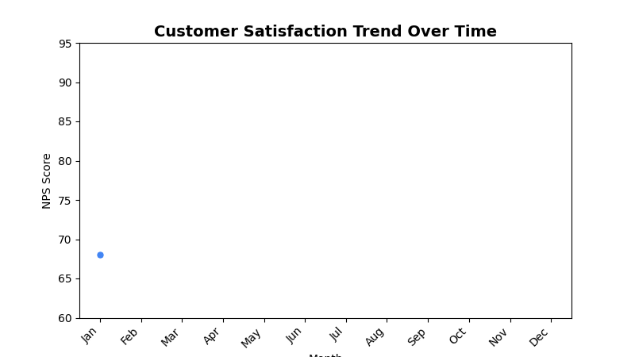

<!--
  © 2026 CVS Health and/or one of its affiliates. All rights reserved.

  Licensed under the Apache License, Version 2.0 (the "License");
  you may not use this file except in compliance with the License.
  You may obtain a copy of the License at

      http://www.apache.org/licenses/LICENSE-2.0

  Unless required by applicable law or agreed to in writing, software
  distributed under the License is distributed on an "AS IS" BASIS,
  WITHOUT WARRANTIES OR CONDITIONS OF ANY KIND, either express or implied.
  See the License for the specific language governing permissions and
  limitations under the License.
-->
# Line Chart

## Overview
Displays data points connected by lines, perfect for showing trends over time or continuous data. The go-to choice for time series analysis and trend visualization.

## Sample Preview



## Best Use Cases
- **Satisfaction Trends** - Track NPS/CSAT scores over time
- **Response Volume Trends** - Monitor survey participation over time
- **Performance Tracking** - Show KPI improvements over periods

## Sample Data Structure

### AskRITA UniversalChartData
```python
from askrita.sqlagent.formatters.DataFormatter import UniversalChartData, ChartDataset, DataPoint

line_data = UniversalChartData(
    type="line",
    title="Customer Satisfaction Trend Over Time",
    labels=["Jan", "Feb", "Mar", "Apr", "May", "Jun", "Jul", "Aug", "Sep", "Oct", "Nov", "Dec"],
    datasets=[
        ChartDataset(
            label="NPS Score",
            data=[
                DataPoint(y=68, category="Jan"),
                DataPoint(y=71, category="Feb"),
                DataPoint(y=74, category="Mar"),
                DataPoint(y=72, category="Apr"),
                DataPoint(y=76, category="May"),
                DataPoint(y=78, category="Jun"),
                DataPoint(y=75, category="Jul"),
                DataPoint(y=79, category="Aug"),
                DataPoint(y=82, category="Sep"),
                DataPoint(y=80, category="Oct"),
                DataPoint(y=84, category="Nov"),
                DataPoint(y=86, category="Dec")
            ]
        )
    ],
    xAxisLabel="Month",
    yAxisLabel="NPS Score"
)
```

## Google Charts Implementation

### HTML Structure
```html
<!DOCTYPE html>
<html>
<head>
    <script type="text/javascript" src="https://www.gstatic.com/charts/loader.js"></script>
</head>
<body>
    <div id="line_chart" style="width: 900px; height: 500px;"></div>
</body>
</html>
```

### JavaScript Code
```javascript
google.charts.load('current', {'packages':['corechart']});
google.charts.setOnLoadCallback(drawLineChart);

function drawLineChart() {
    var data = google.visualization.arrayToDataTable([
        ['Month', 'NPS Score'],
        ['Jan', 68],
        ['Feb', 71],
        ['Mar', 74],
        ['Apr', 72],
        ['May', 76],
        ['Jun', 78],
        ['Jul', 75],
        ['Aug', 79],
        ['Sep', 82],
        ['Oct', 80],
        ['Nov', 84],
        ['Dec', 86]
    ]);

    var options = {
        title: 'Customer Satisfaction Trend Over Time',
        titleTextStyle: {
            fontSize: 18,
            bold: true
        },
        width: 900,
        height: 500,
        hAxis: {
            title: 'Month'
        },
        vAxis: {
            title: 'NPS Score',
            minValue: 0,
            maxValue: 100
        },
        colors: ['#4285f4'],
        backgroundColor: 'white',
        chartArea: {
            left: 80,
            top: 80,
            width: '80%',
            height: '70%'
        },
        pointSize: 5,
        lineWidth: 3,
        curveType: 'function' // Smooth curves
    };

    var chart = new google.visualization.LineChart(document.getElementById('line_chart'));
    chart.draw(data, options);
}
```

### Multi-Series Line Chart
```javascript
function drawMultiSeriesLineChart() {
    var data = google.visualization.arrayToDataTable([
        ['Month', 'NPS Score', 'CSAT Score', 'Response Rate'],
        ['Jan', 68, 8.2, 45],
        ['Feb', 71, 8.4, 48],
        ['Mar', 74, 8.6, 52],
        ['Apr', 72, 8.3, 49],
        ['May', 76, 8.7, 55],
        ['Jun', 78, 8.9, 58],
        ['Jul', 75, 8.5, 53],
        ['Aug', 79, 9.1, 61],
        ['Sep', 82, 9.0, 64],
        ['Oct', 80, 8.8, 59],
        ['Nov', 84, 9.2, 67],
        ['Dec', 86, 9.4, 70]
    ]);

    var options = {
        title: 'Customer Experience Metrics Trend',
        width: 900,
        height: 500,
        hAxis: {
            title: 'Month'
        },
        vAxes: {
            0: {
                title: 'NPS Score / Response Rate (%)',
                textStyle: { color: '#4285f4' }
            },
            1: {
                title: 'CSAT Score (1-10)',
                textStyle: { color: '#34a853' }
            }
        },
        series: {
            0: { 
                targetAxisIndex: 0, 
                color: '#4285f4',
                lineWidth: 3,
                pointSize: 6
            },
            1: { 
                targetAxisIndex: 1, 
                color: '#34a853',
                lineWidth: 3,
                pointSize: 6
            },
            2: { 
                targetAxisIndex: 0, 
                color: '#fbbc04',
                lineWidth: 2,
                pointSize: 4,
                lineDashStyle: [5, 5]
            }
        },
        legend: {
            position: 'top',
            alignment: 'center'
        }
    };

    var chart = new google.visualization.LineChart(document.getElementById('line_chart'));
    chart.draw(data, options);
}
```

## React Implementation
```tsx
import React, { useEffect, useRef } from 'react';

interface LineChartProps {
    data: Array<{
        x: string | number;
        y: number;
        series?: string;
    }>;
    title?: string;
    width?: number;
    height?: number;
    xAxisLabel?: string;
    yAxisLabel?: string;
    smooth?: boolean;
    multiSeries?: boolean;
}

const LineChart: React.FC<LineChartProps> = ({
    data,
    title = "Line Chart",
    width = 900,
    height = 500,
    xAxisLabel = "X Axis",
    yAxisLabel = "Y Axis",
    smooth = true,
    multiSeries = false
}) => {
    const chartRef = useRef<HTMLDivElement>(null);

    useEffect(() => {
        if (!window.google || !chartRef.current) return;

        let chartData;
        
        if (multiSeries) {
            // Group data by x-value and series
            const grouped = data.reduce((acc, item) => {
                const key = item.x.toString();
                if (!acc[key]) acc[key] = {};
                acc[key][item.series || 'Value'] = item.y;
                return acc;
            }, {} as Record<string, Record<string, number>>);

            const xValues = Object.keys(grouped).sort();
            const series = [...new Set(data.map(item => item.series || 'Value'))];
            
            chartData = new google.visualization.DataTable();
            chartData.addColumn('string', 'X');
            series.forEach(s => chartData.addColumn('number', s));

            const rows = xValues.map(x => [
                x,
                ...series.map(s => grouped[x][s] || null)
            ]);
            chartData.addRows(rows);
        } else {
            chartData = new google.visualization.DataTable();
            chartData.addColumn('string', 'X');
            chartData.addColumn('number', 'Y');

            const rows = data.map(item => [item.x.toString(), item.y]);
            chartData.addRows(rows);
        }

        const options = {
            title: title,
            width: width,
            height: height,
            hAxis: {
                title: xAxisLabel
            },
            vAxis: {
                title: yAxisLabel
            },
            colors: ['#4285f4', '#34a853', '#fbbc04', '#ea4335'],
            chartArea: {
                left: 80,
                top: 80,
                width: '80%',
                height: '70%'
            },
            pointSize: 5,
            lineWidth: 3,
            curveType: smooth ? 'function' : 'none'
        };

        const chart = new google.visualization.LineChart(chartRef.current);
        chart.draw(chartData, options);
    }, [data, title, width, height, xAxisLabel, yAxisLabel, smooth, multiSeries]);

    return <div ref={chartRef} style={{ width: `${width}px`, height: `${height}px` }} />;
};

export default LineChart;
```

## Survey Data Examples

### Weekly Response Trends
```javascript
// Weekly survey response volume
var data = google.visualization.arrayToDataTable([
    ['Week', 'Email Surveys', 'SMS Surveys', 'Phone Surveys'],
    ['Week 1', 2450, 890, 320],
    ['Week 2', 2680, 920, 340],
    ['Week 3', 2320, 850, 290],
    ['Week 4', 2890, 980, 380],
    ['Week 5', 3120, 1050, 420],
    ['Week 6', 2950, 990, 390],
    ['Week 7', 3340, 1120, 450],
    ['Week 8', 3580, 1200, 480]
]);

var options = {
    title: 'Weekly Survey Response Volume by Channel',
    hAxis: { title: 'Week' },
    vAxis: { 
        title: 'Number of Responses',
        format: '#,###'
    },
    colors: ['#4285f4', '#34a853', '#fbbc04'],
    pointSize: 6,
    lineWidth: 3
};
```

### Satisfaction Score Comparison
```javascript
// Compare satisfaction across different service areas
var data = google.visualization.arrayToDataTable([
    ['Quarter', 'Retail Store', 'Walk-in Clinic', 'Wellness Center', 'Digital'],
    ['Q1 2023', 8.2, 8.5, 7.9, 6.8],
    ['Q2 2023', 8.4, 8.7, 8.1, 7.2],
    ['Q3 2023', 8.6, 8.8, 8.3, 7.5],
    ['Q4 2023', 8.5, 8.9, 8.2, 7.8],
    ['Q1 2024', 8.7, 9.0, 8.4, 8.1],
    ['Q2 2024', 8.8, 9.1, 8.6, 8.3]
]);

var options = {
    title: 'Quarterly Satisfaction Trends by Service Area',
    hAxis: { title: 'Quarter' },
    vAxis: { 
        title: 'Satisfaction Score (1-10)',
        minValue: 6,
        maxValue: 10
    },
    colors: ['#1f77b4', '#ff7f0e', '#2ca02c', '#d62728'],
    pointSize: 5,
    lineWidth: 2
};
```

### NPS Trend with Target Line
```javascript
// NPS trend with target benchmark
var data = google.visualization.arrayToDataTable([
    ['Month', 'Actual NPS', 'Target NPS', 'Industry Average'],
    ['Jan', 68, 75, 65],
    ['Feb', 71, 75, 65],
    ['Mar', 74, 75, 66],
    ['Apr', 72, 75, 67],
    ['May', 76, 75, 68],
    ['Jun', 78, 75, 68],
    ['Jul', 75, 75, 69],
    ['Aug', 79, 75, 70],
    ['Sep', 82, 75, 71],
    ['Oct', 80, 75, 71],
    ['Nov', 84, 75, 72],
    ['Dec', 86, 75, 73]
]);

var options = {
    title: 'NPS Performance vs Target and Industry Average',
    hAxis: { title: 'Month' },
    vAxis: { 
        title: 'NPS Score',
        minValue: 60,
        maxValue: 90
    },
    series: {
        0: { 
            color: '#4285f4', 
            lineWidth: 4, 
            pointSize: 7 
        },
        1: { 
            color: '#ea4335', 
            lineWidth: 2, 
            lineDashStyle: [10, 5],
            pointSize: 0
        },
        2: { 
            color: '#9aa0a6', 
            lineWidth: 2, 
            lineDashStyle: [5, 5],
            pointSize: 0
        }
    }
};
```

## Advanced Features

### Trend Lines and Annotations
```javascript
function drawLineChartWithTrendline() {
    var data = google.visualization.arrayToDataTable([
        ['Month', 'NPS Score', 'Trendline'],
        ['Jan', 68, null],
        ['Feb', 71, null],
        ['Mar', 74, null],
        ['Apr', 72, null],
        ['May', 76, null],
        ['Jun', 78, null],
        ['Jul', 75, null],
        ['Aug', 79, null],
        ['Sep', 82, null],
        ['Oct', 80, null],
        ['Nov', 84, null],
        ['Dec', 86, null]
    ]);

    var options = {
        title: 'NPS Trend with Forecast',
        trendlines: {
            0: {
                type: 'linear',
                color: '#ff7f0e',
                lineWidth: 2,
                opacity: 0.8,
                showR2: true,
                visibleInLegend: true
            }
        },
        pointSize: 6,
        lineWidth: 3
    };

    var chart = new google.visualization.LineChart(document.getElementById('line_chart'));
    chart.draw(data, options);
}
```

### Interactive Line Chart with Crossfilter
```javascript
function drawInteractiveLineChart() {
    var chart = new google.visualization.LineChart(document.getElementById('line_chart'));
    
    // Add mouse over/out events for data point highlighting
    google.visualization.events.addListener(chart, 'onmouseover', function(e) {
        const row = e.row;
        const col = e.column;
        
        if (row !== null && col !== null) {
            highlightDataPoint(row, col);
        }
    });
    
    google.visualization.events.addListener(chart, 'select', function() {
        var selection = chart.getSelection();
        if (selection.length > 0) {
            var row = selection[0].row;
            var month = data.getValue(row, 0);
            var value = data.getValue(row, 1);
            
            showDetailedBreakdown(month, value);
        }
    });
    
    chart.draw(data, options);
}

function highlightDataPoint(row, col) {
    // Show tooltip or highlight related data
    const tooltip = document.getElementById('custom-tooltip');
    const month = data.getValue(row, 0);
    const series = data.getColumnLabel(col);
    const value = data.getValue(row, col);
    
    tooltip.innerHTML = `
        <strong>${series}</strong><br/>
        ${month}: ${value}
    `;
    tooltip.style.display = 'block';
}
```

### Real-time Updating Line Chart
```javascript
function createRealTimeLineChart() {
    let currentData = initialData;
    
    function addDataPoint() {
        const now = new Date();
        const timeLabel = now.toLocaleTimeString();
        const newValue = Math.random() * 20 + 70; // Random NPS between 70-90
        
        // Add new data point
        currentData.addRow([timeLabel, newValue]);
        
        // Keep only last 20 points
        if (currentData.getNumberOfRows() > 20) {
            currentData.removeRow(0);
        }
        
        chart.draw(currentData, options);
    }
    
    // Update every 5 seconds
    setInterval(addDataPoint, 5000);
}
```

### Area Chart Variant
```javascript
function drawAreaChart() {
    var data = google.visualization.arrayToDataTable([
        ['Month', 'Promoters', 'Passives', 'Detractors'],
        ['Jan', 45, 35, 20],
        ['Feb', 48, 32, 20],
        ['Mar', 52, 30, 18],
        ['Apr', 49, 33, 18],
        ['May', 55, 30, 15],
        ['Jun', 58, 28, 14]
    ]);

    var options = {
        title: 'NPS Composition Over Time',
        isStacked: true,
        areaOpacity: 0.7,
        colors: ['#28a745', '#ffc107', '#dc3545'],
        hAxis: { title: 'Month' },
        vAxis: { title: 'Percentage of Customers' }
    };

    var chart = new google.visualization.AreaChart(document.getElementById('area_chart'));
    chart.draw(data, options);
}
```

## Key Features
- **Trend Visualization** - Clear representation of changes over time
- **Multiple Series** - Compare multiple metrics simultaneously
- **Smooth Curves** - Optional curve smoothing for better visual flow
- **Interactive Points** - Hover and click interactions
- **Trend Lines** - Built-in trend analysis capabilities

## When to Use
✅ **Perfect for:**
- Time series data
- Trend analysis
- Continuous data visualization
- Performance tracking over time
- Comparative trend analysis

❌ **Avoid when:**
- Categorical data without order
- Part-to-whole relationships
- Too many series (>5-6)
- Discrete data points without connection

## Performance Optimization
```javascript
// For large datasets, consider data sampling
function sampleData(data, maxPoints = 100) {
    if (data.length <= maxPoints) return data;
    
    const step = Math.floor(data.length / maxPoints);
    return data.filter((_, index) => index % step === 0);
}

// Or use data aggregation
function aggregateByPeriod(data, period = 'week') {
    // Group data points by week/month and average values
    const grouped = data.reduce((acc, item) => {
        const key = getPeriodKey(item.date, period);
        if (!acc[key]) acc[key] = [];
        acc[key].push(item.value);
        return acc;
    }, {});
    
    return Object.keys(grouped).map(key => ({
        period: key,
        value: grouped[key].reduce((sum, val) => sum + val, 0) / grouped[key].length
    }));
}
```

## Documentation
- [Google Charts LineChart Documentation](https://developers.google.com/chart/interactive/docs/gallery/linechart)
