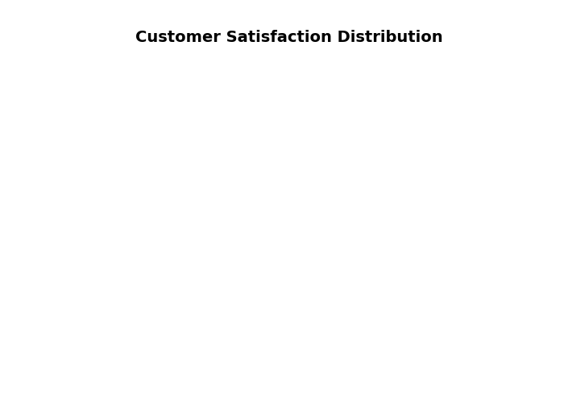

<!--
  © 2026 CVS Health and/or one of its affiliates. All rights reserved.

  Licensed under the Apache License, Version 2.0 (the "License");
  you may not use this file except in compliance with the License.
  You may obtain a copy of the License at

      http://www.apache.org/licenses/LICENSE-2.0

  Unless required by applicable law or agreed to in writing, software
  distributed under the License is distributed on an "AS IS" BASIS,
  WITHOUT WARRANTIES OR CONDITIONS OF ANY KIND, either express or implied.
  See the License for the specific language governing permissions and
  limitations under the License.
-->
# Pie Chart & Donut Chart

## Overview
Displays data as proportional slices of a circle, perfect for showing part-to-whole relationships. Donut charts are pie charts with a hollow center, often used for modern, clean designs.

## Sample Preview



## Best Use Cases
- **NPS Distribution** - Show Promoters, Passives, and Detractors percentages
- **Response Channel Breakdown** - Display survey responses by channel
- **Satisfaction Categories** - Visualize satisfaction level distribution

## Sample Data Structure

### AskRITA UniversalChartData
```python
from askrita.sqlagent.formatters.DataFormatter import UniversalChartData, ChartDataset, DataPoint

pie_data = UniversalChartData(
    type="pie",
    title="Customer Satisfaction Distribution",
    labels=["Very Satisfied", "Satisfied", "Neutral", "Dissatisfied", "Very Dissatisfied"],
    datasets=[
        ChartDataset(
            label="Response Count",
            data=[
                DataPoint(y=4250, category="Very Satisfied"),
                DataPoint(y=3890, category="Satisfied"),
                DataPoint(y=1120, category="Neutral"),
                DataPoint(y=680, category="Dissatisfied"),
                DataPoint(y=260, category="Very Dissatisfied")
            ]
        )
    ]
)
```

## Google Charts Implementation

### HTML Structure
```html
<!DOCTYPE html>
<html>
<head>
    <script type="text/javascript" src="https://www.gstatic.com/charts/loader.js"></script>
</head>
<body>
    <div id="pie_chart" style="width: 900px; height: 500px;"></div>
    <div id="donut_chart" style="width: 900px; height: 500px;"></div>
</body>
</html>
```

### JavaScript Code - Pie Chart
```javascript
google.charts.load('current', {'packages':['corechart']});
google.charts.setOnLoadCallback(drawPieChart);

function drawPieChart() {
    var data = google.visualization.arrayToDataTable([
        ['Satisfaction Level', 'Response Count'],
        ['Very Satisfied', 4250],
        ['Satisfied', 3890],
        ['Neutral', 1120],
        ['Dissatisfied', 680],
        ['Very Dissatisfied', 260]
    ]);

    var options = {
        title: 'Customer Satisfaction Distribution',
        titleTextStyle: {
            fontSize: 18,
            bold: true
        },
        width: 900,
        height: 500,
        colors: ['#28a745', '#6cb33f', '#ffc107', '#fd7e14', '#dc3545'],
        backgroundColor: 'white',
        chartArea: {
            left: 50,
            top: 80,
            width: '90%',
            height: '80%'
        },
        legend: {
            position: 'right',
            alignment: 'center',
            textStyle: {
                fontSize: 12
            }
        },
        pieSliceText: 'percentage',
        pieSliceTextStyle: {
            fontSize: 14,
            color: 'white'
        }
    };

    var chart = new google.visualization.PieChart(document.getElementById('pie_chart'));
    chart.draw(data, options);
}
```

### JavaScript Code - Donut Chart
```javascript
function drawDonutChart() {
    var data = google.visualization.arrayToDataTable([
        ['NPS Category', 'Percentage'],
        ['Promoters (9-10)', 58],
        ['Passives (7-8)', 27],
        ['Detractors (0-6)', 15]
    ]);

    var options = {
        title: 'Net Promoter Score Distribution',
        titleTextStyle: {
            fontSize: 18,
            bold: true
        },
        width: 900,
        height: 500,
        pieHole: 0.4, // Creates donut effect
        colors: ['#28a745', '#ffc107', '#dc3545'],
        backgroundColor: 'white',
        chartArea: {
            left: 50,
            top: 80,
            width: '90%',
            height: '80%'
        },
        legend: {
            position: 'bottom',
            alignment: 'center'
        },
        pieSliceText: 'value',
        pieSliceTextStyle: {
            fontSize: 16,
            color: 'white',
            bold: true
        }
    };

    var chart = new google.visualization.PieChart(document.getElementById('donut_chart'));
    chart.draw(data, options);
}
```

## React Implementation
```tsx
import React, { useEffect, useRef } from 'react';

interface PieChartProps {
    data: Array<{
        category: string;
        value: number;
    }>;
    title?: string;
    width?: number;
    height?: number;
    isDonut?: boolean;
    colors?: string[];
}

const PieChart: React.FC<PieChartProps> = ({
    data,
    title = "Pie Chart",
    width = 900,
    height = 500,
    isDonut = false,
    colors = ['#4285f4', '#34a853', '#fbbc04', '#ea4335', '#9aa0a6']
}) => {
    const chartRef = useRef<HTMLDivElement>(null);

    useEffect(() => {
        if (!window.google || !chartRef.current) return;

        const chartData = new google.visualization.DataTable();
        chartData.addColumn('string', 'Category');
        chartData.addColumn('number', 'Value');

        const rows = data.map(item => [item.category, item.value]);
        chartData.addRows(rows);

        const options = {
            title: title,
            width: width,
            height: height,
            colors: colors,
            pieHole: isDonut ? 0.4 : 0,
            chartArea: {
                left: 50,
                top: 80,
                width: '90%',
                height: '80%'
            },
            legend: {
                position: 'right',
                alignment: 'center'
            },
            pieSliceText: 'percentage',
            pieSliceTextStyle: {
                fontSize: 14,
                color: 'white'
            }
        };

        const chart = new google.visualization.PieChart(chartRef.current);
        chart.draw(chartData, options);
    }, [data, title, width, height, isDonut, colors]);

    return <div ref={chartRef} style={{ width: `${width}px`, height: `${height}px` }} />;
};

export default PieChart;
```

## Survey Data Examples

### NPS Distribution
```javascript
// Net Promoter Score breakdown
var data = google.visualization.arrayToDataTable([
    ['NPS Category', 'Count', 'Percentage'],
    ['Promoters (9-10)', 5800, 58],
    ['Passives (7-8)', 2700, 27],
    ['Detractors (0-6)', 1500, 15]
]);

var options = {
    title: 'Net Promoter Score Distribution',
    pieHole: 0.4,
    colors: ['#28a745', '#ffc107', '#dc3545'],
    slices: {
        0: { offset: 0.1 }, // Slightly separate promoters slice
        2: { offset: 0.05 }  // Slightly separate detractors slice
    },
    pieSliceText: 'label',
    tooltip: {
        text: 'both' // Show both value and percentage
    }
};
```

### Response Channel Distribution
```javascript
// Survey responses by channel
var data = google.visualization.arrayToDataTable([
    ['Channel', 'Responses'],
    ['Email Survey', 15420],
    ['SMS Survey', 8932],
    ['Phone Survey', 5621],
    ['In-Store Kiosk', 3210],
    ['Mobile App', 2890],
    ['Website', 1456]
]);

var options = {
    title: 'Survey Response Distribution by Channel',
    colors: ['#4285f4', '#34a853', '#fbbc04', '#ea4335', '#9467bd', '#8c564b'],
    pieSliceText: 'percentage',
    legend: {
        position: 'bottom',
        alignment: 'center',
        maxLines: 2
    }
};
```

### Service Area Satisfaction
```javascript
// Satisfaction levels across service areas
var data = google.visualization.arrayToDataTable([
    ['Service Area', 'Avg Satisfaction Score'],
    ['Walk-in Clinic', 8.7],
    ['Retail Store', 8.4],
    ['Wellness Center', 8.2],
    ['Premium Services', 7.9],
    ['Customer Service', 7.6],
    ['Digital Experience', 7.1]
]);

var options = {
    title: 'Average Satisfaction Score by Service Area',
    pieHole: 0.3,
    colors: ['#1f77b4', '#ff7f0e', '#2ca02c', '#d62728', '#9467bd', '#8c564b'],
    pieSliceText: 'value',
    pieSliceTextStyle: {
        fontSize: 12,
        color: 'white'
    }
};
```

## Advanced Features

### 3D Pie Chart
```javascript
function draw3DPieChart() {
    var options = {
        title: 'Customer Satisfaction Distribution',
        is3D: true,
        colors: ['#28a745', '#6cb33f', '#ffc107', '#fd7e14', '#dc3545'],
        pieSliceText: 'percentage',
        pieSliceTextStyle: {
            fontSize: 14
        }
    };

    var chart = new google.visualization.PieChart(document.getElementById('pie_chart'));
    chart.draw(data, options);
}
```

### Exploded Pie Chart
```javascript
function drawExplodedPieChart() {
    var options = {
        title: 'NPS Distribution with Emphasis',
        pieHole: 0.2,
        slices: {
            0: { offset: 0.2, color: '#28a745' }, // Promoters - exploded
            1: { offset: 0.0, color: '#ffc107' }, // Passives - normal
            2: { offset: 0.1, color: '#dc3545' }  // Detractors - slightly exploded
        },
        pieSliceText: 'label',
        pieSliceTextStyle: {
            fontSize: 14,
            bold: true
        }
    };

    var chart = new google.visualization.PieChart(document.getElementById('pie_chart'));
    chart.draw(data, options);
}
```

### Interactive Pie Chart with Drill-Down
```javascript
function drawInteractivePieChart() {
    var chart = new google.visualization.PieChart(document.getElementById('pie_chart'));
    
    google.visualization.events.addListener(chart, 'select', function() {
        var selection = chart.getSelection();
        if (selection.length > 0) {
            var row = selection[0].row;
            var category = data.getValue(row, 0);
            var value = data.getValue(row, 1);
            
            showDrillDownChart(category, value);
        }
    });
    
    chart.draw(data, options);
}

function showDrillDownChart(category, value) {
    // Load detailed breakdown for selected category
    const detailData = getDetailedData(category);
    
    // Create new chart for detailed view
    const detailChart = new google.visualization.PieChart(
        document.getElementById('detail_chart')
    );
    
    const detailOptions = {
        title: `${category} - Detailed Breakdown`,
        pieHole: 0.3,
        colors: getDetailColors(category)
    };
    
    detailChart.draw(detailData, detailOptions);
    
    // Show detail panel
    document.getElementById('detail_panel').style.display = 'block';
}
```

### Donut Chart with Center Text
```javascript
function drawDonutWithCenterText() {
    var data = google.visualization.arrayToDataTable([
        ['Category', 'Value'],
        ['Promoters', 58],
        ['Passives', 27],
        ['Detractors', 15]
    ]);

    var options = {
        title: 'NPS Score: 43',
        titlePosition: 'none', // Hide default title
        pieHole: 0.5,
        colors: ['#28a745', '#ffc107', '#dc3545'],
        legend: { position: 'none' },
        pieSliceText: 'none',
        tooltip: { trigger: 'selection' },
        chartArea: {
            left: 50,
            top: 50,
            width: '90%',
            height: '90%'
        }
    };

    var chart = new google.visualization.PieChart(document.getElementById('donut_chart'));
    
    google.visualization.events.addListener(chart, 'ready', function() {
        // Add custom center text
        const chartArea = chart.getChartLayoutInterface().getChartAreaBoundingBox();
        const centerX = chartArea.left + chartArea.width / 2;
        const centerY = chartArea.top + chartArea.height / 2;
        
        // Calculate NPS score
        const npsScore = 58 - 15; // Promoters - Detractors
        
        // Add center text overlay
        addCenterText('NPS Score', npsScore.toString(), centerX, centerY);
    });
    
    chart.draw(data, options);
}

function addCenterText(label, value, x, y) {
    const container = document.getElementById('donut_chart');
    const overlay = document.createElement('div');
    overlay.innerHTML = `
        <div style="position: absolute; left: ${x-50}px; top: ${y-20}px; 
                    width: 100px; text-align: center; pointer-events: none;">
            <div style="font-size: 24px; font-weight: bold; color: #333;">${value}</div>
            <div style="font-size: 12px; color: #666;">${label}</div>
        </div>
    `;
    container.appendChild(overlay);
}
```

## Key Features
- **Part-to-Whole Visualization** - Clear representation of proportions
- **Color Coding** - Visual category differentiation
- **Interactive Selection** - Click handling for detailed analysis
- **Multiple Styles** - 2D, 3D, donut, exploded variations
- **Custom Labels** - Flexible text display options

## When to Use
✅ **Perfect for:**
- Part-to-whole relationships
- Category distribution (3-7 categories)
- Percentage breakdowns
- Simple proportion comparisons
- Dashboard summary widgets

❌ **Avoid when:**
- Too many categories (>7)
- Precise value comparison needed
- Time series data
- Multiple data series
- Small differences between values

## Design Best Practices
```javascript
// Color schemes for different contexts
const satisfactionColors = [
    '#28a745', // Very Satisfied - Green
    '#6cb33f', // Satisfied - Light Green
    '#ffc107', // Neutral - Yellow
    '#fd7e14', // Dissatisfied - Orange
    '#dc3545'  // Very Dissatisfied - Red
];

const npsColors = [
    '#28a745', // Promoters - Green
    '#ffc107', // Passives - Yellow
    '#dc3545'  // Detractors - Red
];

// Accessibility considerations
const accessibleColors = [
    '#1f77b4', '#ff7f0e', '#2ca02c', '#d62728', 
    '#9467bd', '#8c564b', '#e377c2', '#7f7f7f'
];
```

## Performance Tips
```javascript
// For datasets with many small slices, group small values
function groupSmallSlices(data, threshold = 3) {
    const total = data.reduce((sum, item) => sum + item.value, 0);
    const grouped = [];
    let othersValue = 0;
    
    data.forEach(item => {
        const percentage = (item.value / total) * 100;
        if (percentage >= threshold) {
            grouped.push(item);
        } else {
            othersValue += item.value;
        }
    });
    
    if (othersValue > 0) {
        grouped.push({ category: 'Others', value: othersValue });
    }
    
    return grouped;
}
```

## Documentation
- [Google Charts PieChart Documentation](https://developers.google.com/chart/interactive/docs/gallery/piechart)
