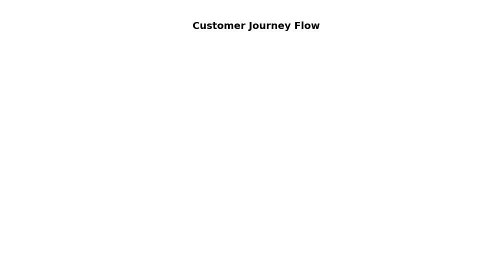

<!--
  © 2026 CVS Health and/or one of its affiliates. All rights reserved.

  Licensed under the Apache License, Version 2.0 (the "License");
  you may not use this file except in compliance with the License.
  You may obtain a copy of the License at

      http://www.apache.org/licenses/LICENSE-2.0

  Unless required by applicable law or agreed to in writing, software
  distributed under the License is distributed on an "AS IS" BASIS,
  WITHOUT WARRANTIES OR CONDITIONS OF ANY KIND, either express or implied.
  See the License for the specific language governing permissions and
  limitations under the License.
-->
# Sankey Flow Diagram

## Overview
Visualizes flow data between different stages, showing how quantities move from one state to another. Perfect for customer journey analysis, process flows, and conversion funnels.

## Sample Preview



## Best Use Cases
- **Customer Journey Flow** - Track customers through survey touchpoints
- **Conversion Funnels** - Show drop-off rates between survey stages
- **Process Analysis** - Visualize survey completion paths

## Sample Data Structure

### AskRITA UniversalChartData
```python
from askrita.sqlagent.formatters.DataFormatter import UniversalChartData

sankey_data = UniversalChartData(
    type="sankey",
    title="Customer Journey Flow",
    datasets=[],  # Empty for sankey charts
    flow_data=[
        {"from": "Survey Invitation", "to": "Survey Started", "weight": 1000},
        {"from": "Survey Started", "to": "Demographics", "weight": 850},
        {"from": "Demographics", "to": "Experience Questions", "weight": 750},
        {"from": "Experience Questions", "to": "NPS Question", "weight": 680},
        {"from": "NPS Question", "to": "Survey Completed", "weight": 620},
        {"from": "Survey Started", "to": "Abandoned", "weight": 150},
        {"from": "Demographics", "to": "Abandoned", "weight": 100},
        {"from": "Experience Questions", "to": "Abandoned", "weight": 70},
        {"from": "NPS Question", "to": "Abandoned", "weight": 60}
    ]
)
```

## Google Charts Implementation

### HTML Structure
```html
<!DOCTYPE html>
<html>
<head>
    <script type="text/javascript" src="https://www.gstatic.com/charts/loader.js"></script>
</head>
<body>
    <div id="sankey_chart" style="width: 900px; height: 600px;"></div>
</body>
</html>
```

### JavaScript Code
```javascript
google.charts.load('current', {'packages':['sankey']});
google.charts.setOnLoadCallback(drawSankeyChart);

function drawSankeyChart() {
    var data = new google.visualization.DataTable();
    data.addColumn('string', 'From');
    data.addColumn('string', 'To');
    data.addColumn('number', 'Weight');

    data.addRows([
        ['Survey Invitation', 'Survey Started', 1000],
        ['Survey Started', 'Demographics', 850],
        ['Demographics', 'Experience Questions', 750],
        ['Experience Questions', 'NPS Question', 680],
        ['NPS Question', 'Survey Completed', 620],
        ['Survey Started', 'Abandoned', 150],
        ['Demographics', 'Abandoned', 100],
        ['Experience Questions', 'Abandoned', 70],
        ['NPS Question', 'Abandoned', 60]
    ]);

    var options = {
        title: 'Customer Survey Journey Flow',
        titleTextStyle: {
            fontSize: 18,
            bold: true
        },
        width: 900,
        height: 600,
        sankey: {
            node: {
                colors: ['#4285f4', '#34a853', '#fbbc04', '#ea4335', '#9aa0a6'],
                label: {
                    fontName: 'Arial',
                    fontSize: 14,
                    color: '#333',
                    bold: true
                },
                nodePadding: 80
            },
            link: {
                colorMode: 'gradient',
                colors: ['#4285f4', '#34a853', '#fbbc04', '#ea4335']
            }
        }
    };

    var chart = new google.visualization.Sankey(document.getElementById('sankey_chart'));
    chart.draw(data, options);
}
```

## React Implementation
```tsx
import React, { useEffect, useRef } from 'react';

interface SankeyChartProps {
    data: Array<{
        from: string;
        to: string;
        weight: number;
    }>;
    title?: string;
    width?: number;
    height?: number;
}

const SankeyChart: React.FC<SankeyChartProps> = ({
    data,
    title = "Flow Diagram",
    width = 900,
    height = 600
}) => {
    const chartRef = useRef<HTMLDivElement>(null);

    useEffect(() => {
        if (!window.google || !chartRef.current) return;

        const chartData = new google.visualization.DataTable();
        chartData.addColumn('string', 'From');
        chartData.addColumn('string', 'To');
        chartData.addColumn('number', 'Weight');

        const rows = data.map(item => [item.from, item.to, item.weight]);
        chartData.addRows(rows);

        const options = {
            title: title,
            width: width,
            height: height,
            sankey: {
                node: {
                    colors: ['#4285f4', '#34a853', '#fbbc04', '#ea4335', '#9aa0a6'],
                    label: {
                        fontName: 'Arial',
                        fontSize: 14,
                        color: '#333'
                    }
                },
                link: {
                    colorMode: 'gradient'
                }
            }
        };

        const chart = new google.visualization.Sankey(chartRef.current);
        chart.draw(chartData, options);
    }, [data, title, width, height]);

    return <div ref={chartRef} style={{ width: `${width}px`, height: `${height}px` }} />;
};

export default SankeyChart;
```

## Survey Data Examples

### Survey Completion Funnel
```javascript
// Customer journey through survey completion
var data = new google.visualization.DataTable();
data.addColumn('string', 'From');
data.addColumn('string', 'To');
data.addColumn('number', 'Count');

data.addRows([
    ['Email Sent', 'Email Opened', 2500],
    ['Email Opened', 'Survey Clicked', 1800],
    ['Survey Clicked', 'Survey Started', 1650],
    ['Survey Started', 'Page 1 Complete', 1450],
    ['Page 1 Complete', 'Page 2 Complete', 1320],
    ['Page 2 Complete', 'NPS Question', 1200],
    ['NPS Question', 'Survey Submitted', 1150],
    
    // Drop-offs
    ['Email Sent', 'Not Opened', 2500],
    ['Email Opened', 'Not Clicked', 700],
    ['Survey Clicked', 'Abandoned at Start', 150],
    ['Survey Started', 'Abandoned Page 1', 200],
    ['Page 1 Complete', 'Abandoned Page 2', 130],
    ['Page 2 Complete', 'Abandoned NPS', 120],
    ['NPS Question', 'Abandoned Final', 50]
]);
```

### Multi-Channel Flow
```javascript
// Customer flow across different channels
var data = new google.visualization.DataTable();
data.addColumn('string', 'From');
data.addColumn('string', 'To');
data.addColumn('number', 'Volume');

data.addRows([
    // Initial touchpoints
    ['Email Campaign', 'Survey Response', 1200],
    ['SMS Campaign', 'Survey Response', 800],
    ['Phone Call', 'Survey Response', 600],
    ['Website Popup', 'Survey Response', 400],
    
    // Response processing
    ['Survey Response', 'Positive Feedback', 1800],
    ['Survey Response', 'Neutral Feedback', 900],
    ['Survey Response', 'Negative Feedback', 300],
    
    // Follow-up actions
    ['Positive Feedback', 'Thank You Email', 1800],
    ['Neutral Feedback', 'Follow-up Survey', 450],
    ['Negative Feedback', 'Customer Service Contact', 300],
    ['Negative Feedback', 'Manager Review', 300]
]);
```

### Business Unit Flow
```javascript
// Customer flow between business units
var data = new google.visualization.DataTable();
data.addColumn('string', 'From');
data.addColumn('string', 'To');
data.addColumn('number', 'Customers');

data.addRows([
    ['New Customers', 'Retail Store', 5000],
    ['New Customers', 'Walk-in Clinic', 2000],
    ['New Customers', 'Wellness Center', 1500],
    
    ['Retail Store', 'Satisfied', 4200],
    ['Retail Store', 'Neutral', 600],
    ['Retail Store', 'Dissatisfied', 200],
    
    ['Walk-in Clinic', 'Satisfied', 1700],
    ['Walk-in Clinic', 'Neutral', 250],
    ['Walk-in Clinic', 'Dissatisfied', 50],
    
    ['Wellness Center', 'Satisfied', 1300],
    ['Wellness Center', 'Neutral', 150],
    ['Wellness Center', 'Dissatisfied', 50],
    
    // Cross-selling
    ['Satisfied', 'Additional Services', 2800],
    ['Satisfied', 'Loyalty Program', 4400]
]);
```

## Advanced Customization

### Custom Colors and Styling
```javascript
var options = {
    title: 'Advanced Survey Flow Analysis',
    sankey: {
        node: {
            colors: [
                '#1f77b4', // Blue for start
                '#ff7f0e', // Orange for process
                '#2ca02c', // Green for success
                '#d62728', // Red for abandonment
                '#9467bd'  // Purple for follow-up
            ],
            label: {
                fontName: 'Roboto',
                fontSize: 12,
                color: '#333',
                bold: false
            },
            nodePadding: 100,
            width: 20
        },
        link: {
            colorMode: 'source', // 'source', 'target', or 'gradient'
            color: {
                fill: '#d9d9d9',
                fillOpacity: 0.8
            }
        }
    },
    tooltip: {
        textStyle: {
            fontSize: 12
        }
    }
};
```

### Interactive Features
```javascript
function drawInteractiveSankey() {
    var chart = new google.visualization.Sankey(document.getElementById('sankey_chart'));
    
    // Add selection listener
    google.visualization.events.addListener(chart, 'select', function() {
        var selection = chart.getSelection();
        if (selection.length > 0) {
            var row = selection[0].row;
            if (row !== null) {
                var from = data.getValue(row, 0);
                var to = data.getValue(row, 1);
                var weight = data.getValue(row, 2);
                
                showFlowDetails(from, to, weight);
            }
        }
    });
    
    chart.draw(data, options);
}

function showFlowDetails(from, to, weight) {
    const percentage = ((weight / getTotalVolume()) * 100).toFixed(1);
    alert(`Flow: ${from} → ${to}\nVolume: ${weight} (${percentage}%)`);
}
```

### Multi-Stage Analysis
```javascript
// Complex multi-stage customer journey
function createMultiStageFlow() {
    var data = new google.visualization.DataTable();
    data.addColumn('string', 'From');
    data.addColumn('string', 'To');
    data.addColumn('number', 'Volume');

    // Stage 1: Awareness
    data.addRows([
        ['Marketing Campaign', 'Website Visit', 10000],
        ['Word of Mouth', 'Website Visit', 3000],
        ['Social Media', 'Website Visit', 2000]
    ]);

    // Stage 2: Interest
    data.addRows([
        ['Website Visit', 'Survey Invitation', 8000],
        ['Website Visit', 'Bounced', 7000]
    ]);

    // Stage 3: Engagement
    data.addRows([
        ['Survey Invitation', 'Survey Started', 6000],
        ['Survey Invitation', 'Ignored', 2000]
    ]);

    // Stage 4: Completion
    data.addRows([
        ['Survey Started', 'Completed', 4500],
        ['Survey Started', 'Partial', 1000],
        ['Survey Started', 'Abandoned', 500]
    ]);

    // Stage 5: Follow-up
    data.addRows([
        ['Completed', 'Promoter', 2700],
        ['Completed', 'Passive', 1350],
        ['Completed', 'Detractor', 450],
        ['Partial', 'Follow-up Sent', 800],
        ['Abandoned', 'Re-engagement', 300]
    ]);

    return data;
}
```

## Key Features
- **Flow Visualization** - Clear representation of quantity movement
- **Multi-path Support** - Shows parallel and converging flows
- **Interactive Selection** - Click handling for detailed analysis
- **Custom Styling** - Flexible color and layout options
- **Gradient Links** - Visual flow direction indicators

## When to Use
✅ **Perfect for:**
- Customer journey mapping
- Process flow analysis
- Conversion funnel visualization
- Multi-stage workflows
- Drop-off analysis

❌ **Avoid when:**
- Simple two-stage comparisons
- Time-series data
- Geographic analysis needed
- Too many small flows (cluttered)

## Performance Tips
```javascript
// For large datasets, consider data aggregation
function aggregateSmallFlows(data, threshold = 50) {
    const aggregated = [];
    let otherWeight = 0;
    
    data.forEach(row => {
        if (row[2] >= threshold) {
            aggregated.push(row);
        } else {
            otherWeight += row[2];
        }
    });
    
    if (otherWeight > 0) {
        aggregated.push(['Other Sources', 'Other Destinations', otherWeight]);
    }
    
    return aggregated;
}
```

## Documentation
- [Google Charts Sankey Documentation](https://developers.google.com/chart/interactive/docs/gallery/sankey)
