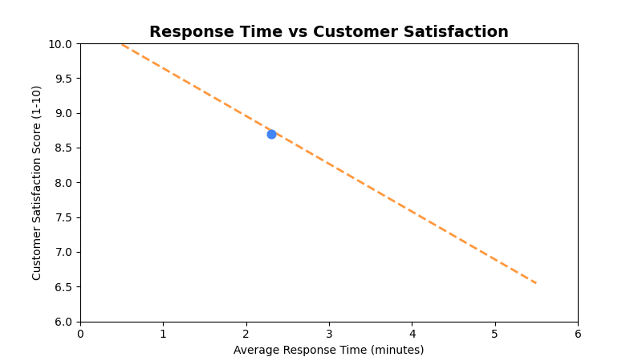

<!--
  © 2026 CVS Health and/or one of its affiliates. All rights reserved.

  Licensed under the Apache License, Version 2.0 (the "License");
  you may not use this file except in compliance with the License.
  You may obtain a copy of the License at

      http://www.apache.org/licenses/LICENSE-2.0

  Unless required by applicable law or agreed to in writing, software
  distributed under the License is distributed on an "AS IS" BASIS,
  WITHOUT WARRANTIES OR CONDITIONS OF ANY KIND, either express or implied.
  See the License for the specific language governing permissions and
  limitations under the License.
-->
# Scatter Plot Chart

## Overview
Displays data points on a two-dimensional plane to show correlation between two numeric variables. Perfect for identifying patterns, outliers, and relationships in survey data.

## Sample Preview



## Best Use Cases
- **Response Time vs Satisfaction** - Analyze if faster responses correlate with higher satisfaction
- **Store Size vs Performance** - Compare store metrics against performance indicators
- **Demographics vs Satisfaction** - Explore relationships between customer attributes and satisfaction

## Sample Data Structure

### AskRITA UniversalChartData
```python
from askrita.sqlagent.formatters.DataFormatter import UniversalChartData, ChartDataset, DataPoint

scatter_data = UniversalChartData(
    type="scatter",
    title="Response Time vs Customer Satisfaction",
    labels=[],  # Not used for scatter plots
    datasets=[
        ChartDataset(
            label="Store Performance",
            data=[
                DataPoint(x=2.3, y=8.7),  # Response time vs satisfaction
                DataPoint(x=3.1, y=8.2),
                DataPoint(x=1.8, y=9.1),
                DataPoint(x=4.2, y=7.5),
                DataPoint(x=2.9, y=8.4),
                DataPoint(x=3.7, y=7.8),
                DataPoint(x=1.5, y=9.3),
                DataPoint(x=5.1, y=6.9)
            ]
        )
    ],
    xAxisLabel="Average Response Time (minutes)",
    yAxisLabel="Customer Satisfaction Score"
)
```

## Google Charts Implementation

### HTML Structure
```html
<!DOCTYPE html>
<html>
<head>
    <script type="text/javascript" src="https://www.gstatic.com/charts/loader.js"></script>
</head>
<body>
    <div id="scatter_chart" style="width: 900px; height: 500px;"></div>
</body>
</html>
```

### JavaScript Code
```javascript
google.charts.load('current', {'packages':['corechart']});
google.charts.setOnLoadCallback(drawScatterChart);

function drawScatterChart() {
    var data = google.visualization.arrayToDataTable([
        ['Response Time (min)', 'Satisfaction Score'],
        [2.3, 8.7],
        [3.1, 8.2],
        [1.8, 9.1],
        [4.2, 7.5],
        [2.9, 8.4],
        [3.7, 7.8],
        [1.5, 9.3],
        [5.1, 6.9],
        [2.7, 8.6],
        [3.9, 7.3],
        [2.1, 8.9],
        [4.8, 7.1],
        [1.9, 9.0],
        [3.4, 8.0],
        [4.5, 7.2]
    ]);

    var options = {
        title: 'Response Time vs Customer Satisfaction',
        titleTextStyle: {
            fontSize: 18,
            bold: true
        },
        width: 900,
        height: 500,
        hAxis: {
            title: 'Average Response Time (minutes)',
            minValue: 0,
            maxValue: 6
        },
        vAxis: {
            title: 'Customer Satisfaction Score (1-10)',
            minValue: 6,
            maxValue: 10
        },
        colors: ['#4285f4'],
        backgroundColor: 'white',
        chartArea: {
            left: 80,
            top: 80,
            width: '80%',
            height: '70%'
        },
        pointSize: 8,
        pointShape: 'circle',
        trendlines: {
            0: {
                type: 'linear',
                color: '#ff7f0e',
                lineWidth: 2,
                opacity: 0.8,
                showR2: true,
                visibleInLegend: true
            }
        }
    };

    var chart = new google.visualization.ScatterChart(document.getElementById('scatter_chart'));
    chart.draw(data, options);
}
```

### Multi-Series Scatter Chart
```javascript
function drawMultiSeriesScatterChart() {
    var data = google.visualization.arrayToDataTable([
        ['Store Size (sq ft)', 'Retail Store', 'Walk-in Clinic', 'Wellness Center'],
        [8000, 8.2, null, null],
        [12000, 8.4, null, null],
        [15000, 8.6, null, null],
        [6000, null, 8.7, null],
        [8000, null, 8.9, null],
        [10000, null, 9.1, null],
        [20000, null, null, 8.0],
        [25000, null, null, 8.3],
        [30000, null, null, 8.5]
    ]);

    var options = {
        title: 'Store Size vs Satisfaction by Service Type',
        hAxis: {
            title: 'Store Size (square feet)',
            format: '#,###'
        },
        vAxis: {
            title: 'Customer Satisfaction Score',
            minValue: 7.5,
            maxValue: 9.5
        },
        colors: ['#4285f4', '#34a853', '#fbbc04'],
        pointSize: 10,
        series: {
            0: { pointShape: 'circle' },
            1: { pointShape: 'triangle' },
            2: { pointShape: 'square' }
        }
    };

    var chart = new google.visualization.ScatterChart(document.getElementById('scatter_chart'));
    chart.draw(data, options);
}
```

## React Implementation
```tsx
import React, { useEffect, useRef } from 'react';

interface ScatterChartProps {
    data: Array<{
        x: number;
        y: number;
        series?: string;
        label?: string;
    }>;
    title?: string;
    width?: number;
    height?: number;
    xAxisLabel?: string;
    yAxisLabel?: string;
    showTrendline?: boolean;
}

const ScatterChart: React.FC<ScatterChartProps> = ({
    data,
    title = "Scatter Chart",
    width = 900,
    height = 500,
    xAxisLabel = "X Axis",
    yAxisLabel = "Y Axis",
    showTrendline = false
}) => {
    const chartRef = useRef<HTMLDivElement>(null);

    useEffect(() => {
        if (!window.google || !chartRef.current) return;

        // Group data by series if multi-series
        const series = [...new Set(data.map(item => item.series || 'Default'))];
        
        if (series.length === 1) {
            // Single series
            const chartData = new google.visualization.DataTable();
            chartData.addColumn('number', xAxisLabel);
            chartData.addColumn('number', yAxisLabel);

            const rows = data.map(item => [item.x, item.y]);
            chartData.addRows(rows);

            const options = {
                title: title,
                width: width,
                height: height,
                hAxis: { title: xAxisLabel },
                vAxis: { title: yAxisLabel },
                colors: ['#4285f4'],
                pointSize: 8,
                trendlines: showTrendline ? {
                    0: {
                        type: 'linear',
                        color: '#ff7f0e',
                        lineWidth: 2,
                        opacity: 0.8,
                        showR2: true
                    }
                } : {}
            };

            const chart = new google.visualization.ScatterChart(chartRef.current);
            chart.draw(chartData, options);
        } else {
            // Multi-series implementation
            const chartData = new google.visualization.DataTable();
            chartData.addColumn('number', xAxisLabel);
            series.forEach(s => chartData.addColumn('number', s));

            // Create sparse matrix for multi-series data
            const xValues = [...new Set(data.map(item => item.x))].sort((a, b) => a - b);
            const rows = xValues.map(x => {
                const row = [x];
                series.forEach(s => {
                    const point = data.find(item => item.x === x && (item.series || 'Default') === s);
                    row.push(point ? point.y : null);
                });
                return row;
            });

            chartData.addRows(rows);

            const options = {
                title: title,
                width: width,
                height: height,
                hAxis: { title: xAxisLabel },
                vAxis: { title: yAxisLabel },
                colors: ['#4285f4', '#34a853', '#fbbc04', '#ea4335'],
                pointSize: 8
            };

            const chart = new google.visualization.ScatterChart(chartRef.current);
            chart.draw(chartData, options);
        }
    }, [data, title, width, height, xAxisLabel, yAxisLabel, showTrendline]);

    return <div ref={chartRef} style={{ width: `${width}px`, height: `${height}px` }} />;
};

export default ScatterChart;
```

## Survey Data Examples

### Wait Time vs Satisfaction Analysis
```javascript
// Analyze relationship between wait time and satisfaction
var data = google.visualization.arrayToDataTable([
    ['Wait Time (minutes)', 'Satisfaction Score', 'Store ID'],
    [2, 9.2, 'Store A'],
    [5, 8.7, 'Store B'],
    [3, 8.9, 'Store C'],
    [8, 7.8, 'Store D'],
    [1, 9.5, 'Store E'],
    [12, 6.9, 'Store F'],
    [4, 8.5, 'Store G'],
    [7, 8.1, 'Store H'],
    [15, 6.2, 'Store I'],
    [6, 8.3, 'Store J']
]);

var options = {
    title: 'Wait Time Impact on Customer Satisfaction',
    hAxis: {
        title: 'Average Wait Time (minutes)',
        minValue: 0
    },
    vAxis: {
        title: 'Customer Satisfaction Score',
        minValue: 5,
        maxValue: 10
    },
    trendlines: {
        0: {
            type: 'linear',
            color: '#ea4335',
            lineWidth: 3,
            opacity: 0.7,
            showR2: true,
            visibleInLegend: true
        }
    },
    pointSize: 10
};
```

### Customer Demographics vs NPS
```javascript
// Age vs NPS score correlation
var data = google.visualization.arrayToDataTable([
    ['Customer Age', 'NPS Score', 'Response Count'],
    [25, 45, 150],
    [35, 62, 280],
    [45, 71, 320],
    [55, 78, 450],
    [65, 82, 380],
    [75, 85, 220],
    [30, 52, 190],
    [40, 68, 310],
    [50, 74, 420],
    [60, 80, 390],
    [70, 84, 250]
]);

var options = {
    title: 'Customer Age vs NPS Score',
    hAxis: {
        title: 'Customer Age',
        minValue: 20,
        maxValue: 80
    },
    vAxis: {
        title: 'NPS Score',
        minValue: 0,
        maxValue: 100
    },
    bubble: {
        textStyle: {
            fontSize: 11
        }
    },
    sizeAxis: {
        minValue: 0,
        maxSize: 20
    }
};

// Use bubble chart for three dimensions
var chart = new google.visualization.BubbleChart(document.getElementById('scatter_chart'));
```

### Store Performance Matrix
```javascript
// Store performance across two key metrics
var data = google.visualization.arrayToDataTable([
    ['Customer Volume', 'Satisfaction Score', 'Store Type'],
    [1200, 8.2, 'Urban'],
    [800, 8.7, 'Suburban'],
    [1500, 7.9, 'Urban'],
    [600, 9.1, 'Rural'],
    [2000, 7.5, 'Urban'],
    [900, 8.5, 'Suburban'],
    [400, 9.3, 'Rural'],
    [1800, 7.8, 'Urban'],
    [700, 8.8, 'Suburban'],
    [500, 9.0, 'Rural']
]);

var options = {
    title: 'Store Performance: Volume vs Satisfaction',
    hAxis: {
        title: 'Monthly Customer Volume',
        format: '#,###'
    },
    vAxis: {
        title: 'Average Satisfaction Score',
        minValue: 7,
        maxValue: 10
    },
    series: {
        0: { color: '#4285f4', pointShape: 'circle' },    // Urban
        1: { color: '#34a853', pointShape: 'triangle' },  // Suburban
        2: { color: '#fbbc04', pointShape: 'square' }     // Rural
    },
    pointSize: 12
};
```

## Advanced Features

### Bubble Chart (3D Scatter)
```javascript
function drawBubbleChart() {
    var data = google.visualization.arrayToDataTable([
        ['ID', 'Customer Volume', 'Satisfaction', 'Store Size', 'Region'],
        ['Store A', 1200, 8.2, 15000, 'Northeast'],
        ['Store B', 800, 8.7, 12000, 'Southeast'],
        ['Store C', 1500, 7.9, 18000, 'Northeast'],
        ['Store D', 600, 9.1, 8000, 'Midwest'],
        ['Store E', 2000, 7.5, 25000, 'West']
    ]);

    var options = {
        title: 'Store Performance Analysis (Volume, Satisfaction, Size)',
        hAxis: { title: 'Monthly Customer Volume' },
        vAxis: { title: 'Customer Satisfaction Score' },
        bubble: {
            textStyle: {
                fontSize: 12,
                fontName: 'Arial',
                color: 'white',
                bold: true
            }
        },
        sizeAxis: {
            minValue: 5000,
            maxValue: 30000,
            minSize: 10,
            maxSize: 30
        },
        colorAxis: {
            colors: ['#4285f4', '#34a853', '#fbbc04', '#ea4335']
        }
    };

    var chart = new google.visualization.BubbleChart(document.getElementById('bubble_chart'));
    chart.draw(data, options);
}
```

### Interactive Scatter with Selection
```javascript
function drawInteractiveScatterChart() {
    var chart = new google.visualization.ScatterChart(document.getElementById('scatter_chart'));
    
    google.visualization.events.addListener(chart, 'select', function() {
        var selection = chart.getSelection();
        if (selection.length > 0) {
            var row = selection[0].row;
            var xValue = data.getValue(row, 0);
            var yValue = data.getValue(row, 1);
            
            showPointDetails(xValue, yValue, row);
        }
    });
    
    // Add brush selection for zooming
    google.visualization.events.addListener(chart, 'regionClick', function(e) {
        zoomToRegion(e.region);
    });
    
    chart.draw(data, options);
}

function showPointDetails(x, y, row) {
    const detailPanel = document.getElementById('point-details');
    detailPanel.innerHTML = `
        <h4>Store Details</h4>
        <p>Response Time: ${x} minutes</p>
        <p>Satisfaction: ${y}/10</p>
        <p>Store ID: ${getStoreId(row)}</p>
        <button onclick="loadStoreAnalysis(${row})">View Full Analysis</button>
    `;
    detailPanel.style.display = 'block';
}
```

### Correlation Analysis
```javascript
function calculateCorrelation(data) {
    const n = data.getNumberOfRows();
    let sumX = 0, sumY = 0, sumXY = 0, sumX2 = 0, sumY2 = 0;
    
    for (let i = 0; i < n; i++) {
        const x = data.getValue(i, 0);
        const y = data.getValue(i, 1);
        
        sumX += x;
        sumY += y;
        sumXY += x * y;
        sumX2 += x * x;
        sumY2 += y * y;
    }
    
    const correlation = (n * sumXY - sumX * sumY) / 
        Math.sqrt((n * sumX2 - sumX * sumX) * (n * sumY2 - sumY * sumY));
    
    return correlation;
}

function displayCorrelationInfo(correlation) {
    const strength = Math.abs(correlation);
    let description;
    
    if (strength >= 0.7) description = 'Strong';
    else if (strength >= 0.3) description = 'Moderate';
    else description = 'Weak';
    
    const direction = correlation > 0 ? 'Positive' : 'Negative';
    
    document.getElementById('correlation-info').innerHTML = `
        <p><strong>Correlation:</strong> ${correlation.toFixed(3)}</p>
        <p><strong>Relationship:</strong> ${description} ${direction}</p>
    `;
}
```

## Key Features
- **Correlation Analysis** - Shows relationships between two variables
- **Trend Lines** - Built-in linear regression analysis
- **Multiple Series** - Compare different groups or categories
- **Outlier Detection** - Easily spot unusual data points
- **Interactive Selection** - Click handling for detailed analysis

## When to Use
✅ **Perfect for:**
- Correlation analysis
- Outlier detection
- Relationship exploration
- Performance analysis
- Quality control charts

❌ **Avoid when:**
- Categorical data
- Time series trends
- Part-to-whole relationships
- Too many data points (>500)

## Performance Tips
```javascript
// For large datasets, consider data sampling
function sampleData(data, maxPoints = 200) {
    if (data.length <= maxPoints) return data;
    
    const step = Math.floor(data.length / maxPoints);
    return data.filter((_, index) => index % step === 0);
}

// Or use data aggregation for dense regions
function aggregatePoints(data, gridSize = 20) {
    const grid = {};
    
    data.forEach(point => {
        const gridX = Math.floor(point.x / gridSize) * gridSize;
        const gridY = Math.floor(point.y / gridSize) * gridSize;
        const key = `${gridX},${gridY}`;
        
        if (!grid[key]) {
            grid[key] = { x: gridX, y: gridY, count: 0, sumX: 0, sumY: 0 };
        }
        
        grid[key].count++;
        grid[key].sumX += point.x;
        grid[key].sumY += point.y;
    });
    
    return Object.values(grid).map(cell => ({
        x: cell.sumX / cell.count,
        y: cell.sumY / cell.count,
        size: cell.count
    }));
}
```

## Documentation
- [Google Charts ScatterChart Documentation](https://developers.google.com/chart/interactive/docs/gallery/scatterchart)
- [Google Charts BubbleChart Documentation](https://developers.google.com/chart/interactive/docs/gallery/bubblechart)
