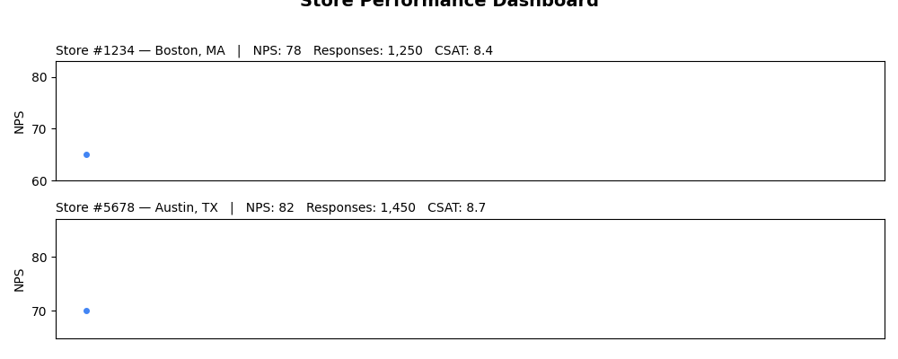

<!--
  © 2026 CVS Health and/or one of its affiliates. All rights reserved.

  Licensed under the Apache License, Version 2.0 (the "License");
  you may not use this file except in compliance with the License.
  You may obtain a copy of the License at

      http://www.apache.org/licenses/LICENSE-2.0

  Unless required by applicable law or agreed to in writing, software
  distributed under the License is distributed on an "AS IS" BASIS,
  WITHOUT WARRANTIES OR CONDITIONS OF ANY KIND, either express or implied.
  See the License for the specific language governing permissions and
  limitations under the License.
-->
# Data Table with Sparklines

## Overview
Displays tabular data with embedded mini-charts (sparklines) in cells. Perfect for showing detailed data alongside visual trends, combining the precision of tables with the insight of charts.

## Sample Preview



## Best Use Cases
- **Store Performance Dashboard** - Show store metrics with trend sparklines
- **Customer Segment Analysis** - Display segment data with satisfaction trends
- **Monthly Reports** - Present KPIs with historical trend visualization

## Sample Data Structure

### AskRITA UniversalChartData
```python
from askrita.sqlagent.formatters.DataFormatter import UniversalChartData

table_data = UniversalChartData(
    type="table",
    title="Store Performance Dashboard",
    datasets=[],  # Empty for table charts
    table_data=[
        {
            "store_id": "Store #1234",
            "location": "Boston, MA",
            "current_nps": 78,
            "nps_trend": [65, 68, 71, 74, 76, 78],
            "monthly_responses": 1250,
            "response_trend": [980, 1050, 1120, 1180, 1220, 1250],
            "satisfaction": 8.4,
            "satisfaction_trend": [8.0, 8.1, 8.2, 8.3, 8.3, 8.4]
        },
        {
            "store_id": "Store #5678",
            "location": "Austin, TX",
            "current_nps": 82,
            "nps_trend": [70, 73, 76, 78, 80, 82],
            "monthly_responses": 1450,
            "response_trend": [1200, 1280, 1320, 1380, 1420, 1450],
            "satisfaction": 8.7,
            "satisfaction_trend": [8.2, 8.3, 8.4, 8.5, 8.6, 8.7]
        }
    ]
)
```

## Google Charts Implementation

### HTML Structure
```html
<!DOCTYPE html>
<html>
<head>
    <script type="text/javascript" src="https://www.gstatic.com/charts/loader.js"></script>
</head>
<body>
    <div id="table_chart" style="width: 1200px; height: 500px;"></div>
</body>
</html>
```

### JavaScript Code
```javascript
google.charts.load('current', {'packages':['table']});
google.charts.setOnLoadCallback(drawTableChart);

function drawTableChart() {
    var data = new google.visualization.DataTable();
    
    // Define columns
    data.addColumn('string', 'Store ID');
    data.addColumn('string', 'Location');
    data.addColumn('number', 'Current NPS');
    data.addColumn('string', 'NPS Trend');
    data.addColumn('number', 'Monthly Responses');
    data.addColumn('string', 'Response Trend');
    data.addColumn('number', 'Satisfaction');
    data.addColumn('string', 'Satisfaction Trend');

    // Add rows with sparkline data
    data.addRows([
        [
            'Store #1234', 
            'Boston, MA', 
            78, 
            createSparklineHTML([65, 68, 71, 74, 76, 78], 'line'),
            1250,
            createSparklineHTML([980, 1050, 1120, 1180, 1220, 1250], 'column'),
            8.4,
            createSparklineHTML([8.0, 8.1, 8.2, 8.3, 8.3, 8.4], 'line')
        ],
        [
            'Store #5678', 
            'Austin, TX', 
            82, 
            createSparklineHTML([70, 73, 76, 78, 80, 82], 'line'),
            1450,
            createSparklineHTML([1200, 1280, 1320, 1380, 1420, 1450], 'column'),
            8.7,
            createSparklineHTML([8.2, 8.3, 8.4, 8.5, 8.6, 8.7], 'line')
        ],
        [
            'Store #9012', 
            'Seattle, WA', 
            75, 
            createSparklineHTML([68, 70, 72, 73, 74, 75], 'line'),
            1180,
            createSparklineHTML([950, 1020, 1080, 1120, 1150, 1180], 'column'),
            8.1,
            createSparklineHTML([7.8, 7.9, 8.0, 8.0, 8.1, 8.1], 'line')
        ],
        [
            'Store #3456', 
            'Denver, CO', 
            85, 
            createSparklineHTML([75, 78, 80, 82, 84, 85], 'line'),
            890,
            createSparklineHTML([720, 780, 820, 850, 870, 890], 'column'),
            8.9,
            createSparklineHTML([8.3, 8.4, 8.6, 8.7, 8.8, 8.9], 'line')
        ]
    ]);

    var options = {
        title: 'Store Performance Dashboard',
        titleTextStyle: {
            fontSize: 18,
            bold: true
        },
        width: 1200,
        height: 500,
        allowHtml: true, // Enable HTML content in cells
        alternatingRowStyle: false,
        cssClassNames: {
            'headerRow': 'table-header',
            'tableRow': 'table-row',
            'evenTableRow': 'table-row-even'
        },
        sort: 'enable'
    };

    var chart = new google.visualization.Table(document.getElementById('table_chart'));
    chart.draw(data, options);
}

function createSparklineHTML(values, type = 'line') {
    const width = 100;
    const height = 30;
    const max = Math.max(...values);
    const min = Math.min(...values);
    const range = max - min || 1;
    
    if (type === 'line') {
        // Create SVG line sparkline
        const points = values.map((value, index) => {
            const x = (index / (values.length - 1)) * width;
            const y = height - ((value - min) / range) * height;
            return `${x},${y}`;
        }).join(' ');
        
        return `<svg width="${width}" height="${height}" style="display: block;">
                    <polyline points="${points}" 
                              fill="none" 
                              stroke="#4285f4" 
                              stroke-width="2"/>
                </svg>`;
    } else if (type === 'column') {
        // Create SVG column sparkline
        const barWidth = width / values.length - 1;
        const bars = values.map((value, index) => {
            const x = index * (barWidth + 1);
            const barHeight = ((value - min) / range) * height;
            const y = height - barHeight;
            return `<rect x="${x}" y="${y}" width="${barWidth}" height="${barHeight}" fill="#34a853"/>`;
        }).join('');
        
        return `<svg width="${width}" height="${height}" style="display: block;">
                    ${bars}
                </svg>`;
    }
}
```

## React Implementation
```tsx
import React, { useEffect, useRef } from 'react';

interface TableRow {
    [key: string]: any;
    sparklines?: { [column: string]: number[] };
}

interface TableChartProps {
    data: TableRow[];
    columns: Array<{
        id: string;
        label: string;
        type: 'string' | 'number' | 'sparkline';
        sparklineType?: 'line' | 'column';
    }>;
    title?: string;
    width?: number;
    height?: number;
    sortable?: boolean;
}

const TableChart: React.FC<TableChartProps> = ({
    data,
    columns,
    title = "Data Table",
    width = 1200,
    height = 500,
    sortable = true
}) => {
    const chartRef = useRef<HTMLDivElement>(null);

    useEffect(() => {
        if (!window.google || !chartRef.current) return;

        const dataTable = new google.visualization.DataTable();
        
        // Add columns
        columns.forEach(col => {
            if (col.type === 'sparkline') {
                dataTable.addColumn('string', col.label);
            } else {
                dataTable.addColumn(col.type, col.label);
            }
        });

        // Add rows
        const rows = data.map(row => {
            return columns.map(col => {
                if (col.type === 'sparkline' && row.sparklines && row.sparklines[col.id]) {
                    return createSparklineHTML(row.sparklines[col.id], col.sparklineType || 'line');
                }
                return row[col.id];
            });
        });
        dataTable.addRows(rows);

        const options = {
            title: title,
            width: width,
            height: height,
            allowHtml: true,
            sort: sortable ? 'enable' : 'disable',
            alternatingRowStyle: false
        };

        const chart = new google.visualization.Table(chartRef.current);
        chart.draw(dataTable, options);
    }, [data, columns, title, width, height, sortable]);

    const createSparklineHTML = (values: number[], type: 'line' | 'column') => {
        const width = 100;
        const height = 30;
        const max = Math.max(...values);
        const min = Math.min(...values);
        const range = max - min || 1;
        
        if (type === 'line') {
            const points = values.map((value, index) => {
                const x = (index / (values.length - 1)) * width;
                const y = height - ((value - min) / range) * height;
                return `${x},${y}`;
            }).join(' ');
            
            return `<svg width="${width}" height="${height}">
                        <polyline points="${points}" fill="none" stroke="#4285f4" stroke-width="2"/>
                    </svg>`;
        } else {
            const barWidth = width / values.length - 1;
            const bars = values.map((value, index) => {
                const x = index * (barWidth + 1);
                const barHeight = ((value - min) / range) * height;
                const y = height - barHeight;
                return `<rect x="${x}" y="${y}" width="${barWidth}" height="${barHeight}" fill="#34a853"/>`;
            }).join('');
            
            return `<svg width="${width}" height="${height}">${bars}</svg>`;
        }
    };

    return <div ref={chartRef} style={{ width: `${width}px`, height: `${height}px` }} />;
};

export default TableChart;
```

## Survey Data Examples

### Customer Segment Performance
```javascript
// Customer segment analysis with trends
function drawSegmentTable() {
    var data = new google.visualization.DataTable();
    
    data.addColumn('string', 'Segment');
    data.addColumn('number', 'Customers');
    data.addColumn('string', 'Growth Trend');
    data.addColumn('number', 'Avg NPS');
    data.addColumn('string', 'NPS Trend');
    data.addColumn('number', 'Satisfaction');
    data.addColumn('string', 'Satisfaction Trend');
    data.addColumn('number', 'Response Rate %');

    data.addRows([
        [
            'Premium Members',
            12450,
            createSparklineHTML([10200, 10800, 11300, 11800, 12100, 12450], 'column'),
            85,
            createSparklineHTML([78, 80, 82, 83, 84, 85], 'line'),
            9.1,
            createSparklineHTML([8.6, 8.7, 8.8, 8.9, 9.0, 9.1], 'line'),
            78
        ],
        [
            'Regular Customers',
            45890,
            createSparklineHTML([43200, 44100, 44800, 45200, 45600, 45890], 'column'),
            72,
            createSparklineHTML([68, 69, 70, 71, 71, 72], 'line'),
            8.3,
            createSparklineHTML([8.0, 8.1, 8.1, 8.2, 8.2, 8.3], 'line'),
            65
        ],
        [
            'New Customers',
            8920,
            createSparklineHTML([6500, 7200, 7800, 8200, 8600, 8920], 'column'),
            68,
            createSparklineHTML([62, 64, 65, 66, 67, 68], 'line'),
            7.8,
            createSparklineHTML([7.2, 7.3, 7.5, 7.6, 7.7, 7.8], 'line'),
            52
        ]
    ]);

    var options = {
        title: 'Customer Segment Performance Analysis',
        width: 1200,
        height: 400,
        allowHtml: true,
        sort: 'enable'
    };

    var chart = new google.visualization.Table(document.getElementById('table_chart'));
    chart.draw(data, options);
}
```

### Regional Performance Dashboard
```javascript
// Regional performance with multiple metrics
function drawRegionalTable() {
    var data = new google.visualization.DataTable();
    
    data.addColumn('string', 'Region');
    data.addColumn('string', 'Top Store');
    data.addColumn('number', 'Stores Count');
    data.addColumn('number', 'Total Responses');
    data.addColumn('string', 'Response Trend');
    data.addColumn('number', 'Avg NPS');
    data.addColumn('string', 'NPS Trend');
    data.addColumn('number', 'CSAT Score');
    data.addColumn('string', 'CSAT Trend');

    data.addRows([
        [
            'Northeast',
            'Boston Downtown #1234',
            145,
            18450,
            createSparklineHTML([16200, 16800, 17300, 17800, 18100, 18450], 'column'),
            74,
            createSparklineHTML([70, 71, 72, 73, 73, 74], 'line'),
            8.4,
            createSparklineHTML([8.0, 8.1, 8.2, 8.3, 8.3, 8.4], 'line')
        ],
        [
            'Southeast',
            'Atlanta Midtown #5678',
            189,
            22890,
            createSparklineHTML([20100, 20900, 21500, 22000, 22400, 22890], 'column'),
            71,
            createSparklineHTML([67, 68, 69, 70, 70, 71], 'line'),
            8.1,
            createSparklineHTML([7.8, 7.9, 8.0, 8.0, 8.1, 8.1], 'line')
        ],
        [
            'West',
            'Seattle Capitol Hill #9012',
            167,
            19780,
            createSparklineHTML([17800, 18400, 18900, 19300, 19600, 19780], 'column'),
            76,
            createSparklineHTML([72, 73, 74, 75, 75, 76], 'line'),
            8.6,
            createSparklineHTML([8.2, 8.3, 8.4, 8.5, 8.5, 8.6], 'line')
        ]
    ]);

    var options = {
        title: 'Regional Performance Dashboard',
        width: 1200,
        height: 350,
        allowHtml: true
    };

    var chart = new google.visualization.Table(document.getElementById('table_chart'));
    chart.draw(data, options);
}
```

### Campaign Performance Tracker
```javascript
// Survey campaign performance with trends
function drawCampaignTable() {
    var data = new google.visualization.DataTable();
    
    data.addColumn('string', 'Campaign');
    data.addColumn('string', 'Channel');
    data.addColumn('date', 'Start Date');
    data.addColumn('date', 'End Date');
    data.addColumn('number', 'Total Sent');
    data.addColumn('number', 'Responses');
    data.addColumn('string', 'Daily Response Trend');
    data.addColumn('number', 'Response Rate %');
    data.addColumn('number', 'Avg Score');
    data.addColumn('string', 'Score Trend');

    data.addRows([
        [
            'Q1 Customer Satisfaction',
            'Email',
            new Date(2024, 0, 15),
            new Date(2024, 1, 15),
            25000,
            3450,
            createSparklineHTML([45, 120, 180, 210, 195, 165, 140, 120, 95, 80], 'column'),
            13.8,
            8.2,
            createSparklineHTML([7.8, 8.0, 8.1, 8.2, 8.3, 8.2, 8.1, 8.2, 8.3, 8.2], 'line')
        ],
        [
            'Post-Visit NPS',
            'SMS',
            new Date(2024, 1, 1),
            new Date(2024, 11, 31),
            180000,
            28900,
            createSparklineHTML([78, 82, 85, 88, 92, 89, 85, 87, 90, 88], 'column'),
            16.1,
            7.9,
            createSparklineHTML([7.5, 7.6, 7.7, 7.8, 7.9, 8.0, 7.9, 7.8, 7.9, 7.9], 'line')
        ],
        [
            'Annual Health Survey',
            'Phone',
            new Date(2024, 8, 1),
            new Date(2024, 9, 30),
            5000,
            1890,
            createSparklineHTML([25, 45, 65, 85, 95, 88, 82, 78, 65, 45], 'column'),
            37.8,
            8.7,
            createSparklineHTML([8.3, 8.4, 8.5, 8.6, 8.7, 8.8, 8.7, 8.6, 8.7, 8.7], 'line')
        ]
    ]);

    var options = {
        title: 'Survey Campaign Performance Tracker',
        width: 1400,
        height: 400,
        allowHtml: true
    };

    var chart = new google.visualization.Table(document.getElementById('table_chart'));
    chart.draw(data, options);
}
```

## Advanced Features

### Interactive Table with Drill-Down
```javascript
function drawInteractiveTable() {
    var chart = new google.visualization.Table(document.getElementById('table_chart'));
    
    google.visualization.events.addListener(chart, 'select', function() {
        var selection = chart.getSelection();
        if (selection.length > 0) {
            var row = selection[0].row;
            var storeId = data.getValue(row, 0);
            showStoreDetails(storeId);
        }
    });
    
    chart.draw(data, options);
}

function showStoreDetails(storeId) {
    // Load detailed store data
    const detailPanel = document.getElementById('store-details');
    detailPanel.innerHTML = `
        <div class="store-detail">
            <h4>${storeId} - Detailed Analysis</h4>
            <div id="store-detail-charts"></div>
            <button onclick="loadFullReport('${storeId}')">Full Report</button>
        </div>
    `;
    detailPanel.style.display = 'block';
    
    // Load additional charts for the selected store
    loadStoreCharts(storeId);
}
```

### Custom Formatting and Styling
```javascript
// Enhanced sparkline with custom styling
function createAdvancedSparkline(values, type, options = {}) {
    const {
        width = 100,
        height = 30,
        color = '#4285f4',
        fillColor = 'rgba(66, 133, 244, 0.1)',
        showPoints = false,
        lineWidth = 2
    } = options;
    
    const max = Math.max(...values);
    const min = Math.min(...values);
    const range = max - min || 1;
    
    if (type === 'area') {
        const points = values.map((value, index) => {
            const x = (index / (values.length - 1)) * width;
            const y = height - ((value - min) / range) * height;
            return `${x},${y}`;
        }).join(' ');
        
        const areaPoints = `0,${height} ${points} ${width},${height}`;
        
        return `<svg width="${width}" height="${height}">
                    <polygon points="${areaPoints}" fill="${fillColor}" stroke="none"/>
                    <polyline points="${points}" fill="none" stroke="${color}" stroke-width="${lineWidth}"/>
                    ${showPoints ? createSparklinePoints(values, width, height, min, range, color) : ''}
                </svg>`;
    }
    
    return createSparklineHTML(values, type);
}

function createSparklinePoints(values, width, height, min, range, color) {
    return values.map((value, index) => {
        const x = (index / (values.length - 1)) * width;
        const y = height - ((value - min) / range) * height;
        return `<circle cx="${x}" cy="${y}" r="2" fill="${color}"/>`;
    }).join('');
}
```

### Conditional Formatting
```javascript
function applyConditionalFormatting(data) {
    // Apply color coding based on values
    for (let row = 0; row < data.getNumberOfRows(); row++) {
        const npsValue = data.getValue(row, 2); // NPS column
        const satisfactionValue = data.getValue(row, 6); // Satisfaction column
        
        // Color code NPS values
        if (npsValue >= 80) {
            data.setProperty(row, 2, 'style', 'background-color: #d4edda; color: #155724;');
        } else if (npsValue < 60) {
            data.setProperty(row, 2, 'style', 'background-color: #f8d7da; color: #721c24;');
        }
        
        // Color code satisfaction values
        if (satisfactionValue >= 8.5) {
            data.setProperty(row, 6, 'style', 'background-color: #d4edda; color: #155724;');
        } else if (satisfactionValue < 7.5) {
            data.setProperty(row, 6, 'style', 'background-color: #f8d7da; color: #721c24;');
        }
    }
}
```

## Key Features
- **Tabular Precision** - Exact values alongside visual trends
- **Embedded Charts** - Sparklines provide context without clutter
- **Sortable Columns** - Interactive sorting for data exploration
- **Custom Formatting** - Conditional formatting and styling
- **Mixed Data Types** - Numbers, text, dates, and visualizations

## When to Use
✅ **Perfect for:**
- Executive dashboards
- Performance scorecards
- Detailed data reports
- Comparative analysis
- KPI tracking with trends

❌ **Avoid when:**
- Simple data visualization
- Large datasets (>100 rows)
- Mobile-first interfaces
- Print-friendly reports

## CSS Styling
```css
.google-visualization-table-table {
    font-family: Arial, sans-serif;
    border-collapse: collapse;
    width: 100%;
}

.table-header {
    background-color: #f8f9fa;
    font-weight: bold;
    border-bottom: 2px solid #dee2e6;
}

.table-row {
    border-bottom: 1px solid #dee2e6;
}

.table-row-even {
    background-color: #f8f9fa;
}

.table-row:hover {
    background-color: #e9ecef;
}
```

## Documentation
- [Google Charts Table Documentation](https://developers.google.com/chart/interactive/docs/gallery/table)
