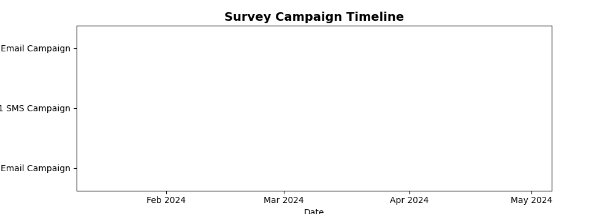

<!--
  © 2026 CVS Health and/or one of its affiliates. All rights reserved.

  Licensed under the Apache License, Version 2.0 (the "License");
  you may not use this file except in compliance with the License.
  You may obtain a copy of the License at

      http://www.apache.org/licenses/LICENSE-2.0

  Unless required by applicable law or agreed to in writing, software
  distributed under the License is distributed on an "AS IS" BASIS,
  WITHOUT WARRANTIES OR CONDITIONS OF ANY KIND, either express or implied.
  See the License for the specific language governing permissions and
  limitations under the License.
-->
# Timeline Chart

## Overview
Displays events along a timeline, perfect for showing survey campaigns, project milestones, or customer journey events. Each event can have a start and end time with descriptive labels.

## Sample Preview



## Best Use Cases
- **Survey Campaign Timeline** - Show when different survey campaigns were active
- **Customer Journey Events** - Track touchpoints and interactions over time
- **Project Milestones** - Display survey project phases and deliverables

## Sample Data Structure

### AskRITA UniversalChartData
```python
from askrita.sqlagent.formatters.DataFormatter import UniversalChartData
from datetime import datetime

timeline_data = UniversalChartData(
    type="timeline",
    title="Survey Campaign Timeline",
    datasets=[],  # Empty for timeline charts
    timeline_events=[
        {
            "id": "Q1_Email",
            "label": "Q1 Email Campaign",
            "start": int(datetime(2024, 1, 15).timestamp() * 1000),
            "end": int(datetime(2024, 2, 15).timestamp() * 1000)
        },
        {
            "id": "Q1_SMS",
            "label": "Q1 SMS Campaign",
            "start": int(datetime(2024, 1, 20).timestamp() * 1000),
            "end": int(datetime(2024, 2, 10).timestamp() * 1000)
        },
        {
            "id": "Q2_Email",
            "label": "Q2 Email Campaign",
            "start": int(datetime(2024, 4, 1).timestamp() * 1000),
            "end": int(datetime(2024, 5, 1).timestamp() * 1000)
        }
    ]
)
```

## Google Charts Implementation

### HTML Structure
```html
<!DOCTYPE html>
<html>
<head>
    <script type="text/javascript" src="https://www.gstatic.com/charts/loader.js"></script>
</head>
<body>
    <div id="timeline_chart" style="width: 900px; height: 500px;"></div>
</body>
</html>
```

### JavaScript Code
```javascript
google.charts.load('current', {'packages':['timeline']});
google.charts.setOnLoadCallback(drawTimelineChart);

function drawTimelineChart() {
    var container = document.getElementById('timeline_chart');
    var chart = new google.visualization.Timeline(container);
    var dataTable = new google.visualization.DataTable();

    dataTable.addColumn({ type: 'string', id: 'Campaign' });
    dataTable.addColumn({ type: 'string', id: 'Name' });
    dataTable.addColumn({ type: 'date', id: 'Start' });
    dataTable.addColumn({ type: 'date', id: 'End' });

    dataTable.addRows([
        ['Email Campaigns', 'Q1 Customer Satisfaction', new Date(2024, 0, 15), new Date(2024, 1, 15)],
        ['Email Campaigns', 'Q2 NPS Survey', new Date(2024, 3, 1), new Date(2024, 4, 1)],
        ['Email Campaigns', 'Q3 Service Feedback', new Date(2024, 6, 15), new Date(2024, 7, 15)],
        
        ['SMS Campaigns', 'Q1 Quick Pulse', new Date(2024, 0, 20), new Date(2024, 1, 10)],
        ['SMS Campaigns', 'Q2 Post-Visit Survey', new Date(2024, 3, 10), new Date(2024, 4, 20)],
        ['SMS Campaigns', 'Q3 Mobile Experience', new Date(2024, 6, 20), new Date(2024, 7, 10)],
        
        ['Phone Campaigns', 'Annual Satisfaction Study', new Date(2024, 2, 1), new Date(2024, 2, 31)],
        ['Phone Campaigns', 'Deep Dive Interviews', new Date(2024, 8, 1), new Date(2024, 8, 30)]
    ]);

    var options = {
        title: 'Survey Campaign Timeline 2024',
        titleTextStyle: {
            fontSize: 18,
            bold: true
        },
        width: 900,
        height: 500,
        backgroundColor: 'white',
        colors: ['#4285f4', '#34a853', '#fbbc04', '#ea4335'],
        timeline: {
            groupByRowLabel: true,
            showRowLabels: true,
            showBarLabels: true,
            rowLabelStyle: {
                fontName: 'Arial',
                fontSize: 14,
                color: '#333'
            },
            barLabelStyle: {
                fontName: 'Arial',
                fontSize: 12,
                color: 'white'
            }
        }
    };

    chart.draw(dataTable, options);
}
```

## React Implementation
```tsx
import React, { useEffect, useRef } from 'react';

interface TimelineEvent {
    id: string;
    category: string;
    label: string;
    start: Date;
    end: Date;
}

interface TimelineChartProps {
    events: TimelineEvent[];
    title?: string;
    width?: number;
    height?: number;
    colors?: string[];
}

const TimelineChart: React.FC<TimelineChartProps> = ({
    events,
    title = "Timeline Chart",
    width = 900,
    height = 500,
    colors = ['#4285f4', '#34a853', '#fbbc04', '#ea4335']
}) => {
    const chartRef = useRef<HTMLDivElement>(null);

    useEffect(() => {
        if (!window.google || !chartRef.current) return;

        const dataTable = new google.visualization.DataTable();
        dataTable.addColumn({ type: 'string', id: 'Category' });
        dataTable.addColumn({ type: 'string', id: 'Label' });
        dataTable.addColumn({ type: 'date', id: 'Start' });
        dataTable.addColumn({ type: 'date', id: 'End' });

        const rows = events.map(event => [
            event.category,
            event.label,
            event.start,
            event.end
        ]);
        dataTable.addRows(rows);

        const options = {
            title: title,
            width: width,
            height: height,
            colors: colors,
            timeline: {
                groupByRowLabel: true,
                showRowLabels: true,
                showBarLabels: true
            }
        };

        const chart = new google.visualization.Timeline(chartRef.current);
        chart.draw(dataTable, options);
    }, [events, title, width, height, colors]);

    return <div ref={chartRef} style={{ width: `${width}px`, height: `${height}px` }} />;
};

export default TimelineChart;
```

## Survey Data Examples

### Customer Journey Timeline
```javascript
// Customer touchpoints and survey events
function drawCustomerJourneyTimeline() {
    var dataTable = new google.visualization.DataTable();
    dataTable.addColumn({ type: 'string', id: 'Journey Stage' });
    dataTable.addColumn({ type: 'string', id: 'Event' });
    dataTable.addColumn({ type: 'date', id: 'Start' });
    dataTable.addColumn({ type: 'date', id: 'End' });

    dataTable.addRows([
        // Awareness Stage
        ['Awareness', 'Digital Ad Campaign', new Date(2024, 0, 1), new Date(2024, 0, 31)],
        ['Awareness', 'Social Media Campaign', new Date(2024, 0, 15), new Date(2024, 1, 15)],
        
        // Consideration Stage
        ['Consideration', 'Website Visit Survey', new Date(2024, 1, 1), new Date(2024, 1, 28)],
        ['Consideration', 'Email Nurture Campaign', new Date(2024, 1, 10), new Date(2024, 2, 10)],
        
        // Purchase Stage
        ['Purchase', 'Post-Purchase Survey', new Date(2024, 2, 1), new Date(2024, 2, 31)],
        ['Purchase', 'Transaction Feedback', new Date(2024, 2, 15), new Date(2024, 3, 15)],
        
        // Retention Stage
        ['Retention', 'Loyalty Program Survey', new Date(2024, 3, 1), new Date(2024, 5, 31)],
        ['Retention', 'Annual Satisfaction Study', new Date(2024, 4, 1), new Date(2024, 4, 30)]
    ]);

    var options = {
        title: 'Customer Journey Survey Timeline',
        colors: ['#1f77b4', '#ff7f0e', '#2ca02c', '#d62728'],
        timeline: {
            groupByRowLabel: true
        }
    };

    var chart = new google.visualization.Timeline(document.getElementById('timeline_chart'));
    chart.draw(dataTable, options);
}
```

### Survey Project Timeline
```javascript
// Project phases and milestones
function drawProjectTimeline() {
    var dataTable = new google.visualization.DataTable();
    dataTable.addColumn({ type: 'string', id: 'Phase' });
    dataTable.addColumn({ type: 'string', id: 'Task' });
    dataTable.addColumn({ type: 'date', id: 'Start' });
    dataTable.addColumn({ type: 'date', id: 'End' });

    dataTable.addRows([
        // Planning Phase
        ['Planning', 'Survey Design', new Date(2024, 0, 1), new Date(2024, 0, 15)],
        ['Planning', 'Question Development', new Date(2024, 0, 10), new Date(2024, 0, 25)],
        ['Planning', 'Stakeholder Review', new Date(2024, 0, 20), new Date(2024, 1, 5)],
        
        // Development Phase
        ['Development', 'Survey Programming', new Date(2024, 1, 1), new Date(2024, 1, 15)],
        ['Development', 'Testing & QA', new Date(2024, 1, 10), new Date(2024, 1, 20)],
        ['Development', 'Pilot Testing', new Date(2024, 1, 15), new Date(2024, 1, 28)],
        
        // Deployment Phase
        ['Deployment', 'Survey Launch', new Date(2024, 2, 1), new Date(2024, 2, 3)],
        ['Deployment', 'Data Collection', new Date(2024, 2, 1), new Date(2024, 3, 30)],
        ['Deployment', 'Monitoring & Support', new Date(2024, 2, 1), new Date(2024, 4, 15)],
        
        // Analysis Phase
        ['Analysis', 'Data Processing', new Date(2024, 4, 1), new Date(2024, 4, 15)],
        ['Analysis', 'Statistical Analysis', new Date(2024, 4, 10), new Date(2024, 4, 25)],
        ['Analysis', 'Report Generation', new Date(2024, 4, 20), new Date(2024, 5, 5)]
    ]);

    var options = {
        title: 'Customer Satisfaction Survey Project Timeline',
        height: 400,
        colors: ['#4285f4', '#34a853', '#fbbc04', '#ea4335']
    };

    var chart = new google.visualization.Timeline(document.getElementById('timeline_chart'));
    chart.draw(dataTable, options);
}
```

### Multi-Channel Campaign Timeline
```javascript
// Overlapping campaigns across different channels
function drawMultiChannelTimeline() {
    var dataTable = new google.visualization.DataTable();
    dataTable.addColumn({ type: 'string', id: 'Channel' });
    dataTable.addColumn({ type: 'string', id: 'Campaign' });
    dataTable.addColumn({ type: 'date', id: 'Start' });
    dataTable.addColumn({ type: 'date', id: 'End' });

    dataTable.addRows([
        // Email Channel
        ['Email', 'Welcome Series Survey', new Date(2024, 0, 1), new Date(2024, 11, 31)],
        ['Email', 'Quarterly NPS Survey', new Date(2024, 2, 1), new Date(2024, 2, 15)],
        ['Email', 'Post-Purchase Follow-up', new Date(2024, 0, 1), new Date(2024, 11, 31)],
        
        // SMS Channel
        ['SMS', 'Store Visit Survey', new Date(2024, 0, 1), new Date(2024, 11, 31)],
        ['SMS', 'Prescription Ready Alert', new Date(2024, 0, 1), new Date(2024, 11, 31)],
        ['SMS', 'Appointment Reminder Survey', new Date(2024, 2, 1), new Date(2024, 10, 30)],
        
        // Phone Channel
        ['Phone', 'Annual Satisfaction Study', new Date(2024, 8, 1), new Date(2024, 9, 30)],
        ['Phone', 'Customer Service Follow-up', new Date(2024, 0, 1), new Date(2024, 11, 31)],
        
        // In-App Channel
        ['In-App', 'Feature Feedback Survey', new Date(2024, 3, 1), new Date(2024, 8, 31)],
        ['In-App', 'App Rating Prompt', new Date(2024, 0, 1), new Date(2024, 11, 31)],
        
        // Web Channel
        ['Web', 'Exit Intent Survey', new Date(2024, 0, 1), new Date(2024, 11, 31)],
        ['Web', 'Cart Abandonment Survey', new Date(2024, 1, 1), new Date(2024, 10, 31)]
    ]);

    var options = {
        title: 'Multi-Channel Survey Campaign Timeline',
        height: 500,
        colors: ['#4285f4', '#34a853', '#fbbc04', '#ea4335', '#9467bd', '#8c564b']
    };

    var chart = new google.visualization.Timeline(document.getElementById('timeline_chart'));
    chart.draw(dataTable, options);
}
```

## Advanced Features

### Interactive Timeline with Events
```javascript
function drawInteractiveTimeline() {
    var chart = new google.visualization.Timeline(document.getElementById('timeline_chart'));
    
    google.visualization.events.addListener(chart, 'select', function() {
        var selection = chart.getSelection();
        if (selection.length > 0) {
            var row = selection[0].row;
            var category = dataTable.getValue(row, 0);
            var event = dataTable.getValue(row, 1);
            var start = dataTable.getValue(row, 2);
            var end = dataTable.getValue(row, 3);
            
            showEventDetails(category, event, start, end);
        }
    });
    
    chart.draw(dataTable, options);
}

function showEventDetails(category, event, start, end) {
    const detailPanel = document.getElementById('event-details');
    const duration = Math.ceil((end - start) / (1000 * 60 * 60 * 24)); // Days
    
    detailPanel.innerHTML = `
        <div class="event-detail">
            <h4>${event}</h4>
            <p><strong>Category:</strong> ${category}</p>
            <p><strong>Start:</strong> ${start.toLocaleDateString()}</p>
            <p><strong>End:</strong> ${end.toLocaleDateString()}</p>
            <p><strong>Duration:</strong> ${duration} days</p>
            <button onclick="loadEventMetrics('${event}')">View Metrics</button>
        </div>
    `;
    detailPanel.style.display = 'block';
}
```

### Timeline with Milestones
```javascript
function drawTimelineWithMilestones() {
    var dataTable = new google.visualization.DataTable();
    dataTable.addColumn({ type: 'string', id: 'Type' });
    dataTable.addColumn({ type: 'string', id: 'Description' });
    dataTable.addColumn({ type: 'date', id: 'Start' });
    dataTable.addColumn({ type: 'date', id: 'End' });

    // Add regular events
    dataTable.addRows([
        ['Survey Campaign', 'Q1 Customer Satisfaction', new Date(2024, 0, 15), new Date(2024, 1, 15)],
        ['Survey Campaign', 'Q2 NPS Survey', new Date(2024, 3, 1), new Date(2024, 4, 1)],
        
        // Add milestone events (same start and end date)
        ['Milestone', 'Survey Launch', new Date(2024, 0, 15), new Date(2024, 0, 15)],
        ['Milestone', 'Mid-Campaign Review', new Date(2024, 0, 30), new Date(2024, 0, 30)],
        ['Milestone', 'Campaign Complete', new Date(2024, 1, 15), new Date(2024, 1, 15)],
        ['Milestone', 'Results Presentation', new Date(2024, 1, 28), new Date(2024, 1, 28)]
    ]);

    var options = {
        title: 'Survey Campaign with Key Milestones',
        colors: ['#4285f4', '#ea4335'], // Different colors for campaigns vs milestones
        timeline: {
            groupByRowLabel: true
        }
    };

    var chart = new google.visualization.Timeline(document.getElementById('timeline_chart'));
    chart.draw(dataTable, options);
}
```

### Resource Allocation Timeline
```javascript
function drawResourceTimeline() {
    var dataTable = new google.visualization.DataTable();
    dataTable.addColumn({ type: 'string', id: 'Resource' });
    dataTable.addColumn({ type: 'string', id: 'Assignment' });
    dataTable.addColumn({ type: 'date', id: 'Start' });
    dataTable.addColumn({ type: 'date', id: 'End' });

    dataTable.addRows([
        // Survey Team
        ['Survey Team', 'Q1 Design Phase', new Date(2024, 0, 1), new Date(2024, 0, 31)],
        ['Survey Team', 'Q1 Data Collection', new Date(2024, 1, 1), new Date(2024, 2, 15)],
        ['Survey Team', 'Q1 Analysis Phase', new Date(2024, 2, 16), new Date(2024, 3, 15)],
        
        // Data Analytics Team
        ['Analytics Team', 'Dashboard Development', new Date(2024, 0, 15), new Date(2024, 1, 28)],
        ['Analytics Team', 'Statistical Analysis', new Date(2024, 2, 1), new Date(2024, 3, 30)],
        ['Analytics Team', 'Reporting & Insights', new Date(2024, 3, 15), new Date(2024, 4, 15)],
        
        // IT Support Team
        ['IT Support', 'Platform Setup', new Date(2024, 0, 1), new Date(2024, 0, 15)],
        ['IT Support', 'Technical Monitoring', new Date(2024, 1, 1), new Date(2024, 2, 28)],
        ['IT Support', 'System Maintenance', new Date(2024, 2, 1), new Date(2024, 4, 30)]
    ]);

    var options = {
        title: 'Team Resource Allocation Timeline',
        colors: ['#4285f4', '#34a853', '#fbbc04']
    };

    var chart = new google.visualization.Timeline(document.getElementById('timeline_chart'));
    chart.draw(dataTable, options);
}
```

## Key Features
- **Event Duration** - Shows start and end times for activities
- **Category Grouping** - Groups related events together
- **Color Coding** - Visual differentiation of event types
- **Interactive Selection** - Click handling for event details
- **Overlapping Events** - Handles concurrent activities

## When to Use
✅ **Perfect for:**
- Project timelines and schedules
- Campaign planning and tracking
- Resource allocation visualization
- Event sequence analysis
- Process flow timelines

❌ **Avoid when:**
- Single point-in-time data
- Quantitative comparisons needed
- Hierarchical relationships
- Too many overlapping events (cluttered)

## Styling and Customization
```javascript
// Custom styling options
var options = {
    title: 'Survey Campaign Timeline',
    backgroundColor: '#f8f9fa',
    colors: ['#007bff', '#28a745', '#ffc107', '#dc3545'],
    timeline: {
        groupByRowLabel: true,
        showRowLabels: true,
        showBarLabels: true,
        avoidOverlappingGridLines: false,
        rowLabelStyle: {
            fontName: 'Arial',
            fontSize: 14,
            color: '#495057',
            bold: true
        },
        barLabelStyle: {
            fontName: 'Arial',
            fontSize: 11,
            color: 'white'
        }
    },
    tooltip: {
        textStyle: {
            fontSize: 12
        }
    }
};
```

## Documentation
- [Google Charts Timeline Documentation](https://developers.google.com/chart/interactive/docs/gallery/timeline)
