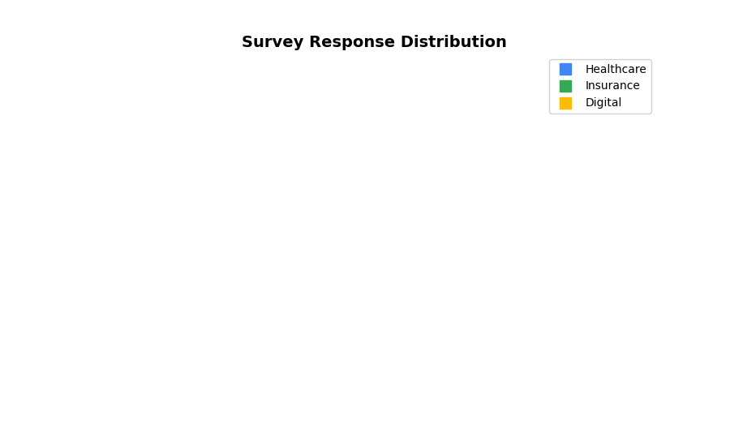

<!--
  © 2026 CVS Health and/or one of its affiliates. All rights reserved.

  Licensed under the Apache License, Version 2.0 (the "License");
  you may not use this file except in compliance with the License.
  You may obtain a copy of the License at

      http://www.apache.org/licenses/LICENSE-2.0

  Unless required by applicable law or agreed to in writing, software
  distributed under the License is distributed on an "AS IS" BASIS,
  WITHOUT WARRANTIES OR CONDITIONS OF ANY KIND, either express or implied.
  See the License for the specific language governing permissions and
  limitations under the License.
-->
# TreeMap Hierarchical Visualization

## Overview
Displays hierarchical data as nested rectangles, where each rectangle's size represents a quantitative value. Perfect for showing survey response distribution across categories and subcategories.

## Sample Preview



## Best Use Cases
- **Response Volume by Category** - Show survey responses across business units and sub-departments
- **Satisfaction Breakdown** - Visualize satisfaction scores by service area and specific touchpoints
- **Market Share Analysis** - Display customer segments and their satisfaction levels

## Sample Data Structure

### AskRITA UniversalChartData
```python
from askrita.sqlagent.formatters.DataFormatter import UniversalChartData

treemap_data = UniversalChartData(
    type="treemap",
    title="Survey Response Distribution",
    datasets=[],  # Empty for treemap charts
    hierarchical_data=[
        {"parent": "Root", "child": "Healthcare Services", "value": 5000},
        {"parent": "Healthcare Services", "child": "Retail Store", "value": 2500},
        {"parent": "Healthcare Services", "child": "Walk-in Clinic", "value": 1500},
        {"parent": "Healthcare Services", "child": "Wellness Center", "value": 1000},
        {"parent": "Root", "child": "Insurance Services", "value": 3000},
        {"parent": "Insurance Services", "child": "Medicare", "value": 1800},
        {"parent": "Insurance Services", "child": "Medicaid", "value": 700},
        {"parent": "Insurance Services", "child": "Commercial", "value": 500},
        {"parent": "Root", "child": "Digital Services", "value": 2000},
        {"parent": "Digital Services", "child": "Mobile App", "value": 1200},
        {"parent": "Digital Services", "child": "Website", "value": 800}
    ]
)
```

## Google Charts Implementation

### HTML Structure
```html
<!DOCTYPE html>
<html>
<head>
    <script type="text/javascript" src="https://www.gstatic.com/charts/loader.js"></script>
</head>
<body>
    <div id="treemap_chart" style="width: 900px; height: 600px;"></div>
</body>
</html>
```

### JavaScript Code
```javascript
google.charts.load('current', {'packages':['treemap']});
google.charts.setOnLoadCallback(drawTreeMap);

function drawTreeMap() {
    var data = google.visualization.arrayToDataTable([
        ['ID', 'Parent', 'Response Count', 'Color Value'],
        ['Root', null, 0, 0],
        
        // Level 1 - Main Categories
        ['Healthcare Services', 'Root', 5000, 85],
        ['Insurance Services', 'Root', 3000, 75],
        ['Digital Services', 'Root', 2000, 65],
        
        // Level 2 - Healthcare Subcategories
        ['Retail Store', 'Healthcare Services', 2500, 88],
        ['Walk-in Clinic', 'Healthcare Services', 1500, 82],
        ['Wellness Center', 'Healthcare Services', 1000, 85],
        
        // Level 2 - Insurance Subcategories
        ['Medicare', 'Insurance Services', 1800, 78],
        ['Medicaid', 'Insurance Services', 700, 72],
        ['Commercial', 'Insurance Services', 500, 75],
        
        // Level 2 - Digital Subcategories
        ['Mobile App', 'Digital Services', 1200, 68],
        ['Website', 'Digital Services', 800, 62]
    ]);

    var options = {
        title: 'Survey Response Distribution by Service Area',
        titleTextStyle: {
            fontSize: 18,
            bold: true
        },
        minColor: '#e53e3e',
        midColor: '#fbb040',
        maxColor: '#38a169',
        headerHeight: 20,
        fontColor: 'white',
        fontFamily: 'Arial',
        fontSize: 12,
        showScale: true,
        generateTooltip: showTooltip
    };

    var tree = new google.visualization.TreeMap(document.getElementById('treemap_chart'));
    tree.draw(data, options);
}

function showTooltip(row, size, value) {
    const name = data.getValue(row, 0);
    const responses = data.getValue(row, 2);
    const satisfaction = data.getValue(row, 3);
    
    return `<div style="background:#fd9; padding:10px; border-style:solid">
        <span style="font-family:Courier">${name}<br/>
        Responses: ${responses.toLocaleString()}<br/>
        Satisfaction: ${satisfaction}%</span>
    </div>`;
}
```

## React Implementation
```tsx
import React, { useEffect, useRef } from 'react';

interface TreeMapData {
    id: string;
    parent: string | null;
    value: number;
    colorValue?: number;
}

interface TreeMapChartProps {
    data: TreeMapData[];
    title?: string;
    width?: number;
    height?: number;
    colorRange?: {
        min: string;
        mid: string;
        max: string;
    };
}

const TreeMapChart: React.FC<TreeMapChartProps> = ({
    data,
    title = "Hierarchical Data",
    width = 900,
    height = 600,
    colorRange = {
        min: '#e53e3e',
        mid: '#fbb040',
        max: '#38a169'
    }
}) => {
    const chartRef = useRef<HTMLDivElement>(null);

    useEffect(() => {
        if (!window.google || !chartRef.current) return;

        const chartData = new google.visualization.DataTable();
        chartData.addColumn('string', 'ID');
        chartData.addColumn('string', 'Parent');
        chartData.addColumn('number', 'Value');
        chartData.addColumn('number', 'Color Value');

        const rows = data.map(item => [
            item.id,
            item.parent,
            item.value,
            item.colorValue || item.value
        ]);
        chartData.addRows(rows);

        const options = {
            title: title,
            width: width,
            height: height,
            minColor: colorRange.min,
            midColor: colorRange.mid,
            maxColor: colorRange.max,
            headerHeight: 20,
            fontColor: 'white',
            showScale: true
        };

        const chart = new google.visualization.TreeMap(chartRef.current);
        chart.draw(chartData, options);
    }, [data, title, width, height, colorRange]);

    return <div ref={chartRef} style={{ width: `${width}px`, height: `${height}px` }} />;
};

export default TreeMapChart;
```

## Survey Data Examples

### Service Area Breakdown
```javascript
// Survey responses by service area and department
var data = google.visualization.arrayToDataTable([
    ['ID', 'Parent', 'Response Count', 'Satisfaction Score'],
    ['Company', null, 0, 0],
    
    // Main service areas
    ['Product A', 'Company', 15000, 82],
    ['Product B', 'Company', 8000, 85],
    ['Product C', 'Company', 5000, 78],
    ['Digital', 'Company', 3000, 70],
    
    // Product A breakdown
    ['Retail', 'Product A', 12000, 83],
    ['Specialty', 'Product A', 2000, 79],
    ['Mail Order', 'Product A', 1000, 85],
    
    // Product B breakdown
    ['Walk-in Clinic', 'Product B', 5000, 87],
    ['Hub', 'Product B', 2000, 84],
    ['Telehealth', 'Product B', 1000, 82],
    
    // Product C breakdown
    ['Plan Medicare', 'Product C', 2500, 80],
    ['Plan Commercial', 'Product C', 1500, 76],
    ['Plan Medicaid', 'Product C', 1000, 75],
    
    // Digital breakdown
    ['Mobile App', 'Digital', 2000, 72],
    ['Website', 'Digital', 800, 68],
    ['Kiosk', 'Digital', 200, 65]
]);
```

### Geographic Response Distribution
```javascript
// Survey responses by region and state
var data = google.visualization.arrayToDataTable([
    ['Location', 'Parent', 'Responses', 'NPS Score'],
    ['United States', null, 0, 0],
    
    // Regions
    ['Northeast', 'United States', 8000, 74],
    ['Southeast', 'United States', 12000, 71],
    ['Midwest', 'United States', 6000, 73],
    ['West', 'United States', 10000, 76],
    
    // Northeast states
    ['New York', 'Northeast', 3000, 75],
    ['Massachusetts', 'Northeast', 2000, 78],
    ['Pennsylvania', 'Northeast', 1500, 72],
    ['Connecticut', 'Northeast', 1000, 74],
    ['Rhode Island', 'Northeast', 500, 76],
    
    // Southeast states
    ['Florida', 'Southeast', 4000, 73],
    ['Georgia', 'Southeast', 2500, 70],
    ['North Carolina', 'Southeast', 2000, 72],
    ['South Carolina', 'Southeast', 1500, 69],
    ['Virginia', 'Southeast', 2000, 71],
    
    // Top performing stores
    ['Store #1234 - Miami', 'Florida', 150, 85],
    ['Store #5678 - Orlando', 'Florida', 120, 82],
    ['Store #9012 - Tampa', 'Florida', 100, 80]
]);
```

### Customer Segment Analysis
```javascript
// Customer satisfaction by demographic segments
var data = google.visualization.arrayToDataTable([
    ['Segment', 'Parent', 'Customer Count', 'Satisfaction'],
    ['All Customers', null, 0, 0],
    
    // Age groups
    ['18-34 Years', 'All Customers', 5000, 68],
    ['35-54 Years', 'All Customers', 8000, 74],
    ['55+ Years', 'All Customers', 7000, 79],
    
    // Income brackets within age groups
    ['Low Income', '18-34 Years', 2000, 65],
    ['Middle Income', '18-34 Years', 2500, 70],
    ['High Income', '18-34 Years', 500, 72],
    
    ['Low Income', '35-54 Years', 2500, 71],
    ['Middle Income', '35-54 Years', 4000, 75],
    ['High Income', '35-54 Years', 1500, 78],
    
    ['Low Income', '55+ Years', 2000, 77],
    ['Middle Income', '55+ Years', 3500, 80],
    ['High Income', '55+ Years', 1500, 82],
    
    // Service usage patterns
    ['Frequent Users', 'High Income', 800, 85],
    ['Occasional Users', 'High Income', 1200, 75]
]);
```

## Advanced Features

### Custom Tooltips
```javascript
function createCustomTooltip(row, size, value) {
    const id = data.getValue(row, 0);
    const parent = data.getValue(row, 1);
    const responses = data.getValue(row, 2);
    const satisfaction = data.getValue(row, 3);
    
    const percentage = ((size / getTotalSize()) * 100).toFixed(1);
    
    return `
        <div style="background: linear-gradient(135deg, #667eea 0%, #764ba2 100%); 
                    color: white; padding: 12px; border-radius: 8px; 
                    box-shadow: 0 4px 8px rgba(0,0,0,0.2); font-family: Arial;">
            <div style="font-size: 14px; font-weight: bold; margin-bottom: 8px;">
                ${id}
            </div>
            <div style="font-size: 12px; line-height: 1.4;">
                Responses: <strong>${responses.toLocaleString()}</strong> (${percentage}%)<br/>
                Satisfaction: <strong>${satisfaction}%</strong><br/>
                ${parent ? `Part of: ${parent}` : 'Top Level'}
            </div>
        </div>
    `;
}
```

### Interactive Drill-Down
```javascript
function createDrillDownTreeMap() {
    let currentData = topLevelData;
    let breadcrumb = ['All'];
    
    function drawTreeMap(data, title) {
        const chart = new google.visualization.TreeMap(document.getElementById('treemap_chart'));
        
        google.visualization.events.addListener(chart, 'select', function() {
            const selection = chart.getSelection();
            if (selection.length > 0) {
                const row = selection[0].row;
                const selectedId = data.getValue(row, 0);
                
                // Check if this item has children
                const childData = getChildData(selectedId);
                if (childData.length > 0) {
                    breadcrumb.push(selectedId);
                    drawTreeMap(childData, `${title} > ${selectedId}`);
                    updateBreadcrumb();
                }
            }
        });
        
        chart.draw(data, {
            title: title,
            generateTooltip: createCustomTooltip
        });
    }
    
    function updateBreadcrumb() {
        const breadcrumbElement = document.getElementById('breadcrumb');
        breadcrumbElement.innerHTML = breadcrumb.map((item, index) => {
            if (index === breadcrumb.length - 1) {
                return `<span class="current">${item}</span>`;
            } else {
                return `<a href="#" onclick="navigateTo(${index})">${item}</a>`;
            }
        }).join(' > ');
    }
    
    window.navigateTo = function(index) {
        breadcrumb = breadcrumb.slice(0, index + 1);
        const targetData = index === 0 ? topLevelData : getDataForLevel(breadcrumb[index]);
        drawTreeMap(targetData, breadcrumb.join(' > '));
        updateBreadcrumb();
    };
    
    // Initial draw
    drawTreeMap(currentData, 'Survey Response Distribution');
    updateBreadcrumb();
}
```

### Color Coding by Performance
```javascript
function getColorValueForSatisfaction(satisfaction) {
    // Convert satisfaction score to color value (0-100)
    if (satisfaction >= 80) return 90;      // Green
    else if (satisfaction >= 70) return 60; // Yellow
    else if (satisfaction >= 60) return 30; // Orange
    else return 10;                         // Red
}

// Apply color coding to data
var enhancedData = rawData.map(item => {
    const colorValue = getColorValueForSatisfaction(item.satisfaction);
    return [item.id, item.parent, item.responses, colorValue];
});
```

### Responsive Design
```javascript
function createResponsiveTreeMap() {
    function drawChart() {
        const container = document.getElementById('treemap_container');
        const width = container.offsetWidth;
        const height = Math.max(400, width * 0.6); // Maintain aspect ratio
        
        const options = {
            title: 'Survey Response Distribution',
            width: width,
            height: height,
            minColor: '#e53e3e',
            midColor: '#fbb040',
            maxColor: '#38a169',
            fontSize: Math.max(10, width / 80), // Scale font with size
            headerHeight: Math.max(15, width / 45)
        };
        
        const chart = new google.visualization.TreeMap(container);
        chart.draw(data, options);
    }
    
    // Initial draw
    drawChart();
    
    // Redraw on window resize
    window.addEventListener('resize', debounce(drawChart, 250));
}

function debounce(func, wait) {
    let timeout;
    return function executedFunction(...args) {
        const later = () => {
            clearTimeout(timeout);
            func(...args);
        };
        clearTimeout(timeout);
        timeout = setTimeout(later, wait);
    };
}
```

## Key Features
- **Hierarchical Visualization** - Shows parent-child relationships clearly
- **Size Proportional** - Rectangle size represents quantitative values
- **Color Coding** - Additional dimension through color variation
- **Interactive Selection** - Click handling for drill-down functionality
- **Custom Tooltips** - Rich hover information display

## When to Use
✅ **Perfect for:**
- Hierarchical data with quantities
- Part-to-whole relationships
- Multi-level categorization
- Space-efficient visualization
- Portfolio or segment analysis

❌ **Avoid when:**
- Flat data without hierarchy
- Time-series analysis
- Precise value comparison needed
- Too many small categories (cluttered)

## Performance Considerations
```javascript
// For large datasets, consider data aggregation
function aggregateSmallCategories(data, threshold = 100) {
    const aggregated = [];
    const others = {};
    
    data.forEach(item => {
        if (item.value >= threshold) {
            aggregated.push(item);
        } else {
            const parent = item.parent || 'Root';
            if (!others[parent]) {
                others[parent] = { value: 0, count: 0 };
            }
            others[parent].value += item.value;
            others[parent].count += 1;
        }
    });
    
    // Add aggregated "Others" categories
    Object.keys(others).forEach(parent => {
        aggregated.push({
            id: `Others (${others[parent].count})`,
            parent: parent,
            value: others[parent].value,
            colorValue: 50 // Neutral color
        });
    });
    
    return aggregated;
}
```

## Documentation
- [Google Charts TreeMap Documentation](https://developers.google.com/chart/interactive/docs/gallery/treemap)
