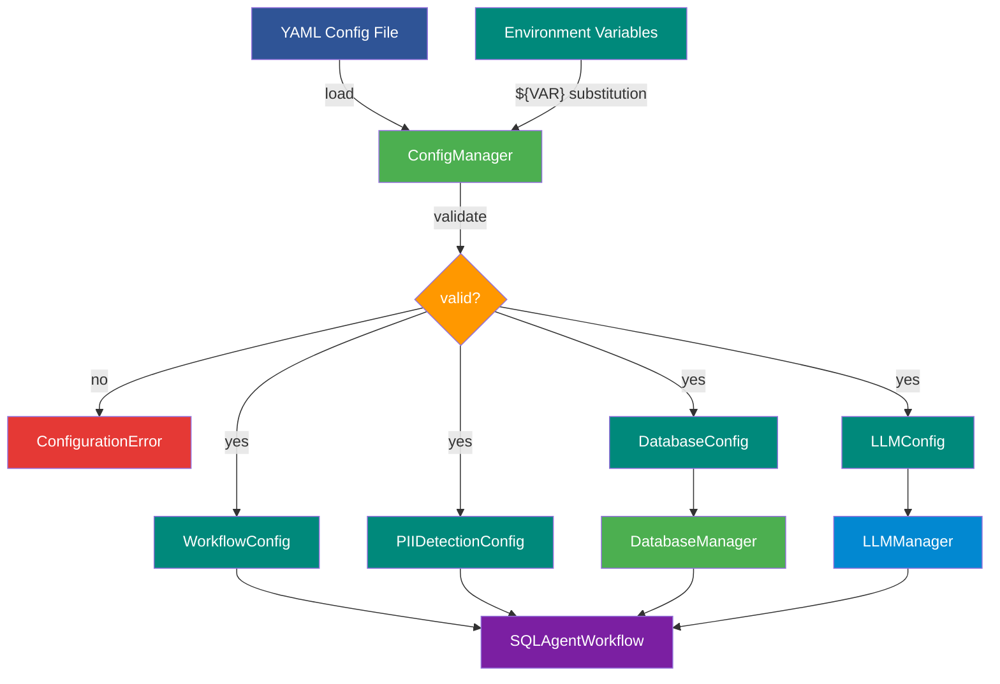

<!--
  © 2026 CVS Health and/or one of its affiliates. All rights reserved.

  Licensed under the Apache License, Version 2.0 (the "License");
  you may not use this file except in compliance with the License.
  You may obtain a copy of the License at

      http://www.apache.org/licenses/LICENSE-2.0

  Unless required by applicable law or agreed to in writing, software
  distributed under the License is distributed on an "AS IS" BASIS,
  WITHOUT WARRANTIES OR CONDITIONS OF ANY KIND, either express or implied.
  See the License for the specific language governing permissions and
  limitations under the License.
-->
# Ask RITA YAML Configuration System

Ask RITA uses comprehensive YAML-based configuration, allowing you to customize every aspect of the framework without modifying code.

## 🎯 Key Features

- **Path-agnostic configuration**: No hardcoded file locations - explicit config paths required
- **Multi-provider LLM support**: OpenAI, Azure OpenAI, Google Vertex AI, AWS Bedrock
- **Multi-database support**: PostgreSQL, MySQL, SQLite, BigQuery, Snowflake, MongoDB, SQL Server, IBM Db2
- **Environment-specific settings**: Different configs for dev/prod/test
- **Security-first design**: Environment variables for sensitive data
- **Step-level control**: Enable/disable any workflow step via config
- **Error recovery**: Configurable SQL retry mechanism with error feedback
- **Business rule integration**: Configurable data validation and security rules
- **⚡ Schema caching**: Two-level intelligent caching for 3x faster query performance (v0.2.0)
- **🌐 Cross-project access**: Configurable cross-project dataset access for BigQuery (New in v0.2.1)
- **🧠 Hybrid schema descriptions**: Automatic metadata extraction + manual enhancements for better SQL generation (New in v0.2.1)
- **🎯 Extended workflow controls**: Enhanced security, validation, and conversation context settings (New in v0.2.1)
- **💡 Follow-up question generation**: AI-powered contextual follow-up questions for deeper data exploration
- **🔒 PII/PHI Detection**: Comprehensive privacy protection with Microsoft Presidio for regulatory compliance (New in v0.10.1)

## How Configuration Flows



## 📁 Configuration Structure

```yaml
# REQUIRED SECTIONS (All three must be present)
database:                        # Database connection settings
llm:                            # LLM model and API configuration  
prompts:                        # All LLM prompts with templating

# OPTIONAL SECTIONS
workflow:                       # SQL workflow step control and retry behavior
framework:                      # Framework behavior settings
logging:                        # Log levels and formats
business_rules:                 # Custom business logic and security
pii_detection:                  # PII/PHI privacy protection settings (New in v0.10.1)

# DATA CLASSIFICATION WORKFLOW (Optional - only if using DataClassificationWorkflow)
data_processing:                # Input/output file paths and processing settings
classification:                 # Classification model configuration and field definitions
data_classification_workflow:   # Data classification workflow control and settings
```

## 🚀 Quick Start

### 1. Environment Variables Setup (REQUIRED for OpenAI)

```bash
# OpenAI (Required for OpenAI provider)
export OPENAI_API_KEY="your-api-key-here"

# Database passwords (Optional - can be in connection string instead)
export DB_PASSWORD="your-db-password"

# Google Cloud (Optional - if not using gcloud CLI auth)
export GOOGLE_APPLICATION_CREDENTIALS="/path/to/service-account.json"

# AWS (Optional - if not using IAM roles)
export AWS_ACCESS_KEY_ID="your-access-key"
export AWS_SECRET_ACCESS_KEY="your-secret-key"
```

### 2. Minimal Configuration Example

```yaml
# Minimal working configuration
database:
  connection_string: "sqlite:///./test.db"
  cache_schema: true              # Enable caching for better performance
  schema_refresh_interval: 3600   # Cache for 1 hour

llm:
  provider: "openai"
  model: "gpt-4o"
  # API key read from OPENAI_API_KEY environment variable

prompts:
  sql_query_generation:
    system: "You are a SQL expert. Generate valid SQL queries."
    user: "Generate SQL for: {question}"
  sql_validation:
    system: "You are a SQL validator. Check and fix SQL queries."
    user: "Validate this SQL: {sql_query}"
```

### 3. Using Example Configurations

```bash
# Copy and customize an example
cp example-configs/query-openai.yaml my-config.yaml

# Edit with your settings
nano my-config.yaml

# Use your configuration
askrita interactive --config my-config.yaml
```

