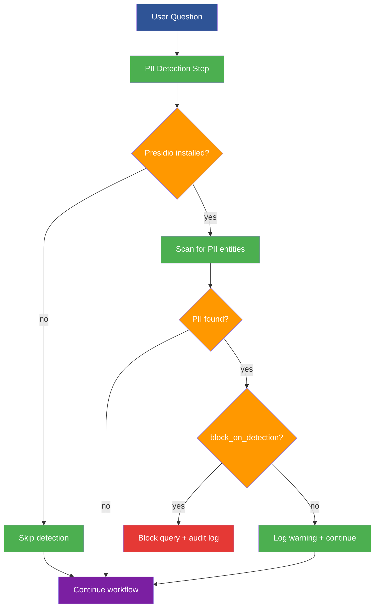

<!--
  © 2026 CVS Health and/or one of its affiliates. All rights reserved.

  Licensed under the Apache License, Version 2.0 (the "License");
  you may not use this file except in compliance with the License.
  You may obtain a copy of the License at

      http://www.apache.org/licenses/LICENSE-2.0

  Unless required by applicable law or agreed to in writing, software
  distributed under the License is distributed on an "AS IS" BASIS,
  WITHOUT WARRANTIES OR CONDITIONS OF ANY KIND, either express or implied.
  See the License for the specific language governing permissions and
  limitations under the License.
-->
# PII/PHI Detection Configuration

Automatic detection and blocking of personally identifiable information using Microsoft Presidio analyzer. Essential for HIPAA, GDPR, and SOX compliance.

## How PII Detection Works



## Key Features

- **🔍 Smart Detection**: Scans user queries for 13+ PII entity types before SQL execution
- **🚫 Configurable Blocking**: Block queries containing sensitive data with customizable rules
- **📊 Sample Data Validation**: Proactive scanning of existing database data during initialization
- **📝 Enterprise Audit Logging**: Complete audit trail for regulatory compliance requirements
- **⚙️ Granular Control**: Entity selection, confidence thresholds, and redaction policies
- **🔄 Graceful Degradation**: Works seamlessly without Presidio installed (detection disabled)

## Installation Requirements

PII detection requires the `presidio-analyzer` package:

```bash
# Install with poetry (recommended)
poetry add presidio-analyzer

# Or install with pip
pip install presidio-analyzer>=2.2.360

# Optional: Enhanced NLP models for better accuracy
python -m spacy download en_core_web_sm
```

## Basic Configuration

```yaml
# Enable PII detection as the first workflow step
workflow:
  steps:
    pii_detection: true          # Enable PII detection (default: false)
    # ... other workflow steps

# Basic PII protection setup
pii_detection:
  enabled: true                  # Master enable/disable switch
  block_on_detection: true       # Block queries containing PII (recommended)
  entities:                      # PII types to detect
    - "PERSON"                   # Names and personal identifiers
    - "EMAIL_ADDRESS"            # Email addresses
    - "PHONE_NUMBER"             # Phone numbers
    - "CREDIT_CARD"              # Credit card numbers
    - "US_SSN"                   # Social Security Numbers
  confidence_threshold: 0.5      # Detection sensitivity (0.0-1.0)
```

## Enterprise Configuration (HIPAA/GDPR Ready)

```yaml
pii_detection:
  enabled: true
  block_on_detection: true
  
  # Comprehensive entity detection for regulatory compliance
  entities:
    # Personal Identifiers
    - "PERSON"                   # Names and personal identifiers
    - "EMAIL_ADDRESS"            # Email addresses  
    - "PHONE_NUMBER"             # Phone numbers
    - "IP_ADDRESS"               # IP addresses
    
    # Financial Data (SOX/PCI Compliance)
    - "CREDIT_CARD"              # Credit card numbers
    - "IBAN_CODE"                # International bank account numbers
    - "US_BANK_NUMBER"           # US bank account numbers
    
    # Government IDs
    - "US_SSN"                   # Social Security Numbers
    - "US_DRIVER_LICENSE"        # Driver's license numbers
    - "US_PASSPORT"              # Passport numbers
    
    # Healthcare (HIPAA Compliance)
    - "MEDICAL_LICENSE"          # Medical license numbers
    - "US_DEA_NUMBER"            # DEA registration numbers
    - "NPI"                      # National Provider Identifier
    
    # Location & Temporal
    - "LOCATION"                 # Geographic locations
    - "DATE_TIME"                # Dates and timestamps
  
  # Detection Sensitivity
  confidence_threshold: 0.3      # Lower = more sensitive (recommended for compliance)
  language: "en"                 # Detection language (default: "en")
  
  # Sample Data Validation - Scan existing database for PII
  validate_sample_data: true     # Enable proactive data scanning
  sample_data_rows: 1000         # Rows to scan per table (recommended: 500-1000)
  sample_data_timeout: 300       # Timeout for sample scanning in seconds
  
  # Enterprise Audit Logging
  audit_log_path: "/var/log/askrita/pii_audit.log"
  redact_in_logs: true           # Redact PII in log files (recommended)
  
  # Custom Recognizers (Optional - for domain-specific patterns)
  custom_recognizers: []         # Leave empty for standard patterns
```

## Configuration Options Reference

| Setting | Type | Default | Description |
|---------|------|---------|-------------|
| **`enabled`** | boolean | `false` | Master switch for PII detection functionality |
| **`block_on_detection`** | boolean | `false` | Block queries containing PII vs. log warnings only |
| **`entities`** | list | `["PERSON", "EMAIL_ADDRESS", "PHONE_NUMBER"]` | PII entity types to detect |
| **`confidence_threshold`** | float | `0.5` | Detection sensitivity (0.0-1.0, lower = more sensitive) |
| **`language`** | string | `"en"` | Detection language code |
| **`validate_sample_data`** | boolean | `false` | Scan database sample data during initialization |
| **`sample_data_rows`** | integer | `100` | Number of rows to scan per table |
| **`sample_data_timeout`** | integer | `120` | Timeout for sample data validation (seconds) |
| **`audit_log_path`** | string | `null` | Path for audit log file (creates if doesn't exist) |
| **`redact_in_logs`** | boolean | `true` | Replace detected PII with `[REDACTED]` in logs |
| **`custom_recognizers`** | list | `[]` | Custom PII pattern recognizers |

## Supported PII Entity Types

| Category | Entity Types | Description |
|----------|-------------|-------------|
| **Personal** | `PERSON`, `EMAIL_ADDRESS`, `PHONE_NUMBER` | Names, emails, phone numbers |
| **Financial** | `CREDIT_CARD`, `IBAN_CODE`, `US_BANK_NUMBER` | Payment and banking information |
| **Government** | `US_SSN`, `US_DRIVER_LICENSE`, `US_PASSPORT` | Government-issued IDs |
| **Healthcare** | `MEDICAL_LICENSE`, `US_DEA_NUMBER`, `NPI` | Healthcare professional identifiers |
| **Technical** | `IP_ADDRESS`, `URL` | Network and web identifiers |
| **Location** | `LOCATION`, `US_ADDRESS` | Geographic and address information |
| **Temporal** | `DATE_TIME` | Dates and timestamps |

## Workflow Integration

PII detection runs as the **first step** in the workflow to prevent sensitive data from entering the system:

```yaml
workflow:
  steps:
    pii_detection: true          # First step - privacy protection
    parse_question: true         # Second step - question analysis
    generate_sql: true           # Third step - SQL generation
    # ... rest of workflow
```

## Usage Examples

### ✅ Safe Query (No PII Detected)
```python
# Query passes PII detection and executes normally
result = workflow.query("What are the top sales regions this quarter?")
print(result.answer)  # Shows results normally
```

### ❌ Blocked Query (PII Detected)
```python
# Query blocked due to PII detection
try:
    result = workflow.query("Show me John Smith's phone number from customers table")
except Exception as e:
    print("Query blocked for privacy protection")
    # Audit log: "PII detected: PERSON entity 'John Smith' with confidence 0.9"
```

### 📊 Sample Data Validation Results
```python
# During workflow initialization with validate_sample_data: true
workflow = SQLAgentWorkflow(config)
# Console output:
# "⚠️ PII detected in sample data from table 'customers': 5 instances of PERSON, 3 instances of EMAIL_ADDRESS"
# "✅ Sample data validation completed. Review audit logs for details."
```

## Security Best Practices

### 1. Enable Comprehensive Detection
```yaml
pii_detection:
  # Use comprehensive entity list for maximum protection
  entities:
    - "PERSON"
    - "EMAIL_ADDRESS" 
    - "PHONE_NUMBER"
    - "CREDIT_CARD"
    - "US_SSN"
    - "LOCATION"
    - "DATE_TIME"
```

### 2. Set Appropriate Sensitivity
```yaml
pii_detection:
  # Lower threshold = more sensitive detection
  confidence_threshold: 0.3     # Recommended for compliance environments
  block_on_detection: true      # Block queries vs. warnings only
```

### 3. Enable Audit Logging
```yaml
pii_detection:
  audit_log_path: "/var/log/askrita/pii_audit.log"
  redact_in_logs: true         # Prevent PII in log files
```

### 4. Validate Existing Data
```yaml
pii_detection:
  validate_sample_data: true   # Scan existing database tables
  sample_data_rows: 1000      # Adequate sample size
```

## Example Configurations

### Healthcare (HIPAA Compliance)
```yaml
# credentials/healthcare-hipaa.yaml
pii_detection:
  enabled: true
  block_on_detection: true
  confidence_threshold: 0.2    # High sensitivity for healthcare
  entities:
    - "PERSON"
    - "EMAIL_ADDRESS"
    - "PHONE_NUMBER"
    - "US_SSN"
    - "MEDICAL_LICENSE"
    - "US_DEA_NUMBER"
    - "NPI"
    - "DATE_TIME"
  validate_sample_data: true
  audit_log_path: "/var/log/healthcare/pii_audit.log"
```

### Financial Services (SOX/PCI Compliance)
```yaml
# credentials/financial-compliance.yaml
pii_detection:
  enabled: true
  block_on_detection: true
  confidence_threshold: 0.3
  entities:
    - "PERSON"
    - "EMAIL_ADDRESS"
    - "CREDIT_CARD"
    - "US_BANK_NUMBER"
    - "IBAN_CODE"
    - "US_SSN"
    - "US_DRIVER_LICENSE"
  validate_sample_data: true
  sample_data_rows: 500
  audit_log_path: "/var/log/financial/pii_audit.log"
```

### Development Environment
```yaml
# example-configs/query-pii-detection.yaml
pii_detection:
  enabled: true
  block_on_detection: false    # Log warnings only in development
  confidence_threshold: 0.5    # Standard sensitivity
  entities:
    - "PERSON"
    - "EMAIL_ADDRESS"
    - "PHONE_NUMBER"
  validate_sample_data: false  # Skip sample validation in dev
```

## Troubleshooting

### PII Detection Not Working
1. **Check Presidio Installation**:
   ```bash
   pip install presidio-analyzer>=2.2.360
   python -c "from presidio_analyzer import AnalyzerEngine; print('✅ Presidio installed')"
   ```

2. **Verify Workflow Step Enabled**:
   ```yaml
   workflow:
     steps:
       pii_detection: true  # Must be enabled
   ```

3. **Check Configuration Syntax**:
   ```bash
   askrita test --config your-config.yaml
   ```

### False Positives
1. **Adjust Confidence Threshold**:
   ```yaml
   pii_detection:
     confidence_threshold: 0.7  # Higher = less sensitive
   ```

2. **Review Entity Types**:
   ```yaml
   pii_detection:
     entities: ["CREDIT_CARD", "US_SSN"]  # Only detect specific types
   ```

### Performance Issues
1. **Limit Sample Data Scanning**:
   ```yaml
   pii_detection:
     sample_data_rows: 100      # Reduce for faster startup
     sample_data_timeout: 60    # Shorter timeout
   ```

2. **Disable Sample Validation**:
   ```yaml
   pii_detection:
     validate_sample_data: false
   ```

## Migration from v0.10.0

**No Breaking Changes**: PII detection is disabled by default, ensuring backward compatibility.

**Optional Enhancement**:
```yaml
# Add to existing configuration
workflow:
  steps:
    pii_detection: true  # Add as first step

# Add new section
pii_detection:
  enabled: true
  block_on_detection: true
  entities: ["PERSON", "EMAIL_ADDRESS", "PHONE_NUMBER"]
```

