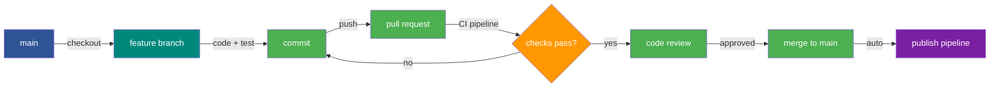

<!--
  © 2026 CVS Health and/or one of its affiliates. All rights reserved.

  Licensed under the Apache License, Version 2.0 (the "License");
  you may not use this file except in compliance with the License.
  You may obtain a copy of the License at

      http://www.apache.org/licenses/LICENSE-2.0

  Unless required by applicable law or agreed to in writing, software
  distributed under the License is distributed on an "AS IS" BASIS,
  WITHOUT WARRANTIES OR CONDITIONS OF ANY KIND, either express or implied.
  See the License for the specific language governing permissions and
  limitations under the License.
-->
# Developer Guide

How to set up your development environment, create feature branches, and submit pull requests for Ask RITA.

## Prerequisites

- **Python 3.11+** (3.11, 3.12, 3.13, or 3.14)
- **Poetry** for dependency management
- **Git** for version control
- **Docker** (optional, for cross-version compatibility testing)

## Development Setup

### 1. Clone the Repository

```bash
git clone https://github.com/cvs-health/askRITA.git
cd askRITA
```

### 2. Install Poetry

```bash
pip install poetry
```

### 3. Install Dependencies

```bash
poetry install --with dev,test
```

This installs all production, development, and test dependencies in a virtual environment managed by Poetry.

To also install optional export dependencies (PPTX, PDF, Excel):

```bash
poetry install --with dev,test --extras exports
```

### 4. Activate the Virtual Environment

```bash
poetry shell
```

Or prefix commands with `poetry run`:

```bash
poetry run pytest tests/ -v
```

### 5. Install Pre-Commit Hooks

```bash
pre-commit install
```

Pre-commit hooks automatically run Black (formatting), isort (import sorting), and flake8 (linting) on every commit.

### 6. Verify Setup

```bash
poetry run pytest tests/ -v
```

All tests should pass before you begin development.

---

## Branch Workflow

Ask RITA uses a feature-branch workflow. All changes go through pull requests — direct pushes to `main` are not allowed.



### Creating a Feature Branch

```bash
git checkout main
git pull origin main
git checkout -b feature/your-feature-name
```

Use a descriptive branch name that reflects the change:

| Branch Type | Naming Convention | Example |
|---|---|---|
| New feature | `feature/description` | `feature/snowflake-streaming` |
| Bug fix | `fix/description` | `fix/bigquery-auth-timeout` |
| Documentation | `docs/description` | `docs/add-bedrock-guide` |
| Refactor | `refactor/description` | `refactor/schema-decorators` |
| Test | `test/description` | `test/nosql-edge-cases` |

### Making Changes

1. Write your code following the project's [code style](#code-style)
2. Add or update tests for any new or changed functionality
3. Run the full test suite to verify nothing is broken

```bash
poetry run pytest tests/ -v
```

4. Check code coverage to ensure new code is tested:

```bash
poetry run pytest tests/ --cov=askrita --cov-report=term-missing
```

### Committing Changes

```bash
git add .
git commit -m "Add Snowflake streaming support for large result sets"
```

Write clear, descriptive commit messages:

- Use imperative mood: "Add feature" not "Added feature"
- First line should be a concise summary (50-72 characters)
- Include context in the body if the change is complex

Pre-commit hooks will automatically format your code. If the hooks modify files, stage the changes and commit again:

```bash
git add .
git commit -m "Add Snowflake streaming support for large result sets"
```

### Pushing Your Branch

```bash
git push origin feature/your-feature-name
```

---

## Submitting a Pull Request

### 1. Create the Pull Request

Push your branch and open a pull request against `main`. Include:

- **Title**: Clear summary of the change
- **Description**: What was changed and why
- **Testing**: How the change was verified
- **Related issues**: Link any relevant issue numbers

### 2. CI Pipeline

When you open a pull request, the CI pipeline runs automatically:

| Step | What It Does |
|---|---|
| **Lint** | Black, isort, Flake8, Mypy — formatting and type safety |
| **Security** | Bandit (SAST) and Safety (dependency CVEs) |
| **Test matrix** | Full pytest suite across Python 3.11, 3.12, 3.13, and 3.14 — 80% coverage enforced |
| **Build** | Verifies the package builds correctly (wheel + sdist) |

The PR cannot be merged until all CI checks pass (`CI ✓` status check).

### 3. Code Review

- At least one code owner must approve the PR
- Address all review feedback with additional commits on the same branch
- Re-request review after making changes

### 4. Merge

Once approved and all checks pass, the PR is merged to `main`. The publish pipeline then runs automatically on `main` to build, test across Python 3.11–3.14, and publish the package.

---

## Code Quality

### Running Checks Locally

Run these before pushing to catch issues early:

| Check | Command |
|---|---|
| Run tests | `poetry run pytest tests/ -v` |
| Tests with coverage | `poetry run pytest tests/ --cov=askrita --cov-report=term-missing` |
| Format code | `poetry run black askrita tests` |
| Sort imports | `poetry run isort askrita tests` |
| Lint | `poetry run flake8 askrita tests` |
| Type check | `poetry run mypy askrita` |
| Security scan | `poetry run bandit -r askrita` |
| All checks (tox) | `tox` |

### Code Style

Ask RITA uses these tools for consistent code style:

- **[Black](https://github.com/psf/black)** — code formatting (line length: 88)
- **[isort](https://pycqa.github.io/isort/)** — import sorting (Black-compatible profile)
- **[flake8](https://flake8.pycqa.org/)** — linting
- **[mypy](https://mypy-lang.org/)** — static type checking

Configuration is in `pyproject.toml`. Pre-commit hooks enforce these automatically.

### Requirements for All Code Changes

- All functions must include **type hints** and **docstrings**
- New features must have **unit tests** with >80% coverage
- Overall project coverage must stay above **80%**
- No **hardcoded credentials** — use `${ENV_VAR}` substitution
- Follow existing **design patterns** (Strategy, Decorator, Chain of Responsibility)

---

## Project Structure

```
askRITA/
├── askrita/                    # Main package
│   ├── __init__.py             # Public API exports
│   ├── cli.py                  # CLI entry point
│   ├── config_manager.py       # YAML config loading and validation
│   ├── exceptions.py           # Custom exception hierarchy
│   ├── mcp_server.py           # MCP stdio server
│   ├── models/                 # Shared Pydantic models
│   ├── utils/                  # LLM, tokens, PII, CoT utilities
│   ├── sqlagent/               # SQL/NoSQL agents
│   │   ├── workflows/          # LangGraph workflow definitions
│   │   ├── database/           # DB strategies, schema decorators
│   │   ├── formatters/         # Chart data formatting
│   │   └── exporters/          # PPTX, PDF, Excel export
│   ├── research/               # CRISP-DM research agent
│   └── dataclassifier/         # Data classification workflow
├── tests/                      # Test suite
├── example-configs/            # Example YAML configurations
├── benchmarks/                 # BIRD benchmark tooling
├── docs/                       # MkDocs documentation
└── pyproject.toml              # Project metadata and dependencies
```

---

## Testing

### Running Tests

```bash
poetry run pytest tests/ -v
```

### Running Specific Tests

```bash
poetry run pytest tests/test_config_manager.py -v
poetry run pytest tests/test_sql_agent.py::TestSQLWorkflow -v
poetry run pytest tests/ -k "test_bigquery" -v
```

### Coverage Report

```bash
poetry run pytest tests/ --cov=askrita --cov-report=term-missing --cov-report=html
```

Open `htmlcov/index.html` in a browser for a detailed visual report.

### Cross-Version Compatibility

Use [Docker Testing](docker-testing.md) to verify your changes work across Python 3.11, 3.12, 3.13, and 3.14 in isolated environments.

---

## Versioning

See the [Versioning & Releases](versioning.md) guide for how to bump versions, cut releases, and keep version numbers in sync across `pyproject.toml`, `setup.py`, and `askrita/__init__.py`.

---

## Documentation

Documentation lives in `docs/` and is built with [MkDocs Material](https://squidfunk.github.io/mkdocs-material/).

### Previewing Docs Locally

```bash
pip install mkdocs-material
mkdocs serve
```

Open `http://localhost:8000` to preview.

### Key Documentation Files

| File | Content |
|---|---|
| `docs/index.md` | Home page and documentation map |
| `docs/configuration/` | Full YAML configuration reference |
| `docs/guides/` | Feature and workflow guides |
| `docs/charts/` | Chart type reference and framework integration |
| `docs/benchmarks/` | BIRD benchmark results and per-model analysis |
| `example-configs/` | Example YAML configurations |
| `CHANGELOG.md` | Version history |

### When to Update Docs

- **New feature** — add or update the relevant guide in `docs/guides/`
- **New config option** — update `docs/configuration/`
- **New database/LLM support** — update `docs/supported-platforms.md`
- **API changes** — update `docs/usage-examples.md`
- **New chart type** — add a page in `docs/charts/`
