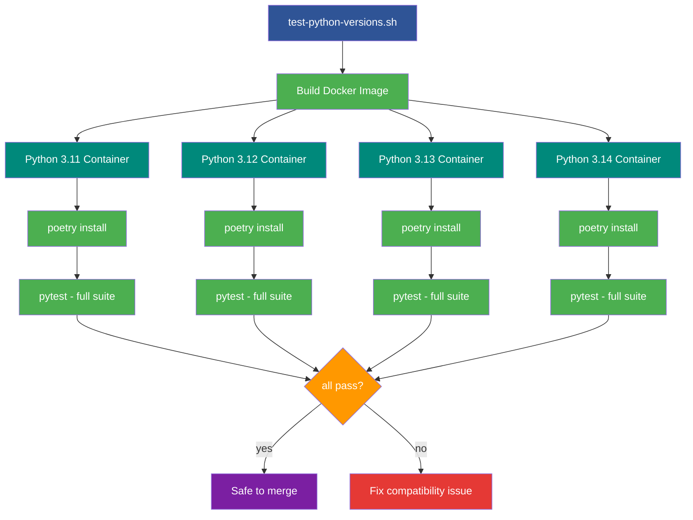

<!--
  © 2026 CVS Health and/or one of its affiliates. All rights reserved.

  Licensed under the Apache License, Version 2.0 (the "License");
  you may not use this file except in compliance with the License.
  You may obtain a copy of the License at

      http://www.apache.org/licenses/LICENSE-2.0

  Unless required by applicable law or agreed to in writing, software
  distributed under the License is distributed on an "AS IS" BASIS,
  WITHOUT WARRANTIES OR CONDITIONS OF ANY KIND, either express or implied.
  See the License for the specific language governing permissions and
  limitations under the License.
-->
# Docker Testing

## Overview

Ask RITA supports Python 3.11, 3.12, 3.13, and 3.14. Differences between Python versions — in typing behavior, dependency resolution, C extension compatibility, and mock internals — can cause tests to pass on one version but fail on another.

Docker testing solves this by running the full test suite inside isolated containers, each with a specific Python version and a clean dependency install from scratch. This catches:

- **Dependency version conflicts** — a package that installs fine on 3.13 may fail on 3.11
- **Type hint incompatibilities** — newer `typing` features not available in older versions
- **C extension build failures** — native packages like `pygraphviz` may not compile on all versions
- **Behavioral differences** — subtle changes in standard library modules across versions

Run Docker tests before submitting a pull request to ensure your changes are compatible across all supported Python versions.



## Prerequisites

- [Docker](https://docs.docker.com/get-docker/) installed and running
- Repository cloned locally

## Quick Start

### Test all supported Python versions

```bash
./test-python-versions.sh
```

### Test a specific Python version

```bash
./test-python-versions.sh 3.11
./test-python-versions.sh 3.12
./test-python-versions.sh 3.13
./test-python-versions.sh 3.14
```

### Clean up Docker images

```bash
./test-python-versions.sh cleanup
```

### Show help

```bash
./test-python-versions.sh help
```

## Supported Python Versions

| Version | Status |
|---------|--------|
| Python 3.11 | Supported |
| Python 3.12 | Supported |
| Python 3.13 | Supported |
| Python 3.14 | Supported |

Each version runs the full test suite (550+ tests) to verify:

- Package installation via Poetry
- All unit and integration tests pass
- Import and type hint compatibility
- Mock compatibility across versions

## Manual Docker Commands

Build and run manually if you prefer:

```bash
# Build image for a specific Python version
docker build -t askrita-test:py312 \
    --build-arg PYTHON_VERSION=3.12 \
    -f Dockerfile.test .

# Run tests
docker run --rm \
    -v "$(pwd):/app" \
    -e OPENAI_API_KEY=test-key-for-testing \
    askrita-test:py312

# Interactive shell for debugging
docker run -it --rm \
    -v "$(pwd):/app" \
    -e OPENAI_API_KEY=test-key-for-testing \
    askrita-test:py312 /bin/bash
```

## Files

| File | Location | Purpose |
|------|----------|---------|
| `test-python-versions.sh` | Project root | Test runner script |
| `Dockerfile.test` | Project root | Docker image definition |

## Troubleshooting

### Docker build fails

- Ensure Docker is running: `docker info`
- Check available disk space: `docker system df`
- Free space if needed: `docker system prune`
- The Dockerfile automatically retries without `pygraphviz` if its native build fails

### Tests fail in container but pass locally

- Run interactively to inspect: `docker run -it --rm -v "$(pwd):/app" askrita-test:py312 /bin/bash`
- Check for version-specific differences in dependencies
- Verify `poetry.lock` is committed and up to date

### Permission issues

- Make the script executable: `chmod +x test-python-versions.sh`
- On Windows, use Git Bash or WSL

## CI/CD Integration

```yaml
# GitHub Actions example
- name: Test Python Compatibility
  run: |
    chmod +x test-python-versions.sh
    ./test-python-versions.sh all
```
