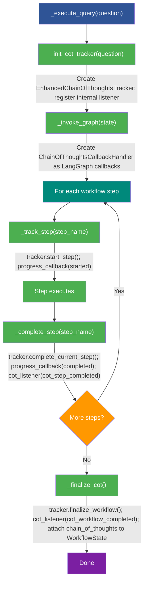

<!--
  © 2026 CVS Health and/or one of its affiliates. All rights reserved.

  Licensed under the Apache License, Version 2.0 (the "License");
  you may not use this file except in compliance with the License.
  You may obtain a copy of the License at

      http://www.apache.org/licenses/LICENSE-2.0

  Unless required by applicable law or agreed to in writing, software
  distributed under the License is distributed on an "AS IS" BASIS,
  WITHOUT WARRANTIES OR CONDITIONS OF ANY KIND, either express or implied.
  See the License for the specific language governing permissions and
  limitations under the License.
-->
# Chain of Thoughts and Progress Tracking

Ask RITA provides two observability mechanisms: **Chain of Thoughts (CoT)** for detailed step-by-step reasoning traces, and **Progress Callbacks** for lightweight step status updates.

## Table of Contents

- [Overview](#overview)
- [Chain of Thoughts](#chain-of-thoughts)
- [Progress Callbacks](#progress-callbacks)
- [Configuration](#configuration)
- [Usage Examples](#usage-examples)
- [API Reference](#api-reference)
- [How It Works](#how-it-works)
- [Troubleshooting](#troubleshooting)

## Overview

| Mechanism | Purpose | Data Shape | Consumer |
|---|---|---|---|
| **CoT Listeners** | Detailed step reasoning, timing, confidence | Event dicts with step details | SSE / WebSocket / UI streaming |
| **`query_with_cot()`** | Typed CoT output with reasoning summary | `ChainOfThoughtsOutput` Pydantic model | API responses |
| **`WorkflowState.chain_of_thoughts`** | Full step trace attached to result | Dict with summary + detailed steps | Post-query analysis |
| **Progress Callbacks** | Lightweight step status updates | `ProgressData` dataclass | Simple progress UIs / console |

## Chain of Thoughts

### Enabling CoT

CoT tracking is **enabled by default**. Configure it under the `chain_of_thoughts` key:

```yaml
chain_of_thoughts:
  enabled: true
  include_timing: true
  include_confidence: true
  include_step_details: false   # Advanced: shows detailed step data
  track_retries: true
  max_reasoning_length: 500     # Max characters for reasoning text
```

### CoT Listeners

Register a listener to receive real-time events as each workflow step completes:

```python
from askrita import SQLAgentWorkflow, ConfigManager

config = ConfigManager("config.yaml")
workflow = SQLAgentWorkflow(config)

def cot_listener(event):
    event_type = event["event_type"]

    if event_type == "cot_step_completed":
        step = event["cot_step"]
        print(f"Step: {step['step_name']}")
        print(f"  Status: {step['status']}")
        print(f"  Duration: {step.get('duration_ms', 'N/A')}ms")
        print(f"  Reasoning: {step.get('reasoning', '')}")

    elif event_type == "cot_workflow_completed":
        summary = event["summary"]
        print(f"\nWorkflow complete: {summary['overall_success']}")
        print(f"Total steps: {summary['total_steps']}")

workflow.register_cot_listener(cot_listener)
result = workflow.query("What are total sales by region?")
```

### Event Types

**`cot_step_completed`** — Emitted after each workflow step:

| Key | Type | Description |
|---|---|---|
| `event_type` | `str` | `"cot_step_completed"` |
| `step_name` | `str` | Name of the step |
| `cot_step` | `dict` | Full step details (see below) |
| `details` | `dict` | Step-specific metadata |
| `progress_data` | `dict` | Progress data for the step |

**`cot_workflow_completed`** — Emitted when the workflow finishes:

| Key | Type | Description |
|---|---|---|
| `event_type` | `str` | `"cot_workflow_completed"` |
| `summary` | `dict` | Overall summary with step list |
| `detailed_steps` | `list` | All step details |
| `workflow_id` | `str` | Unique workflow run ID |

### CoT Step Fields

Each step in the trace contains:

| Field | Type | Description |
|---|---|---|
| `step_name` | `str` | Step identifier (e.g., `"generate_sql"`) |
| `step_type` | `str` | Category (e.g., `"llm"`, `"database"`, `"validation"`) |
| `status` | `str` | `"started"`, `"completed"`, `"failed"`, or `"skipped"` |
| `start_time` | `float` | Start timestamp |
| `end_time` | `float` | End timestamp |
| `duration_ms` | `float` | Elapsed time in milliseconds |
| `reasoning` | `str` | What happened in this step |
| `input_summary` | `str` | Summary of step input |
| `output_summary` | `str` | Summary of step output |
| `error_message` | `str` | Error details (if failed) |
| `retry_count` | `int` | Number of retries |
| `confidence_score` | `float` | Confidence score (0.0–1.0) |
| `details` | `dict` | Step-specific metadata |

### Listener Management

```python
# Register
workflow.register_cot_listener(my_listener)

# Unregister
workflow.unregister_cot_listener(my_listener)

# Clear all listeners
workflow.clear_cot_listeners()
```

### query_with_cot()

For a typed CoT response, use `query_with_cot()`:

```python
from askrita.models import ChainOfThoughtsOutput

cot_output = workflow.query_with_cot("What are total sales by region?")

# Reasoning breadcrumbs (up to 5 high-level steps)
for step in cot_output.reasoning.steps:
    print(f"  - {step}")

# SQL draft
print(f"SQL: {cot_output.sql.sql}")
print(f"Confidence: {cot_output.sql.confidence}")

# Execution result
if cot_output.result:
    print(f"Rows: {cot_output.result.row_count}")

# Visualization recommendation
if cot_output.viz:
    print(f"Chart: {cot_output.viz.kind}")
```

### ChainOfThoughtsOutput

```python
class ChainOfThoughtsOutput(BaseModel):
    reasoning: ReasoningSummary     # High-level step bullets
    sql: SqlDraft                   # Generated SQL + confidence
    result: Optional[ExecutionResult]
    viz: Optional[VisualizationSpec]
```

Supporting models:

```python
class ReasoningSummary(BaseModel):
    steps: List[str]                # e.g., ["Parsed question", "Generated SQL", ...]

class SqlDraft(BaseModel):
    sql: str
    confidence: float

class ExecutionResult(BaseModel):
    rows: list
    columns: list
    row_count: int

class VisualizationSpec(BaseModel):
    kind: str                       # Chart type
    x: Optional[str]
    y: Optional[str]
    series: Optional[str]
    options: Optional[dict]
```

When the query needs clarification, `query_with_cot()` returns a `ClarificationQuestion` instead:

```python
class ClarificationQuestion(BaseModel):
    question: str
    rationale: str
```

### Accessing CoT from WorkflowState

After a query, the full CoT trace is attached to the result:

```python
result = workflow.query("What are total sales?")

cot = result.chain_of_thoughts
if cot:
    summary = cot.get("summary", {})
    print(f"Steps: {summary.get('total_steps')}")
    print(f"Success: {summary.get('overall_success')}")

    for step in cot.get("detailed_steps", []):
        print(f"  {step['step_name']}: {step['status']} ({step.get('duration_ms', 0):.0f}ms)")
```

## Progress Callbacks

Progress callbacks provide a simpler alternative to CoT listeners for tracking step status.

### Basic Usage

```python
from askrita import SQLAgentWorkflow, ConfigManager

def on_progress(progress_data):
    print(f"[{progress_data.status}] {progress_data.message}")

config = ConfigManager("config.yaml")
workflow = SQLAgentWorkflow(config, progress_callback=on_progress)

result = workflow.query("How many customers?")
```

### Built-In Console Callback

Ask RITA includes a ready-made console callback:

```python
from askrita.sqlagent.progress_tracker import create_simple_progress_callback

callback = create_simple_progress_callback()
workflow = SQLAgentWorkflow(config, progress_callback=callback)

result = workflow.query("Total revenue by month")
# Prints step-by-step progress to console
```

### ProgressData

```python
@dataclass
class ProgressData:
    step_name: str          # e.g., "generate_sql"
    status: str             # "started", "completed", "failed", "skipped"
    message: str            # User-facing message (with emoji)
    error: Optional[str]    # Error message if failed
    step_index: Optional[int]
    total_steps: Optional[int]
    step_data: Optional[dict]
    timestamp: str          # ISO timestamp

    def to_dict(self) -> dict:
        """Convert to JSON-serializable dict."""
```

### Step Messages

Progress messages include emoji indicators for each step:

| Step | Message |
|---|---|
| `pii_detection` | "Scanning for sensitive data..." |
| `parse_question` | "Understanding your question..." |
| `get_unique_nouns` | "Looking up key values..." |
| `generate_sql` | "Writing SQL query..." |
| `validate_and_fix_sql` | "Validating SQL..." |
| `execute_sql` | "Running query..." |
| `format_results` | "Formatting results..." |
| `choose_and_format_visualization` | "Creating visualization..." |
| `generate_followup_questions` | "Generating follow-up questions..." |

### Using Both CoT and Progress

CoT listeners and progress callbacks are independent — you can use both simultaneously:

```python
def cot_listener(event):
    # Detailed reasoning trace (for logging or streaming)
    pass

def progress_callback(data):
    # Simple status updates (for UI progress bar)
    pass

workflow = SQLAgentWorkflow(
    config,
    progress_callback=progress_callback,
)
workflow.register_cot_listener(cot_listener)

result = workflow.query("Show me the dashboard data")
```

## Configuration

### Chain of Thoughts Configuration

```yaml
chain_of_thoughts:
  enabled: true                    # Master switch (default: true)
  include_timing: true             # Include step duration
  include_confidence: true         # Include confidence scores
  include_step_details: false      # Include detailed step metadata
  track_retries: true              # Track retry attempts
  max_reasoning_length: 500        # Max chars for reasoning text (50-5000)

  display_preferences:             # Hints for UI rendering
    show_successful_steps: true
    show_failed_steps: true
    show_skipped_steps: true
    collapse_successful_steps: false
    highlight_failed_steps: true
    show_step_timing: true
    show_confidence_scores: true
```

### Configuration Options

| Option | Type | Default | Description |
|---|---|---|---|
| `enabled` | `bool` | `true` | Enable/disable CoT tracking |
| `include_timing` | `bool` | `true` | Record step start/end times and duration |
| `include_confidence` | `bool` | `true` | Include confidence scores per step |
| `include_step_details` | `bool` | `false` | Include detailed metadata (tokens, latency, etc.) |
| `track_retries` | `bool` | `true` | Track retry attempts in step details |
| `max_reasoning_length` | `int` | `500` | Truncation limit for reasoning text (50–5000) |

### Display Preferences

Display preferences are hints for UI rendering. They do not affect the data collected — they guide how a frontend should present the CoT trace:

| Preference | Default | Description |
|---|---|---|
| `show_successful_steps` | `true` | Display steps that completed successfully |
| `show_failed_steps` | `true` | Display steps that failed |
| `show_skipped_steps` | `true` | Display steps that were skipped |
| `collapse_successful_steps` | `false` | Collapse successful steps by default |
| `highlight_failed_steps` | `true` | Visually highlight failed steps |
| `show_step_timing` | `true` | Show duration for each step |
| `show_confidence_scores` | `true` | Show confidence scores |

## Usage Examples

### Streaming to Server-Sent Events (SSE)

```python
from flask import Flask, Response
import json

app = Flask(__name__)

@app.route("/query/stream")
def stream_query():
    def generate():
        events = []

        def listener(event):
            events.append(event)

        workflow.register_cot_listener(listener)
        result = workflow.query(request.args["q"])
        workflow.unregister_cot_listener(listener)

        for event in events:
            yield f"data: {json.dumps(event)}\n\n"

        yield f"data: {json.dumps({'type': 'result', 'answer': result.answer})}\n\n"

    return Response(generate(), mimetype="text/event-stream")
```

### Logging Step Performance

```python
import logging

logger = logging.getLogger("askrita.performance")

def performance_listener(event):
    if event["event_type"] == "cot_step_completed":
        step = event["cot_step"]
        logger.info(
            f"Step {step['step_name']}: "
            f"{step.get('duration_ms', 0):.0f}ms "
            f"(confidence: {step.get('confidence_score', 'N/A')})"
        )
    elif event["event_type"] == "cot_workflow_completed":
        metrics = event["summary"].get("performance_metrics", {})
        logger.info(f"Total workflow time: {metrics.get('total_time_ms', 0):.0f}ms")

workflow.register_cot_listener(performance_listener)
```

### Disabling CoT for Performance

```yaml
chain_of_thoughts:
  enabled: false
```

When disabled, no tracker is created and no listener events are emitted. The `chain_of_thoughts` field in `WorkflowState` will be empty.

## API Reference

### SQLAgentWorkflow CoT Methods

```python
class SQLAgentWorkflow:
    def query_with_cot(self, question: str) -> ChainOfThoughtsOutput: ...

    def register_cot_listener(self, listener: Callable[[Dict], None]) -> None: ...
    def unregister_cot_listener(self, listener: Callable[[Dict], None]) -> None: ...
    def clear_cot_listeners(self) -> None: ...
```

### NoSQLAgentWorkflow CoT Methods

The NoSQL workflow supports the same CoT API:

```python
class NoSQLAgentWorkflow:
    def register_cot_listener(self, listener: Callable[[Dict], None]) -> None: ...
    def unregister_cot_listener(self, listener: Callable[[Dict], None]) -> None: ...
    def clear_cot_listeners(self) -> None: ...
```

### Progress Tracking

```python
from askrita.sqlagent.progress_tracker import (
    ProgressData,
    ProgressStatus,
    create_simple_progress_callback,
)

# Type alias
ProgressCallback = Callable[[ProgressData], None]
```

## How It Works

### CoT Tracking Flow



### Step Registry

Ask RITA maintains a global registry of workflow steps with metadata (step type, reasoning templates, descriptions). The registry is initialized at module import with all standard SQL workflow steps. Custom steps can be registered for plugins or extensions.

## Troubleshooting

### CoT Data Missing from WorkflowState

**Symptom**: `result.chain_of_thoughts` is empty.

- Check that `chain_of_thoughts.enabled: true` in your config
- CoT is enabled by default; if you explicitly set `enabled: false`, it is disabled

### Listeners Not Receiving Events

**Symptom**: Registered listener is never called.

- Ensure the listener is registered **before** calling `query()` or `chat()`
- Verify CoT is enabled in configuration
- Check that the listener function signature accepts a single `dict` argument

### Reasoning Text Truncated

**Symptom**: Reasoning strings end with `...` or are cut off.

Increase `max_reasoning_length`:

```yaml
chain_of_thoughts:
  max_reasoning_length: 2000  # Default: 500
```

Valid range: 50–5000 characters.

### Performance Impact

CoT tracking adds minimal overhead (microseconds per step for timing and string operations). If you need maximum performance, disable it:

```yaml
chain_of_thoughts:
  enabled: false
```

---

**See also:**

- [Configuration Guide](../configuration/overview.md) — Complete YAML configuration reference
- [Conversational SQL](conversational-sql.md) — Chat mode and follow-up questions
- [Usage Examples](../usage-examples.md) — Workflow usage patterns
