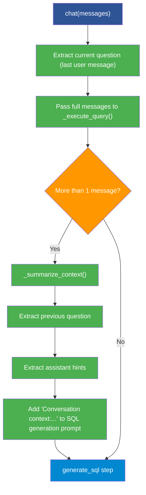

<!--
  © 2026 CVS Health and/or one of its affiliates. All rights reserved.

  Licensed under the Apache License, Version 2.0 (the "License");
  you may not use this file except in compliance with the License.
  You may obtain a copy of the License at

      http://www.apache.org/licenses/LICENSE-2.0

  Unless required by applicable law or agreed to in writing, software
  distributed under the License is distributed on an "AS IS" BASIS,
  WITHOUT WARRANTIES OR CONDITIONS OF ANY KIND, either express or implied.
  See the License for the specific language governing permissions and
  limitations under the License.
-->
# Conversational SQL (Chat Mode)

Ask RITA supports multi-turn conversations where follow-up questions automatically reference previous context. The `chat()` method maintains conversation history so the LLM can resolve pronouns, references, and implicit context across turns.

## Table of Contents

- [Overview](#overview)
- [Quick Start](#quick-start)
- [Configuration](#configuration)
- [Usage Examples](#usage-examples)
- [API Reference](#api-reference)
- [How It Works](#how-it-works)
- [Follow-Up Questions](#follow-up-questions)
- [Clarification Flow](#clarification-flow)
- [Troubleshooting](#troubleshooting)

## Overview

Ask RITA provides two query methods:

| Method | Use Case | Context |
|---|---|---|
| `query(question)` | Single, standalone questions | No conversation history |
| `chat(messages)` | Multi-turn conversations | Full message history passed to SQL generation |

The `chat()` method extracts the current question from the last user message and passes the full conversation history to the SQL generation step, enabling the LLM to resolve references like "the same table", "those customers", or "break that down by region".

## Quick Start

```python
from askrita import SQLAgentWorkflow, ConfigManager

config = ConfigManager("config.yaml")
workflow = SQLAgentWorkflow(config)

# Build conversation history
messages = []

# Turn 1
messages.append({"role": "user", "content": "How many orders were placed last month?"})
result = workflow.chat(messages)
print(result.answer)

# Add assistant response to history
messages.append({"role": "assistant", "content": result.answer})

# Turn 2 — references "last month" implicitly
messages.append({"role": "user", "content": "What was the total revenue?"})
result = workflow.chat(messages)
print(result.answer)

# Turn 3 — references previous results
messages.append({"role": "assistant", "content": result.answer})
messages.append({"role": "user", "content": "Break that down by product category"})
result = workflow.chat(messages)
print(result.answer)
```

## Configuration

### Conversation Context Settings

```yaml
workflow:
  conversation_context:
    max_history_messages: 6  # Number of recent messages to include in context
```

| Setting | Default | Description |
|---|---|---|
| `max_history_messages` | `6` | How many recent messages (from the tail of the list) are used to build conversation context for SQL generation |

The conversation context window slides over the most recent messages. Older messages are dropped to keep the context focused and within token limits.

### Enabling Follow-Up Questions

To have Ask RITA suggest follow-up questions after each answer:

```yaml
workflow:
  steps:
    generate_followup_questions: true

prompts:
  generate_followup_questions:
    system: "You are a helpful data analyst."
    human: |
      Based on the question: {question}
      Answer: {answer}
      Query: {sql_query}
      Results summary: {results_summary}
      Schema: {schema_context}

      Generate 3 relevant follow-up questions.
```

Follow-up generation is **disabled by default** and requires both the step flag and the prompt configuration.

## Usage Examples

### Basic Multi-Turn Conversation

```python
from askrita import SQLAgentWorkflow, ConfigManager

config = ConfigManager("config.yaml")
workflow = SQLAgentWorkflow(config)

messages = []

# Helper to run a turn
def ask(question):
    messages.append({"role": "user", "content": question})
    result = workflow.chat(messages)
    messages.append({"role": "assistant", "content": result.answer})
    return result

# Conversation
r1 = ask("Show me the top 10 customers by total spend")
print(r1.answer)

r2 = ask("What are their most purchased product categories?")
print(r2.answer)  # "their" refers to the top 10 customers

r3 = ask("Compare that with the bottom 10 customers")
print(r3.answer)  # "that" refers to product categories
```

### Single Query (No Context)

For standalone questions that don't need conversation history:

```python
result = workflow.query("What is the average order value this year?")
print(result.answer)
```

### With Follow-Up Suggestions

```python
config = ConfigManager("config-with-followups.yaml")
workflow = SQLAgentWorkflow(config)

result = workflow.query("What are total sales by region?")

print(f"Answer: {result.answer}")
print(f"Follow-ups: {result.followup_questions}")
# e.g., ["Which region had the highest growth rate?",
#         "What are the top products in each region?",
#         "How do regional sales compare to last year?"]
```

### NoSQL Chat (MongoDB)

The `NoSQLAgentWorkflow` also supports `chat()` with the same message format:

```python
from askrita import NoSQLAgentWorkflow, ConfigManager

config = ConfigManager("mongodb-config.yaml")
workflow = NoSQLAgentWorkflow(config)

messages = [
    {"role": "user", "content": "How many documents are in the orders collection?"}
]
result = workflow.chat(messages)
```

## API Reference

### SQLAgentWorkflow.chat()

```python
def chat(self, messages: list) -> WorkflowState:
    """
    Chat interface using LangGraph messages pattern for conversational queries.

    Args:
        messages: List of conversation messages in format:
            [
                {"role": "user", "content": "Show me sales data"},
                {"role": "assistant", "content": "Here are your sales..."},
                {"role": "user", "content": "What about last month?"}
            ]

    Returns:
        WorkflowState with question, answer, SQL, results, visualization, and chart data.

    Raises:
        ValidationError: If messages are invalid or unsafe
        DatabaseError: If database connection or query fails
        LLMError: If LLM provider fails
        QueryError: If SQL generation or execution fails
    """
```

### SQLAgentWorkflow.query()

```python
def query(self, question: str) -> WorkflowState:
    """
    Query the database using natural language.

    Args:
        question: Natural language question to convert to SQL and execute

    Returns:
        WorkflowState with question, answer, SQL, results, visualization, and chart data.

    Raises:
        ValidationError: If question is invalid or unsafe
        DatabaseError: If database connection or query fails
        LLMError: If LLM provider fails
        QueryError: If SQL generation or execution fails
    """
```

### Message Format

Each message in the list must be a dict with:

| Key | Type | Required | Description |
|---|---|---|---|
| `role` | `str` | Yes | `"user"` or `"assistant"` |
| `content` | `str` | Yes | The message text |

The last message with `role: "user"` is used as the current question. All messages are passed as conversation context.

### WorkflowState Result Fields

| Field | Type | Description |
|---|---|---|
| `question` | `str` | The current question being answered |
| `answer` | `str` | Human-readable answer |
| `analysis` | `str` | Detailed analysis |
| `sql_query` | `str` | Generated SQL query |
| `results` | `list` | Raw query results |
| `visualization` | `str` | Recommended chart type |
| `chart_data` | `dict` | Universal chart data for rendering |
| `followup_questions` | `list` | Suggested follow-up questions (if enabled) |
| `needs_clarification` | `bool` | Whether the question needs clarification |
| `clarification_questions` | `list` | Questions to ask the user |
| `messages` | `list` | The conversation messages (preserved from input) |

## How It Works

### Conversation Context in SQL Generation

When `chat()` is called with more than one message, the SQL generation step receives additional context:



### Context Summarization

The context summarizer (`_summarize_conversation_context`) builds a natural language summary from recent messages:

1. Takes the last `max_history_messages` messages (default: 6)
2. Extracts the **previous user question** (second-to-last user message)
3. Extracts **assistant context hints** from the first assistant message in the window
4. Combines into a string like: `"Conversation context: Previous question was: How many orders last month?. The data shows monthly order counts."`

This summary is added to the SQL generation prompt as `additional_context["conversation_context"]`, helping the LLM understand what "it", "those", "that", etc. refer to.

### chat() vs query() Differences

| Behavior | `query()` | `chat()` |
|---|---|---|
| Input | Single string | List of message dicts |
| Conversation context | None | Summarized from message history |
| Prompt injection check | Runs `_detect_prompt_injection()` | Not applied to message list |
| Input validation | On the question string | On the extracted current question |
| `WorkflowState.messages` | Empty list | Full message list preserved |

## Follow-Up Questions

When enabled, Ask RITA generates relevant follow-up questions after answering a query.

### Enabling

Two requirements:

1. Enable the step in `workflow.steps`:
   ```yaml
   workflow:
     steps:
       generate_followup_questions: true
   ```

2. Provide the prompt in `prompts`:
   ```yaml
   prompts:
     generate_followup_questions:
       system: "You are a helpful data analyst."
       human: |
         Based on the question: {question}
         Answer: {answer}
         Query: {sql_query}
         Results summary: {results_summary}
         Schema: {schema_context}
         Generate 3 relevant follow-up questions.
   ```

### Accessing Follow-Ups

```python
result = workflow.query("What are total sales by region?")

for q in result.followup_questions:
    print(f"  - {q}")
```

Follow-up questions are automatically cleaned (leading numbers, bullets, and whitespace are stripped).

### Context Awareness

In chat mode, follow-up generation considers the conversation context. The prompt receives a `context_info` variable indicating whether this is a multi-message conversation or a standalone query.

## Clarification Flow

When the LLM determines a question is ambiguous, it can request clarification instead of generating SQL:

```python
result = workflow.query("Show me the data")

if result.needs_clarification:
    print("The system needs more information:")
    for q in result.clarification_questions:
        print(f"  - {q}")
    # e.g., ["Which table or dataset are you interested in?",
    #         "What specific columns or metrics would you like to see?"]
```

### WorkflowState Clarification Fields

| Field | Type | Description |
|---|---|---|
| `needs_clarification` | `bool` | `True` when the question is too ambiguous |
| `clarification_prompt` | `str` | A prompt explaining what information is needed |
| `clarification_questions` | `list` | Specific questions to ask the user |

### Handling Clarification in Chat

```python
messages = [{"role": "user", "content": "Show me the data"}]
result = workflow.chat(messages)

if result.needs_clarification:
    # Present clarification questions to the user
    user_response = "I want to see the sales data from last quarter"

    messages.append({"role": "assistant", "content": result.clarification_prompt})
    messages.append({"role": "user", "content": user_response})

    result = workflow.chat(messages)
    print(result.answer)  # Now has enough context to generate SQL
```

## Troubleshooting

### Context Not Being Used

**Symptom**: Follow-up questions are answered as if they are standalone.

- Ensure you are using `chat(messages)` not `query(question)`
- Verify the message list contains previous turns (both user and assistant messages)
- Check that `max_history_messages` is large enough to include relevant context

### ValidationError on chat()

**Symptom**: `ValidationError: Messages must be a non-empty list` or `No user question found`.

- `messages` must be a non-empty `list`
- At least one message must have `role: "user"` with non-empty `content`

### Follow-Up Questions Not Generated

**Symptom**: `followup_questions` is always an empty list.

- Enable the step: `workflow.steps.generate_followup_questions: true`
- Provide the prompt: `prompts.generate_followup_questions` with `system` and `human` keys
- Follow-ups require both `query_results` and `answer` to be present

### Conversation Becoming Incoherent

**Symptom**: After many turns, the LLM loses track of context.

- Increase `max_history_messages` (but watch token limits)
- Consider starting a fresh conversation for unrelated questions
- The sliding window approach means very old context is dropped

---

**See also:**

- [Configuration Guide](../configuration/overview.md) — Complete YAML configuration reference
- [Usage Examples](../usage-examples.md) — SQL and NoSQL workflow examples
- [NoSQL Workflow](nosql-workflow.md) — MongoDB workflow (also supports `chat()`)
- [Security](security.md) — SQL safety and input validation
