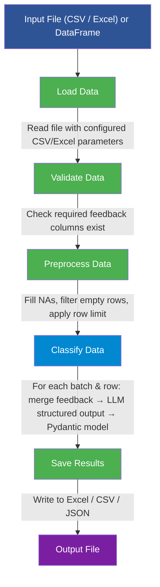

<!--
  © 2026 CVS Health and/or one of its affiliates. All rights reserved.

  Licensed under the Apache License, Version 2.0 (the "License");
  you may not use this file except in compliance with the License.
  You may obtain a copy of the License at

      http://www.apache.org/licenses/LICENSE-2.0

  Unless required by applicable law or agreed to in writing, software
  distributed under the License is distributed on an "AS IS" BASIS,
  WITHOUT WARRANTIES OR CONDITIONS OF ANY KIND, either express or implied.
  See the License for the specific language governing permissions and
  limitations under the License.
-->
# Data Classification Workflow

Ask RITA's `DataClassificationWorkflow` classifies tabular data (CSV, Excel) or raw text using LLM-powered structured output. Define your classification schema in YAML and the workflow handles batching, I/O, and result merging.

## Table of Contents

- [Overview](#overview)
- [Quick Start](#quick-start)
- [Configuration](#configuration)
- [Usage Examples](#usage-examples)
- [API Reference](#api-reference)
- [How It Works](#how-it-works)
- [Field Definitions](#field-definitions)
- [Troubleshooting](#troubleshooting)

## Overview

The classification workflow processes data through five steps:

| Step | Description | Can Disable |
|---|---|---|
| `load_data` | Load CSV or Excel file | No (required) |
| `preprocess_data` | Filter empty rows, apply row limit | Yes |
| `classify_data` | LLM classifies each row using structured output | Yes |
| `postprocess_results` | Post-processing hook (placeholder) | Yes |
| `save_results` | Save to Excel, CSV, or JSON | Yes |

Key capabilities:

- **Dynamic Pydantic models** — Define classification fields in YAML; a Pydantic model is built at runtime for structured LLM output
- **Multiple I/O formats** — Read CSV (with full delimiter/encoding control) or Excel; write to Excel, CSV, or JSON
- **Batch processing** — Process large files in configurable batches
- **Fluent API** — Chain `configure_*()` calls for runtime setup
- **Context manager** — Automatic temp file cleanup

## Quick Start

### 1. Install Dependencies

```bash
pip install askrita
```

### 2. Create Configuration

Create a `classification-config.yaml`:

```yaml
llm:
  provider: "openai"
  model: "gpt-4o"
  temperature: 0.1

data_processing:
  input_file_path: "data/feedback.csv"
  output_file_path: "data/classified_feedback.xlsx"
  feedback_columns: ["comment", "description"]
  max_rows_to_process: 1000
  batch_size: 100
  skip_empty_rows: true
  output_format: "excel"

classification:
  model_type: "general"
  system_prompt: "You are an expert data classifier."
  analysis_columns: ["category", "sentiment", "priority"]
  enable_batch_processing: true
  field_definitions:
    category:
      type: "literal"
      values: ["Bug", "Feature Request", "Question", "Other"]
      description: "The type of feedback"
    sentiment:
      type: "literal"
      values: ["Positive", "Negative", "Neutral"]
      description: "Overall sentiment of the feedback"
    priority:
      type: "literal"
      values: ["High", "Medium", "Low"]
      description: "Priority level"
      default: "Medium"

data_classification_workflow:
  steps:
    load_data: true
    preprocess_data: true
    classify_data: true
    postprocess_results: true
    save_results: true
```

### 3. Run the Workflow

```python
from askrita import DataClassificationWorkflow, ConfigManager

config = ConfigManager("classification-config.yaml")
workflow = DataClassificationWorkflow(config)

result = workflow.run_workflow()

if result["status"] == "success":
    print(f"Output saved to: {result['output_path']}")
    print(f"Rows processed: {result['statistics']['processed_rows']}")
else:
    print(f"Error: {result['error']}")
```

## Configuration

### Data Processing (`data_processing`)

```yaml
data_processing:
  input_file_path: "data/input.csv"
  output_file_path: "data/output.xlsx"
  feedback_columns: ["DESCRIPTION_ISSUE"]  # Columns to merge for LLM input
  max_rows_to_process: 10000               # 0 = no limit
  batch_size: 100
  skip_empty_rows: true
  output_format: "excel"                   # "excel", "csv", or "json"

  # CSV-specific read parameters
  csv_delimiter: ","
  csv_encoding: "utf-8"
  csv_header: 0                            # Row number for header (0-indexed)
  csv_quotechar: "\""
  csv_escapechar: null
  csv_decimal: "."
  csv_thousands: null
  csv_na_values: null
```

### Classification (`classification`)

```yaml
classification:
  model_type: "general"        # "general" or "customer_feedback"
  system_prompt: ""            # Custom prompt (overrides model_type default)
  analysis_columns:            # Fields to copy into result rows
    - "category"
    - "sentiment"
  enable_batch_processing: true
  field_definitions:           # Required — defines the structured output schema
    category:
      type: "literal"
      values: ["A", "B", "C"]
      description: "Category label"
```

When `system_prompt` is empty, a default prompt is used based on `model_type`:

- `"customer_feedback"` — Specialized for vendor/customer feedback analysis
- `"general"` — General-purpose data classification

### Workflow Steps (`data_classification_workflow`)

```yaml
data_classification_workflow:
  steps:
    load_data: true
    preprocess_data: true
    classify_data: true
    postprocess_results: true
    save_results: true
  max_retries: 3
  timeout_per_step: 300
```

### LLM Provider

The classification workflow uses the standard `llm` configuration section. All providers supported by Ask RITA work (OpenAI, Azure OpenAI, Vertex AI, Bedrock):

```yaml
llm:
  provider: "openai"
  model: "gpt-4o"
  temperature: 0.1
  max_tokens: 4000
```

## Usage Examples

### File-Based Classification

```python
from askrita import DataClassificationWorkflow, ConfigManager

config = ConfigManager("classification-config.yaml")
workflow = DataClassificationWorkflow(config)

result = workflow.run_workflow()
print(f"Status: {result['status']}")
print(f"Output: {result['output_path']}")
print(f"Stats: {result['statistics']}")
```

### Override Paths at Runtime

```python
result = workflow.run_workflow(
    input_file_path="data/new_input.csv",
    output_file_path="data/new_output.xlsx"
)
```

### Classify a Single Text

```python
from askrita import DataClassificationWorkflow, ConfigManager

config = ConfigManager("classification-config.yaml")
workflow = DataClassificationWorkflow(config)

result = workflow.classify_text("The login page is broken and I can't access my account")
print(result)
# {"category": "Bug", "sentiment": "Negative", "priority": "High"}
```

### Classify a List of Texts

```python
result = workflow.process_texts(
    texts=[
        "Great product, love the new features!",
        "The app crashes when I click submit",
        "Can you add dark mode support?",
    ],
    return_dataframe=True
)

if result["status"] == "success":
    df = result["processed_data"]
    print(df[["text", "category", "sentiment"]].to_string())
```

### DataFrame Input (Fluent API)

```python
import pandas as pd
from askrita import DataClassificationWorkflow, ConfigManager

df = pd.DataFrame({
    "id": [1, 2, 3],
    "comment": ["Great service", "Too slow", "Average experience"],
})

config = ConfigManager("classification-config.yaml")

with DataClassificationWorkflow(config) as workflow:
    workflow.set_input_dataframe(
        df=df,
        feedback_columns=["comment"],
        output_path="results.json"
    )
    result = workflow.run_workflow()
```

### Runtime Configuration (Fluent API)

```python
from askrita import DataClassificationWorkflow, ConfigManager

config = ConfigManager("base-config.yaml")  # Only needs llm section

workflow = DataClassificationWorkflow(config)

result = (
    workflow
    .configure_data_processing(
        input_file_path="data/feedback.csv",
        output_file_path="data/results.xlsx",
        feedback_columns=["comment", "description"],
        max_rows=500,
        output_format="excel",
    )
    .configure_classification(
        model_type="general",
        system_prompt="Classify each item by topic and urgency.",
        field_definitions={
            "topic": {
                "type": "literal",
                "values": ["Billing", "Technical", "General"],
                "description": "Topic category",
            },
            "urgency": {
                "type": "literal",
                "values": ["Urgent", "Normal", "Low"],
                "description": "Urgency level",
                "default": "Normal",
            },
        },
        analysis_columns=["topic", "urgency"],
    )
    .configure_workflow_steps(max_retries=3)
    .run_workflow()
)
```

### Workflow Info

```python
info = workflow.get_workflow_info()
print(info)
# {
#   "workflow_type": "data_classification",
#   "llm_provider": "openai",
#   "llm_model": "gpt-4o",
#   "classification_model_type": "general",
#   "enabled_steps": {"load_data": True, ...},
#   "data_processing": {
#       "input_file_path": "data/feedback.csv",
#       ...
#   }
# }
```

## API Reference

### DataClassificationWorkflow

```python
class DataClassificationWorkflow:
    def __init__(self, config_manager: Optional[ConfigManager] = None): ...

    # Fluent configuration (all return self for chaining)
    def configure_data_processing(
        self,
        input_data: Optional[pd.DataFrame] = None,
        input_file_path: Optional[str] = None,
        output_file_path: Optional[str] = None,
        feedback_columns: Optional[List[str]] = None,
        max_rows: Optional[int] = None,
        batch_size: Optional[int] = None,
        output_format: Optional[str] = None,
        skip_empty_rows: Optional[bool] = None,
    ) -> DataClassificationWorkflow: ...

    def configure_classification(
        self,
        model_type: Optional[str] = None,
        system_prompt: Optional[str] = None,
        field_definitions: Optional[Dict] = None,
        analysis_columns: Optional[List[str]] = None,
        enable_batch_processing: Optional[bool] = None,
    ) -> DataClassificationWorkflow: ...

    def configure_workflow_steps(
        self,
        steps: Optional[Dict[str, bool]] = None,
        max_retries: Optional[int] = None,
        timeout_per_step: Optional[int] = None,
    ) -> DataClassificationWorkflow: ...

    def set_field_definitions(
        self, field_definitions: Dict[str, Dict[str, Any]]
    ) -> DataClassificationWorkflow: ...

    def set_input_dataframe(
        self,
        df: pd.DataFrame,
        feedback_columns: List[str],
        output_path: Optional[str] = None,
    ) -> DataClassificationWorkflow: ...

    # Execution
    def run_workflow(
        self,
        input_file_path: Optional[str] = None,
        output_file_path: Optional[str] = None,
    ) -> Dict[str, Any]: ...

    def classify_text(self, text: str) -> Dict[str, Any]: ...

    def process_texts(
        self,
        texts: List[str],
        return_dataframe: bool = True,
    ) -> Dict[str, Any]: ...

    # Utilities
    def get_system_prompt(self) -> str: ...
    def get_workflow_info(self) -> Dict[str, Any]: ...
    def cleanup_temp_files(self) -> None: ...

    # Context manager
    def __enter__(self) -> DataClassificationWorkflow: ...
    def __exit__(self, *args) -> None: ...
```

### run_workflow Return Value

**Success:**

| Key | Type | Description |
|---|---|---|
| `status` | `str` | `"success"` |
| `output_path` | `str` | Path to saved output file (or `None` if save disabled) |
| `statistics` | `dict` | Processing statistics (see below) |
| `processed_data` | `DataFrame` | Final classified DataFrame |

**Failure:**

| Key | Type | Description |
|---|---|---|
| `status` | `str` | `"failed"` |
| `error` | `str` | Error message |
| `statistics` | `None` | — |

### Processing Statistics

| Key | Type | Description |
|---|---|---|
| `original_rows` | `int` | Rows in original file |
| `processed_rows` | `int` | Rows after preprocessing |
| `rows_filtered` | `int` | Rows removed by preprocessing |
| `columns` | `list` | Column names |
| `feedback_columns` | `list` | Columns used for classification input |
| `max_rows_limit` | `int` | Configured row limit |
| `batch_size` | `int` | Configured batch size |

### DataProcessor

```python
class DataProcessor:
    def __init__(self, config_manager: ConfigManager): ...

    def load_data(self, file_path: Optional[str] = None) -> pd.DataFrame: ...
    def preprocess_data(self, df: pd.DataFrame) -> pd.DataFrame: ...
    def combine_feedback_text(self, row: pd.Series) -> str: ...
    def create_batches(self, df: pd.DataFrame) -> Generator[pd.DataFrame, None, None]: ...
    def save_results(self, df: pd.DataFrame, output_path: Optional[str] = None) -> str: ...
    def validate_input_data(self, df: pd.DataFrame) -> bool: ...
    def get_processing_stats(self, original_df, processed_df) -> Dict[str, Any]: ...
```

## How It Works



### Structured Output Pipeline

The classification uses LangChain's `with_structured_output()` to bind a dynamically created Pydantic model to the LLM. This ensures every classification response matches the defined schema exactly:

1. `field_definitions` in YAML → `create_dynamic_classification_model()` → Pydantic `BaseModel` subclass
2. `llm.with_structured_output(DynamicModel)` → Constrained LLM that returns typed objects
3. Each row's combined text is sent as the human message; the system prompt provides classification instructions
4. The Pydantic response is converted to a dict and merged into the result row

## Field Definitions

The `field_definitions` section defines the structured output schema. Each key becomes a field on the dynamic Pydantic model:

### Supported Types

| Type | Python Annotation | Description |
|---|---|---|
| `string` | `str` | Free-form text |
| `optional_string` | `Optional[str]` | Optional free-form text |
| `literal` | `Literal["A", "B", ...]` | Constrained to specific values (requires `values` list) |
| `list` | `Optional[List[str]]` | List of strings |
| `integer` | `int` | Integer value |
| `float` | `float` | Decimal value |

### Field Properties

| Property | Required | Description |
|---|---|---|
| `type` | No (default: `"string"`) | One of the types above |
| `description` | No | Description passed to the LLM for guidance |
| `default` | No | Default value; makes the field optional |
| `values` | For `literal` only | List of allowed values |
| `item_type` | For `list` only | Type of list items (`"string"` or generic) |

### Example

```yaml
field_definitions:
  category:
    type: "literal"
    values: ["Bug", "Feature", "Question", "Other"]
    description: "The primary category of this item"
  summary:
    type: "string"
    description: "A one-sentence summary"
  confidence:
    type: "literal"
    values: ["High", "Medium", "Low"]
    description: "Classification confidence"
    default: "Medium"
  tags:
    type: "list"
    item_type: "string"
    description: "Relevant tags"
  priority_score:
    type: "integer"
    description: "Priority score from 1 to 10"
```

### Fallback Behavior

- If a single field definition fails, it falls back to `str`
- If the entire model creation fails, a fallback model with `result: str` and `category: str` is used
- Unknown `type` values fall back to `str` with a warning

## Troubleshooting

### ConfigurationError: field_definitions Required

**Symptom**: `ConfigurationError` at workflow initialization.

The `field_definitions` section is required for structured LLM output. Add it to the `classification` section of your config, or set it at runtime:

```python
workflow.set_field_definitions({
    "category": {"type": "string", "description": "Category"},
})
```

### Missing Feedback Columns

**Symptom**: `ValidationError: Required feedback columns not found`.

Ensure the column names in `data_processing.feedback_columns` match the actual column names in your input file (case-sensitive).

### Empty Classification Results

**Symptom**: All classification fields are `None` in the output.

- Check that `classification.analysis_columns` lists the same field names as your `field_definitions`
- Verify the system prompt is appropriate for your data
- Test with a single text first: `workflow.classify_text("sample text")`

### Unsupported File Format

**Symptom**: `ValidationError: Unsupported file format`.

Supported input formats: `.csv`, `.xlsx`, `.xls`. Supported output formats: `excel`, `csv`, `json` (set via `output_format`).

### LLM Errors During Classification

**Symptom**: Rows return `None` for classification fields.

- Individual row failures are logged as warnings but do not stop the workflow
- Check LLM provider connectivity and API key
- Reduce `batch_size` if hitting rate limits
- Verify the `field_definitions` schema is not too complex for the model

---

**See also:**

- [Configuration Guide](../configuration/overview.md) — Complete YAML configuration reference
- [Supported Platforms](../supported-platforms.md) — LLM provider setup
- Example configs: `example-configs/data-classification-general.yaml`, `data-classification-openai.yaml`, `data-classification-azure.yaml`, `data-classification-vertex-ai.yaml`
