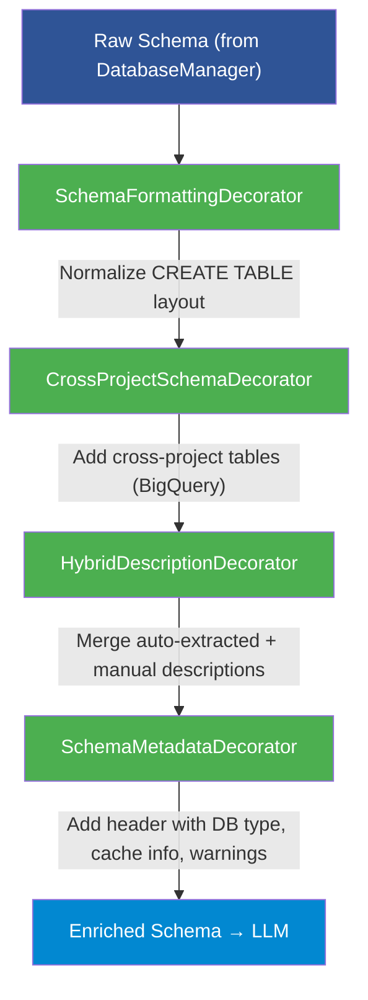

<!--
  © 2026 CVS Health and/or one of its affiliates. All rights reserved.

  Licensed under the Apache License, Version 2.0 (the "License");
  you may not use this file except in compliance with the License.
  You may obtain a copy of the License at

      http://www.apache.org/licenses/LICENSE-2.0

  Unless required by applicable law or agreed to in writing, software
  distributed under the License is distributed on an "AS IS" BASIS,
  WITHOUT WARRANTIES OR CONDITIONS OF ANY KIND, either express or implied.
  See the License for the specific language governing permissions and
  limitations under the License.
-->
# Schema Enrichment and Caching

Ask RITA can enrich your database schema with descriptions, business context, and cross-project metadata to help the LLM generate more accurate SQL. Schema caching reduces latency by avoiding repeated schema introspection.

## Table of Contents

- [Overview](#overview)
- [Schema Caching](#schema-caching)
- [Schema Descriptions](#schema-descriptions)
- [Schema Decorators](#schema-decorators)
- [Cross-Project Access (BigQuery)](#cross-project-access-bigquery)
- [Custom SQL Syntax](#custom-sql-syntax)
- [Configuration Reference](#configuration-reference)
- [Troubleshooting](#troubleshooting)

## Overview

The schema enrichment pipeline processes the raw database schema through a chain of decorators:



Each decorator is optional and controlled by configuration.

## Schema Caching

Schema caching stores the enriched schema in memory to avoid expensive database introspection on every query.

### Configuration

```yaml
database:
  cache_schema: true              # Enable caching (default: true)
  schema_refresh_interval: 3600   # Cache TTL in seconds (default: 3600)
```

### Behavior

- **First query**: Schema is fetched from the database and cached
- **Subsequent queries**: Cached schema is used if within the TTL
- **After TTL expires**: Schema is re-fetched on the next query
- **Manual control**: Use `preload_schema()`, `clear_schema_cache()`, and `get_cache_status()`

### API

```python
from askrita import SQLAgentWorkflow, ConfigManager

config = ConfigManager("config.yaml")
workflow = SQLAgentWorkflow(config)

# Preload schema into cache (runs at init by default)
workflow.preload_schema()

# Check cache status
status = workflow.get_cache_status()
print(status)
# {
#   "enabled": True,
#   "cached": True,
#   "age_seconds": 42.5,
#   "remaining_seconds": 3557.5,
#   "refresh_interval": 3600,
#   "valid": True
# }

# Force refresh
workflow.clear_schema_cache()
```

### ConfigManager Cache Methods

For direct cache control:

```python
config = ConfigManager("config.yaml")

config.should_cache_schema()       # True if cache is valid
config.get_schema_cache()          # Returns cached schema or None
config.set_schema_cache(schema)    # Set cache manually
config.clear_schema_cache()        # Clear cache
config.get_schema_cache_info()     # Detailed cache status dict
```

## Schema Descriptions

Add human-readable descriptions to tables and columns to guide the LLM toward better SQL generation.

### Configuration

```yaml
database:
  schema_descriptions:
    project_context: |
      This is an e-commerce database with customer orders, products, and inventory.
      Fiscal year starts April 1.

    automatic_extraction:
      enabled: true                    # Extract descriptions from DB metadata
      fallback_to_column_name: true    # Use column name as fallback description
      include_data_types: true         # Include data type info
      extract_comments: true           # Extract column/table comments

    tables:
      orders:
        description: "Customer purchase orders"
        business_purpose: "Tracks all customer transactions"
        override_mode: "supplement"    # "supplement", "override", or "auto_only"
      products:
        description: "Product catalog"
        business_purpose: "Master product data with pricing"

    columns:
      customer_id:
        description: "Unique customer identifier (UUID format)"
        mode: "supplement"             # "supplement", "override", "fallback", or "auto_only"
        business_context: "Links to the CRM system customer record"
      created_at:
        description: "Record creation timestamp in UTC"
        mode: "fallback"
      revenue:
        description: "Net revenue after discounts and returns"
        mode: "override"
        business_context: "Use this for all revenue calculations, not gross_amount"

    business_terms:
      "active customer": "A customer with at least one order in the last 90 days"
      "churn": "A customer with no orders in the last 180 days"
      "AOV": "Average Order Value = total revenue / number of orders"
      "LTV": "Lifetime Value = total revenue from a customer since first purchase"
```

### Description Modes

Modes control how manual descriptions interact with automatically extracted descriptions:

| Mode | Behavior |
|---|---|
| `supplement` | Manual description is appended to the auto-extracted description |
| `override` | Manual description replaces the auto-extracted description entirely |
| `fallback` | Manual description is used only if no auto-extracted description exists |
| `auto_only` | Only auto-extracted descriptions are used; manual descriptions are ignored |

### Automatic Extraction

When `automatic_extraction.enabled` is `true`, Ask RITA extracts descriptions from database metadata:

- **BigQuery**: Column descriptions from `INFORMATION_SCHEMA.COLUMN_FIELD_PATHS` (with fallback to direct query)
- **PostgreSQL**: Column comments from `pg_catalog`
- **MySQL**: Column comments from `information_schema`

The `HybridDescriptionDecorator` then merges auto-extracted and manual descriptions according to the configured `mode` for each column.

### Project Context

The `project_context` string is prepended to the schema, giving the LLM high-level understanding of the database:

```yaml
database:
  schema_descriptions:
    project_context: |
      Healthcare claims database for analytics.
      All dates are in Eastern Time.
      Member IDs are always 10-digit numbers.
      Use ICD-10 codes for diagnosis lookups.
```

### Business Terms Glossary

The `business_terms` dictionary is appended to the schema as a glossary. This helps the LLM understand domain-specific terminology:

```yaml
database:
  schema_descriptions:
    business_terms:
      "DAU": "Daily Active Users"
      "MAU": "Monthly Active Users"
      "retention rate": "Percentage of users who return within 30 days"
```

## Schema Decorators

Schema decorators follow the decorator pattern to build enriched schemas. Each decorator wraps a `SchemaProvider` and enhances the schema string.

### Available Decorators

| Decorator | Purpose |
|---|---|
| `SchemaFormattingDecorator` | Normalizes `CREATE TABLE` layout and indentation |
| `CrossProjectSchemaDecorator` | Adds BigQuery cross-project table metadata |
| `HybridDescriptionDecorator` | Merges auto-extracted and manual column/table descriptions |
| `SchemaMetadataDecorator` | Prepends a metadata header (DB type, cache status, warnings) |

### Supporting Classes

| Class | Purpose |
|---|---|
| `AutoDescriptionExtractor` | Static helpers for extracting descriptions from BigQuery, PostgreSQL, MySQL |
| `DescriptionMerger` | Merges auto + manual descriptions based on column `mode` |
| `BaseSchemaProvider` | Returns the raw schema string (base of the chain) |
| `SchemaDecoratorBuilder` | Fluent builder to construct the decorator chain |

### SchemaDecoratorBuilder

The builder provides a fluent API for constructing the decorator chain:

```python
from askrita.sqlagent.database.schema_decorators import SchemaDecoratorBuilder

provider = (
    SchemaDecoratorBuilder(base_schema)
    .with_formatting()                    # Normalize layout
    .with_cross_project_enhancement()     # Add cross-project tables
    .with_hybrid_descriptions()           # Merge descriptions
    .with_metadata()                      # Add header
    .build()
)

enriched_schema = provider.get_schema(config)
```

Decorators are stacked in the order you add them, with the last one being the outermost wrapper.

### Custom Decorators

To create a custom decorator, extend `SchemaDecorator`:

```python
from askrita.sqlagent.database.schema_decorators import SchemaDecorator

class MyCustomDecorator(SchemaDecorator):
    def enhance_schema(self, schema: str, config) -> str:
        return f"-- Custom header\n{schema}"
```

## Cross-Project Access (BigQuery)

For BigQuery, Ask RITA can query tables across multiple GCP projects and datasets.

### Configuration

```yaml
database:
  connection_string: "bigquery://my-project/my-dataset"
  bigquery_project_id: "my-project"

  cross_project_access:
    enabled: true
    datasets:
      - project_id: "other-project"
        dataset_id: "shared_data"
        include_tables: ["customers", "orders"]  # Optional filter
      - project_id: "analytics-project"
        dataset_id: "reports"
        exclude_tables: ["temp_*"]               # Optional exclusion pattern

    cache_metadata: true
    metadata_refresh_interval: 7200  # Seconds (default: 7200)
```

### How It Works

1. The `CrossProjectSchemaDecorator` queries `INFORMATION_SCHEMA.TABLES` and `INFORMATION_SCHEMA.COLUMNS` for each configured dataset
2. Table and column metadata is appended to the schema
3. The `SchemaMetadataDecorator` adds a cross-project summary to the header
4. Table names in generated SQL are fully qualified: `project.dataset.table`

### Filtering

- `include_tables`: Only include listed tables (exact match)
- `exclude_tables`: Exclude tables matching patterns (supports `*` wildcards)
- If neither is specified, all tables in the dataset are included

### Metadata Caching

Cross-project metadata is cached separately from the main schema cache:

```yaml
database:
  cross_project_access:
    cache_metadata: true
    metadata_refresh_interval: 7200  # 2 hours
```

### Validation

BigQuery cross-project access uses a chain-of-responsibility pattern (`ValidationContext` / `ValidationStep`) to validate connections and permissions before querying metadata.

## Custom SQL Syntax

For databases with non-standard SQL syntax, you can provide hints to the LLM:

### Configuration

```yaml
database:
  sql_syntax:
    dialect_hints:
      - "Use LIMIT instead of TOP for row limiting"
      - "Date functions use DATE_TRUNC('month', column) syntax"
      - "String concatenation uses || operator, not CONCAT()"
    date_format: "YYYY-MM-DD"
    identifier_quoting: "double_quotes"  # or "backticks" or "brackets"
    catalog_separator: "."
```

The `SQLSyntaxConfig` passes these hints into the SQL generation prompt, helping the LLM produce valid SQL for your specific database dialect.

## Configuration Reference

### Complete Schema Enrichment Configuration

```yaml
database:
  connection_string: "bigquery://my-project/my-dataset"
  bigquery_project_id: "my-project"

  # Caching
  cache_schema: true
  schema_refresh_interval: 3600

  # Cross-project access (BigQuery only)
  cross_project_access:
    enabled: true
    datasets:
      - project_id: "other-project"
        dataset_id: "shared_data"
    cache_metadata: true
    metadata_refresh_interval: 7200

  # Descriptions
  schema_descriptions:
    project_context: "E-commerce analytics database"
    automatic_extraction:
      enabled: true
      fallback_to_column_name: true
      include_data_types: true
      extract_comments: true
    tables:
      orders:
        description: "Purchase orders"
        business_purpose: "Transaction tracking"
        override_mode: "supplement"
    columns:
      customer_id:
        description: "Unique customer identifier"
        mode: "supplement"
        business_context: "Maps to CRM customer_id"
    business_terms:
      "AOV": "Average Order Value"
      "active customer": "Ordered in the last 90 days"

  # Custom SQL syntax hints
  sql_syntax:
    dialect_hints:
      - "Use LIMIT for row limiting"
    date_format: "YYYY-MM-DD"
```

## Troubleshooting

### Schema Not Being Cached

**Symptom**: Every query triggers a schema fetch.

- Check `database.cache_schema: true` in your config
- Check `schema_refresh_interval` — if set to `0`, cache is always expired
- Verify with `workflow.get_cache_status()`

### Descriptions Not Appearing in Schema

**Symptom**: Manual descriptions are not added to the schema.

- Ensure `schema_descriptions` is nested under `database` in the YAML
- Check that `automatic_extraction.enabled` is `true` for auto descriptions
- Verify column names in `columns` match the actual database column names
- Check the `mode` — `auto_only` ignores manual descriptions

### Cross-Project Tables Not Found

**Symptom**: Cross-project tables are not in the schema.

- Ensure `cross_project_access.enabled: true`
- Check that the service account has `bigquery.tables.list` and `bigquery.tables.get` permissions on the target project
- Verify `project_id` and `dataset_id` are correct
- Check `include_tables` / `exclude_tables` filters

### Schema Too Large for LLM Context

**Symptom**: Token limit errors during SQL generation.

- Use `cross_project_access` filters (`include_tables`, `exclude_tables`) to reduce schema size
- Focus `schema_descriptions` on high-value tables only
- The framework automatically manages token budgets, but very large schemas may still exceed limits

### Stale Schema After DDL Changes

**Symptom**: New tables or columns are not recognized.

```python
workflow.clear_schema_cache()
result = workflow.query("Show me the new_table data")
```

Or wait for the `schema_refresh_interval` to expire.

---

**See also:**

- [Configuration Guide](../configuration/overview.md) — Complete YAML configuration reference
- [Supported Platforms](../supported-platforms.md) — Database connection strings
- [Security](security.md) — SQL safety and input validation
- Example config: `example-configs/schema-descriptions-simple.yaml`
